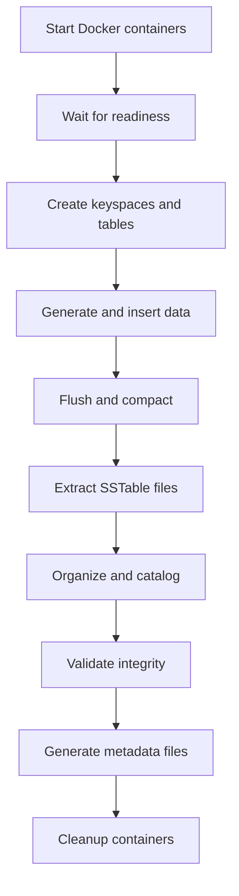

# Issue #28: 🐳 Set up Docker-based test data generation

## 🎯 **Priority: MEDIUM** - Infrastructure Foundation

**Status**: Referenced in README but not fully implemented  
**Impact**: Testing and validation of real Cassandra compatibility  
**Estimated Effort**: 3-4 days  
**Assigned**: TBD  

---

## 📋 **Problem Statement**

CQLite needs comprehensive test data generated from real Cassandra instances to validate compatibility and correctness. The README mentions Docker-based test data generation, but this infrastructure needs to be fully implemented and automated.

Current gaps:
- No automated test data generation pipeline
- Limited variety in test SSTable formats and data types
- No cross-version compatibility testing
- Manual test data creation is time-consuming and error-prone
- Missing edge cases and real-world data patterns

## ✅ **Acceptance Criteria**

### **Docker Infrastructure**
- [ ] Multi-version Cassandra Docker setup (3.11, 4.0, 5.0)
- [ ] Automated container orchestration and management
- [ ] Configurable data generation scripts
- [ ] Automated SSTable extraction and organization
- [ ] Cross-platform compatibility (Linux, macOS, Windows)

### **Test Data Variety**
- [ ] Basic data types (text, int, uuid, timestamp, boolean)
- [ ] Collection types (list, set, map)
- [ ] Complex composite keys and clustering columns
- [ ] User-defined types (UDTs) and tuples
- [ ] Large datasets for performance testing
- [ ] Edge cases (empty tables, null values, tombstones)

### **Data Organization**
- [ ] Structured test data directory with clear naming
- [ ] Metadata files describing each test dataset
- [ ] Automated validation of generated data
- [ ] Version tracking and reproducibility
- [ ] Easy integration with CI/CD pipelines

### **Generation Automation**
- [ ] One-command data generation for all scenarios
- [ ] Incremental generation for development workflow
- [ ] Parallel generation for faster execution
- [ ] Cleanup and resource management
- [ ] Progress monitoring and error reporting

## 🔧 **Technical Requirements**

### **Docker Compose Configuration**
```yaml
# docker-compose.test-data.yml
version: '3.8'
services:
  cassandra-3-11:
    image: cassandra:3.11
    environment:
      - CASSANDRA_CLUSTER_NAME=test-cluster-3-11
      - CASSANDRA_DC=datacenter1
      - CASSANDRA_RACK=rack1
    volumes:
      - ./test-data-generation/schemas:/schemas
      - ./test-data/cassandra-3.11:/var/lib/cassandra/data
    ports:
      - "9042:9042"
    
  cassandra-4-0:
    image: cassandra:4.0
    environment:
      - CASSANDRA_CLUSTER_NAME=test-cluster-4-0
    volumes:
      - ./test-data-generation/schemas:/schemas  
      - ./test-data/cassandra-4.0:/var/lib/cassandra/data
    ports:
      - "9043:9042"
      
  cassandra-5-0:
    image: cassandra:5.0
    environment:
      - CASSANDRA_CLUSTER_NAME=test-cluster-5-0
    volumes:
      - ./test-data-generation/schemas:/schemas
      - ./test-data/cassandra-5.0:/var/lib/cassandra/data  
    ports:
      - "9044:9042"

  data-generator:
    build: ./test-data-generation
    depends_on:
      - cassandra-3-11
      - cassandra-4-0
      - cassandra-5-0
    volumes:
      - ./test-data:/output
    environment:
      - CASSANDRA_HOSTS=cassandra-3-11:9042,cassandra-4-0:9042,cassandra-5-0:9042
```

### **Data Generation Scripts**
```bash
#!/bin/bash
# generate-test-data.sh

set -e

SCRIPT_DIR="$(cd "$(dirname "${BASH_SOURCE[0]}")" && pwd)"
DATA_DIR="${SCRIPT_DIR}/../test-data"

echo "🚀 Starting test data generation..."

# Start Cassandra instances
docker-compose -f docker-compose.test-data.yml up -d

# Wait for Cassandra to be ready
echo "⏳ Waiting for Cassandra instances to be ready..."
./wait-for-cassandra.sh

# Generate test data for each version
for version in "3.11" "4.0" "5.0"; do
    echo "📊 Generating data for Cassandra ${version}..."
    ./generate-version-data.sh "${version}"
done

# Extract SSTable files
echo "📦 Extracting SSTable files..."
./extract-sstables.sh

# Validate generated data
echo "✅ Validating generated data..."
./validate-test-data.sh

echo "🎉 Test data generation complete!"
```

### **Schema Definitions**
```sql
-- test-data-generation/schemas/basic-types.cql
CREATE KEYSPACE test_basic WITH replication = {
    'class': 'SimpleStrategy', 
    'replication_factor': 1
};

CREATE TABLE test_basic.simple_table (
    id UUID PRIMARY KEY,
    text_col TEXT,
    int_col INT,
    bigint_col BIGINT,
    boolean_col BOOLEAN,
    timestamp_col TIMESTAMP,
    decimal_col DECIMAL,
    float_col FLOAT,
    double_col DOUBLE
);

-- Insert test data
INSERT INTO test_basic.simple_table (id, text_col, int_col, bigint_col, boolean_col, timestamp_col, decimal_col, float_col, double_col)
VALUES (uuid(), 'Test String 1', 42, 9223372036854775807, true, '2024-01-01 12:00:00', 123.45, 3.14, 2.718281828);
```

```sql
-- test-data-generation/schemas/collections.cql
CREATE KEYSPACE test_collections WITH replication = {
    'class': 'SimpleStrategy',
    'replication_factor': 1  
};

CREATE TABLE test_collections.collection_table (
    id UUID PRIMARY KEY,
    list_col LIST<TEXT>,
    set_col SET<INT>,
    map_col MAP<TEXT, TEXT>,
    frozen_list FROZEN<LIST<TEXT>>,
    nested_map MAP<TEXT, FROZEN<MAP<TEXT, INT>>>
);

-- Insert collection test data
INSERT INTO test_collections.collection_table (id, list_col, set_col, map_col, frozen_list, nested_map)
VALUES (
    uuid(),
    ['item1', 'item2', 'item3'],
    {1, 2, 3, 4, 5},
    {'key1': 'value1', 'key2': 'value2'},
    ['frozen1', 'frozen2'],
    {'outer1': {'inner1': 10, 'inner2': 20}}
);
```

### **Test Data Management**
```rust
// test-data-generation/src/data_manager.rs
use std::path::Path;
use serde::{Deserialize, Serialize};

#[derive(Debug, Serialize, Deserialize)]
pub struct TestDataset {
    pub name: String,
    pub version: String,
    pub cassandra_version: String,
    pub schema_file: String,
    pub sstable_files: Vec<String>,
    pub row_count: u64,
    pub size_bytes: u64,
    pub created_at: String,
    pub description: String,
}

pub struct TestDataManager {
    base_path: PathBuf,
}

impl TestDataManager {
    pub fn new(base_path: impl AsRef<Path>) -> Self {
        Self {
            base_path: base_path.as_ref().to_path_buf(),
        }
    }
    
    pub async fn generate_all_datasets(&self) -> Result<Vec<TestDataset>> {
        let datasets = vec![
            self.generate_basic_types().await?,
            self.generate_collections().await?,
            self.generate_large_dataset().await?,
            self.generate_complex_keys().await?,
            self.generate_edge_cases().await?,
        ];
        
        Ok(datasets)
    }
    
    pub async fn validate_dataset(&self, dataset: &TestDataset) -> Result<ValidationReport> {
        // Validate SSTable files can be read
        // Check row counts match expectations
        // Verify data integrity
        // Compare with Cassandra's own output
        todo!()
    }
}
```

## 📊 **Test Data Categories**

### **1. Basic Data Types**
- All primitive CQL types
- Null value handling
- Default value behavior
- Type conversion edge cases

### **2. Collection Types**
- Lists, sets, maps with various element types
- Nested collections
- Frozen vs non-frozen collections
- Empty collections

### **3. Complex Schema Patterns**
- Composite partition keys
- Multiple clustering columns
- Secondary indexes
- Materialized views

### **4. Performance Test Data**
- Large tables (1M+ rows)
- Wide rows (many columns)
- Large collections
- Various partition sizes

### **5. Edge Cases**
- Empty tables
- Single-row tables
- Tables with only tombstones
- Corrupted data scenarios

### **6. Real-World Patterns**
- Time-series data
- User profiles with preferences
- E-commerce order data
- Log/event data patterns

## 🔄 **Data Generation Workflow**



## 🧪 **Testing Integration**

### **CI/CD Integration**
```yaml
# .github/workflows/test-data-generation.yml
name: Test Data Generation

on:
  schedule:
    - cron: '0 2 * * 0'  # Weekly on Sunday
  workflow_dispatch:

jobs:
  generate-test-data:
    runs-on: ubuntu-latest
    
    steps:
    - uses: actions/checkout@v4
    
    - name: Set up Docker
      uses: docker/setup-buildx-action@v2
      
    - name: Generate test data
      run: |
        cd test-data-generation
        ./generate-test-data.sh
        
    - name: Validate generated data
      run: |
        cargo test --test test_data_validation
        
    - name: Archive test data
      uses: actions/upload-artifact@v3
      with:
        name: test-data-${{ github.run_id }}
        path: test-data/
        retention-days: 30
```

### **Local Development**
```bash
# Quick test data generation for development
make generate-test-data-quick

# Full test data generation (all versions, all scenarios)
make generate-test-data-full

# Generate specific test data category
make generate-test-data category=collections version=5.0

# Validate existing test data
make validate-test-data

# Clean up test data and containers
make clean-test-data
```

## 📖 **Documentation Requirements**

### **User Documentation**
- [ ] Setup and configuration guide
- [ ] How to generate custom test data
- [ ] Troubleshooting common issues
- [ ] Test data format documentation

### **Developer Documentation**
- [ ] Adding new test data scenarios
- [ ] Extending schema definitions
- [ ] Integration with testing framework
- [ ] Performance considerations

### **Maintenance Documentation**
- [ ] Container management procedures
- [ ] Data validation processes
- [ ] Version upgrade procedures
- [ ] Cleanup and resource management

## 🚀 **Implementation Plan**

### **Phase 1: Infrastructure Setup (Days 1-2)**
1. Create Docker Compose configuration for multi-version Cassandra
2. Implement container orchestration and health checking
3. Create basic schema definitions and data insertion scripts
4. Set up automated SSTable extraction process

### **Phase 2: Data Generation (Days 2-3)**
1. Implement comprehensive schema definitions for all test categories
2. Create data generation scripts with realistic data patterns
3. Add validation and integrity checking
4. Implement metadata generation and cataloging

### **Phase 3: Automation (Days 3-4)**
1. Create automated generation pipeline with progress monitoring
2. Add CI/CD integration for regular data generation
3. Implement incremental generation for development workflow
4. Add cleanup and resource management

### **Phase 4: Integration (Day 4)**
1. Integrate with existing test framework
2. Update documentation and usage guides
3. Add performance monitoring and optimization
4. Complete validation and quality assurance

## 📊 **Success Metrics**

### **Infrastructure Metrics**
- [ ] Generate test data for all target Cassandra versions
- [ ] Complete data generation in < 30 minutes
- [ ] Reliable container orchestration (>99% success rate)
- [ ] Cross-platform compatibility validated

### **Data Quality Metrics**
- [ ] 100% of generated SSTable files are readable by CQLite
- [ ] Data integrity verified against Cassandra's own output
- [ ] Comprehensive coverage of CQL data types and patterns
- [ ] Edge cases and error scenarios included

### **Automation Metrics**
- [ ] One-command generation for development workflow
- [ ] CI/CD integration working reliably
- [ ] Incremental generation reduces development time
- [ ] Resource cleanup prevents accumulation issues

## ⚠️ **Risk Factors**

- **Medium**: Docker resource usage on CI/CD systems
- **Medium**: Cassandra startup time impacting generation speed
- **Low**: Cross-platform Docker compatibility issues
- **Low**: Schema evolution and version compatibility

## 💡 **Future Enhancements**

- Support for additional Cassandra versions
- Integration with real production data anonymization
- Custom data generation patterns for specific use cases
- Performance benchmarking data generation
- Multi-datacenter and replication testing scenarios

---

**Labels**: `medium-priority`, `infrastructure`, `testing`, `docker`, `phase-2`  
**Milestone**: Testing Infrastructure  
**Dependencies**: Basic SSTable reading functionality (#25)  
**Enables**: Comprehensive testing across all components