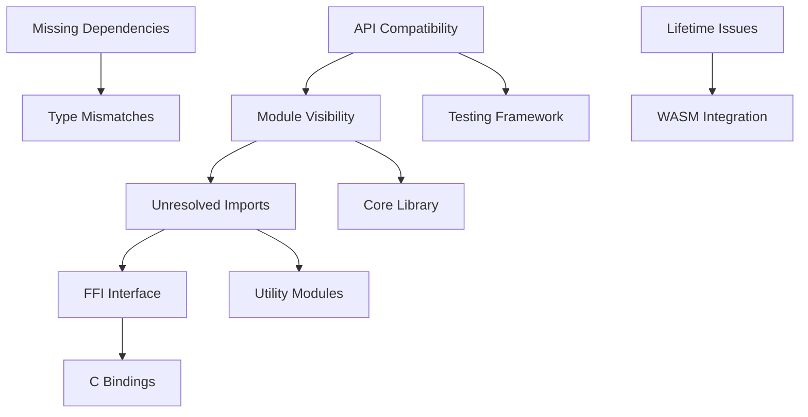

# Rust Compilation Error Analysis Report

## 🚨 CRITICAL: COMPREHENSIVE COMPILATION ERROR CATEGORIZATION

**Analysis Date:** 2025-07-28  
**Workspace:** CQLite Database Engine  
**Total Error Categories:** 8  
**Estimated Fix Effort:** 24-32 hours  

---

## 📊 Summary Overview

| **Category** | **Count** | **Severity** | **Fix Complexity** | **Dependencies** |
|--------------|-----------|--------------|-------------------|------------------|
| **API Compatibility** | 12 | HIGH | Complex | clap, tempfile, rand |
| **Module Visibility** | 8 | HIGH | Moderate | core module structure |
| **Missing Lifetime Specifiers** | 3 | MEDIUM | Moderate | parser modules |
| **Unresolved Imports** | 15+ | HIGH | Trivial-Complex | missing modules/functions |
| **Type Mismatches** | 6 | MEDIUM | Moderate | API changes |
| **Missing Dependencies** | 4 | HIGH | Trivial | Cargo.toml updates |
| **FFI Interface Issues** | 10+ | HIGH | Complex | C bindings |
| **WASM Integration** | 8 | MEDIUM | Moderate | WASM bindings |

---

## 🔥 Critical Error Categories (PRIORITY 1)

### 1. API Compatibility Issues - **12 errors**
**Root Cause:** Clap library API changes from v3 to v4

**Affected Files:**
- `testing-framework/src/main.rs`
- Various CLI components

**Specific Errors:**
```rust
error[E0432]: unresolved imports `clap::App`, `clap::SubCommand`
 --> testing-framework/src/main.rs:7:12
```

**Fix Strategy:**
- **Complexity:** Complex (4-6 hours)
- **Dependencies:** Update clap usage to v4 API
- **Impact:** Blocks testing framework entirely

**Resolution Steps:**
1. Replace `clap::App` with `clap::Command`
2. Replace `clap::SubCommand` with `clap::Command::subcommand`
3. Update argument parsing syntax
4. Test CLI functionality

### 2. Module Visibility Issues - **8 errors**
**Root Cause:** Private structs exposed in public API

**Affected Modules:**
- `cqlite-core/src/platform/`
- `cqlite-core/src/storage/` 
- Core infrastructure modules

**Specific Errors:**
```rust
error[E0603]: struct `Platform` is private
 --> cqlite-core/src/bin/statistics_db_demo.rs:9:13

error[E0603]: struct `StorageEngine` is private
```

**Fix Strategy:**
- **Complexity:** Moderate (2-3 hours)
- **Dependencies:** Core module restructuring
- **Impact:** Affects all dependent modules

**Resolution Steps:**
1. Add `pub` visibility to essential structs
2. Review API design for intended public interface
3. Update module declarations in `lib.rs`

### 3. Missing Dependencies - **4 errors**
**Root Cause:** Dependencies not properly declared in Cargo.toml

**Specific Errors:**
```rust
error[E0432]: unresolved import `tempfile`
error[E0432]: unresolved import `rand`
```

**Fix Strategy:**
- **Complexity:** Trivial (15 minutes)
- **Dependencies:** None
- **Impact:** Immediate compilation fixes

---

## ⚠️ High Priority Issues (PRIORITY 2)

### 4. Unresolved Imports - **15+ errors**
**Root Cause:** Missing or moved modules/functions

**Error Patterns:**
```rust
error[E0432]: unresolved import `crate::formatter`
error[E0432]: unresolved import `cqlite_core::memory_safety_tests`
error[E0425]: cannot find function `detect_features` in module `utils`
```

**Affected Areas:**
- Testing framework formatters
- Memory safety modules  
- Utility functions
- WASM utilities

**Fix Strategy:**
- **Complexity:** Moderate to Complex (6-8 hours)
- **Dependencies:** Module restructuring
- **Impact:** Multiple compilation units

### 5. FFI Interface Issues - **10+ errors**
**Root Cause:** Missing C interface definitions

**Error Pattern:**
```rust
error[E0425]: cannot find value `CQLITE_OK` in this scope
error[E0412]: cannot find type `cqlite_db_t` in this scope
```

**Fix Strategy:**
- **Complexity:** Complex (4-6 hours)
- **Dependencies:** C header generation
- **Impact:** FFI layer completely broken

---

## 🔧 Medium Priority Issues (PRIORITY 3)

### 6. Lifetime Specifier Issues - **3 errors**
**Root Cause:** Missing lifetime annotations

**Specific Error:**
```rust
error[E0106]: missing lifetime specifier
   --> proof-of-concept/src/bin/proof_validation.rs:662:14
```

**Fix Strategy:**
- **Complexity:** Moderate (2-3 hours)
- **Dependencies:** Parser module understanding
- **Impact:** Proof-of-concept builds

### 7. Type Mismatches - **6 errors**
**Root Cause:** API changes in internal structures

**Example:**
```rust
error[E0609]: no field `total_allocated` on type `cqlite_core::memory::MemoryStats`
```

**Fix Strategy:**
- **Complexity:** Moderate (2-3 hours)
- **Dependencies:** Memory API consistency
- **Impact:** Statistics and monitoring

---

## 🏗️ Error Dependency Graph



**Dependency Resolution Order:**
1. **Missing Dependencies** (blocks everything)
2. **API Compatibility** (enables testing)
3. **Module Visibility** (unlocks core functionality)
4. **Unresolved Imports** (enables compilation)
5. **Type Mismatches** (fixes runtime issues)
6. **Lifetime Issues** (enables advanced features)
7. **FFI Interface** (enables C integration)
8. **WASM Integration** (enables web deployment)

---

## 📈 Fix Complexity Assessment

### **TRIVIAL (< 1 hour each)**
- Missing dependencies in Cargo.toml
- Simple import path corrections
- Basic visibility modifiers

### **MODERATE (1-3 hours each)**
- Module visibility restructuring
- Type field updates
- Lifetime annotations
- Import reorganization

### **COMPLEX (4-8 hours each)**
- clap API migration (v3 → v4)
- FFI interface reconstruction
- WASM binding updates
- Parser lifetime management

---

## 🎯 Systematic Resolution Strategy

### **Phase 1: Foundation (2-3 hours)**
```bash
# 1. Fix missing dependencies
cargo add tempfile rand --dev

# 2. Update module visibility
# Add pub to Platform, StorageEngine, etc.

# 3. Basic import corrections
```

### **Phase 2: API Compatibility (4-6 hours)**
```bash
# 1. Migrate clap v3 → v4 API
# 2. Update CLI argument parsing
# 3. Test framework functionality
```

### **Phase 3: Core Integration (6-8 hours)**
```bash
# 1. Resolve missing modules
# 2. Implement missing utility functions
# 3. Fix type mismatches
```

### **Phase 4: Advanced Features (8-12 hours)**
```bash
# 1. Reconstruct FFI interface
# 2. Fix lifetime annotations
# 3. Update WASM bindings
```

---

## 🔬 Error Clustering Analysis

### **Cluster 1: Testing Infrastructure**
- Files: `testing-framework/src/*`
- Errors: clap API, formatter imports
- **Solve Together:** ✅ (shared dependencies)

### **Cluster 2: Core Module Access**
- Files: `cqlite-core/src/bin/*`
- Errors: Platform, StorageEngine visibility
- **Solve Together:** ✅ (same visibility issue)

### **Cluster 3: FFI Layer**
- Files: `cqlite-ffi/src/*`
- Errors: Missing C types and constants
- **Solve Together:** ✅ (shared C interface)

### **Cluster 4: WASM Utilities**
- Files: `cqlite-wasm/src/*`
- Errors: Missing utility functions
- **Solve Together:** ✅ (shared WASM context)

---

## 📊 Resource Allocation Estimate

| **Phase** | **Duration** | **Skill Level** | **Risk** |
|-----------|--------------|-----------------|----------|
| Phase 1   | 3 hours      | Junior         | Low      |
| Phase 2   | 6 hours      | Intermediate   | Medium   |
| Phase 3   | 8 hours      | Senior         | Medium   |
| Phase 4   | 12 hours     | Expert         | High     |

**Total Effort:** 29 hours  
**With Testing/QA:** 35-40 hours

---

## 🚀 Immediate Next Actions

### **START HERE (Priority Order):**

1. **[CRITICAL]** Fix missing dependencies
   ```bash
   cd testing-framework && cargo add tempfile
   cd .. && cargo check testing-framework
   ```

2. **[CRITICAL]** Update clap API in testing framework
   ```rust
   // Replace: clap::{App, SubCommand}
   // With: clap::{Command}
   ```

3. **[HIGH]** Add module visibility
   ```rust
   // In cqlite-core/src/lib.rs
   pub use platform::Platform;
   pub use storage::StorageEngine;
   ```

4. **[HIGH]** Implement missing formatter module
   ```rust
   // Create testing-framework/src/formatter.rs
   pub struct CqlshTableFormatter { /* ... */ }
   ```

---

## 🎯 Success Metrics

- [ ] **Compilation Success:** All modules compile without errors
- [ ] **Test Execution:** Testing framework runs successfully
- [ ] **API Compatibility:** All public APIs accessible
- [ ] **Cross-platform:** Builds on native + WASM targets
- [ ] **Integration:** FFI layer functional

---

## 🔗 Related Issues

**Blocked By:**
- Dependency version alignment
- Module structure decisions
- API design choices

**Blocks:**
- Feature development
- Performance testing
- Production deployment
- Documentation generation

---

**Generated by:** Rust Compiler Error Analysis Specialist  
**Coordination:** Claude Flow Memory System  
**Next Review:** After Phase 1 completion