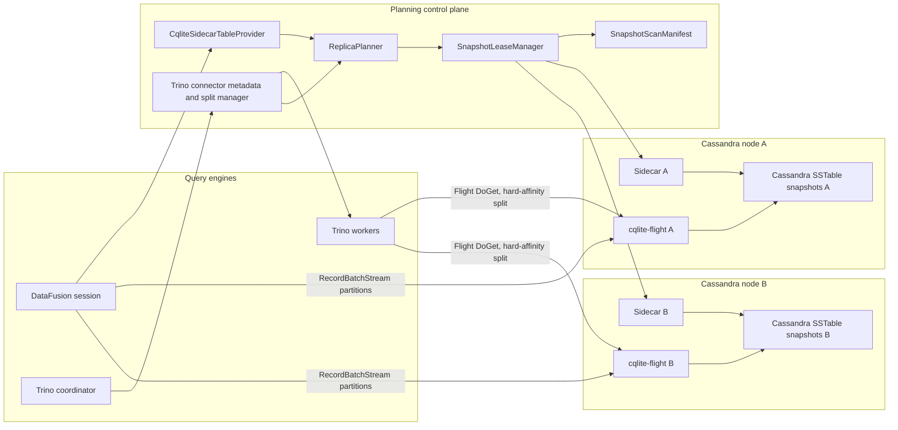
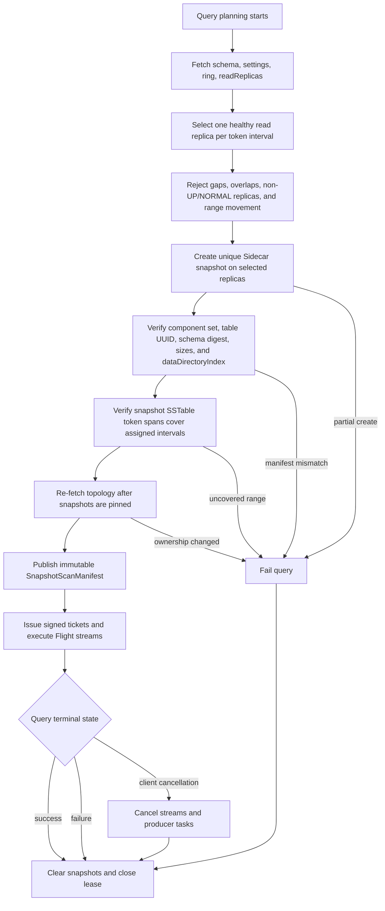
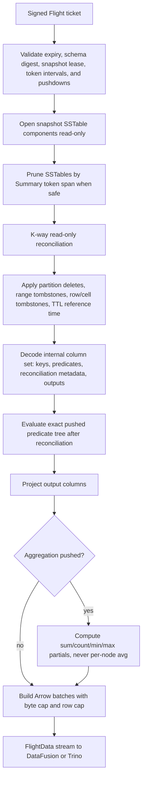
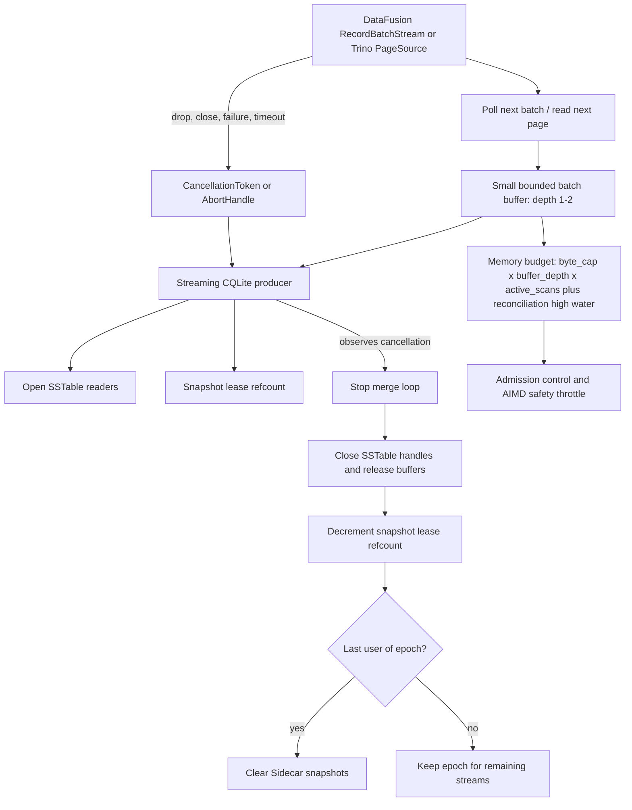

# Issue 941 Design A: Co-Located Flight-Backed DataFusion Provider

**Status:** Recommended first design
**Related overview:** [Issue 941 council analysis](issue-941-datafusion-table-provider-council.md)
**Core idea:** A DataFusion `TableProvider` uses Sidecar to plan a snapshot scan, then each DataFusion execution partition pulls Arrow batches from node-local `cqlite-flight` services.

## Executive summary

This design adds a DataFusion table provider without replacing the existing Trino connector. DataFusion gets a standard `TableProvider` over Cassandra snapshots. Trino continues to use its Java connector and MPP scheduler.

The live data path is:

```text
DataFusion Session
  -> CqliteSidecarTableProvider::scan(projection, filters, limit)
  -> Sidecar schema + token-range read replicas + snapshot epoch
  -> CqliteFlightExec partitions
  -> per partition: Arrow Flight DoGet(ticket)
  -> RecordBatch stream
```

For Trino, the equivalent path remains:

```text
Trino coordinator
  -> CqliteFlightSplitManager
  -> Trino workers
  -> CqliteFlightPageSource
  -> Arrow Flight DoGet(ticket)
  -> Trino Page
```

Both paths should share the same scan manifest, ticket fields, Sidecar snapshot lease logic, predicate capability rules, and metrics.

## Why this is the best first design

It reuses the strongest existing work:

- `cqlite-flight/src/ticket.rs` already has the wire contract for keyspace/table, DDL, snapshot, `(start, end]` token ranges, projection, predicate trees, and aggregation.
- `cqlite-flight/src/filter.rs` already lowers pushed predicates into CQLite's evaluator.
- `cqlite-flight/src/producer.rs` already drives the compaction merge, token filters partitions, prunes SSTables by token span where possible, builds full rows for predicates, and applies projection only at Arrow conversion.
- `cqlite-core/src/export/arrow_convert.rs` already maps CQL values into Arrow schemas and `RecordBatch` values.
- `trino-connector/.../CqliteFlightSplitManager.java` already demonstrates Sidecar token-range replicas to one selected replica per range.

The main implementation risk is bounded streaming, not the planner shape. `cqlite-flight` currently returns `Vec<RecordBatch>` from `producer.produce()` before encoding Flight output. For this design to scale, the producer must become a lazy stream with cancellation.

## Architecture diagrams

These diagrams are intended to make ownership boundaries explicit. DataFusion and Trino can share the same scan manifest, snapshot leases, and Flight ticket contract, but they do not share a query scheduler.

### System Architecture



Key boundary: Trino never delegates join, split, aggregation, or memory scheduling to DataFusion. The common artifact is the manifest/ticket contract, not a DataFusion physical plan.

### Snapshot Lease Lifecycle



The published epoch is a stable file-set contract only. It is not a Cassandra `QUORUM` read, not a cross-range transaction, and not a globally consistent cut.

### Split Planning And Token Coverage

```mermaid
flowchart LR
    Ring["Sidecar readReplicas ranges"] --> Canonical["Canonical token intervals: start exclusive, end inclusive"]
    Canonical --> Wrap["Wraparound interval if start > end: token > start OR token <= end"]
    Wrap --> Coverage["Coverage validator counts every ring interval exactly once"]
    Coverage --> Replica["ReplicaPlanner chooses one healthy replica per interval"]

    Replica --> DFPlan["DataFusion plan"]
    Replica --> TrinoPlan["Trino plan"]

    DFPlan --> DFGrouped["Group adjacent intervals by replica for fewer local scans"]
    DFGrouped --> DFPartitions["DataFusion ExecutionPlan partitions"]

    TrinoPlan --> ByteSplit["Create many byte-balanced splits per selected replica"]
    ByteSplit --> Affinity["ConnectorSplit addresses plus HARD_AFFINITY to co-located worker"]
    Affinity --> TrinoSplits["Trino worker PageSource per split"]

    DFPartitions --> Ticket["Ticket carries assigned interval set"]
    TrinoSplits --> Ticket
    Ticket --> Backstop["cqlite-flight row-level token membership backstop"]
```



The same correctness intervals feed both engines. The physical split policy differs: DataFusion can tolerate grouped partitions; Trino needs enough affinity splits per node for parallelism and straggler control.

### Flight DoGet Data Path



Projection pushdown reduces Arrow conversion and network bytes. It does not automatically reduce decode CPU until row assembly accepts the projected plus predicate column set instead of always rebuilding full `QueryRow` values.

### Cancellation And Backpressure



Dropping the receiver side of a channel is not sufficient by itself. The producer must be poll-driven by the stream, explicitly abortable, or wired to a cancellation token that it checks during merge and decode.

## Components

### `CqliteSidecarTableProvider`

Responsibilities:

- cache or lazily fetch Sidecar schema for a `keyspace.table`;
- expose an Arrow schema to DataFusion;
- implement `supports_filters_pushdown`;
- implement `scan(state, projection, filters, limit)`;
- create or acquire a snapshot epoch before building the execution plan;
- map projection indices to CQL column names;
- translate supported DataFusion expressions into the existing Flight predicate JSON tree;
- return residual filters by marking unsupported filters as unsupported, not silently dropping them;
- build `CqliteFlightExec`.

The provider should not own a long-running query scheduler. DataFusion owns local physical execution. Trino owns Trino MPP execution.

### `SnapshotLeaseManager`

Responsibilities:

- create globally unique snapshot names, for example `cqlite-q941-<query-id>-<epoch-nanos>`;
- fan out Sidecar `PUT /api/v1/keyspaces/:ks/tables/:table/snapshots/:snapshot` to selected nodes;
- verify every selected node exposes a complete component set;
- build an immutable epoch manifest;
- reference count active execution partitions;
- clear snapshots with `DELETE` on success, cancellation, or failure;
- run a janitor for leaked old snapshots.

The lease manager must not publish an epoch until coverage is complete. A partially-created epoch fails the query and triggers cleanup.

### `ReplicaPlanner`

Responsibilities:

- call Sidecar `GET /api/v1/keyspaces/:keyspace/token-range-replicas`;
- use `readReplicas`, not `writeReplicas`;
- filter replicas by `UP/NORMAL` state/status from `replicaMetadata`;
- prefer the configured local datacenter when possible;
- choose exactly one replica for each canonical `(start, end]` interval;
- verify complete ring coverage;
- group adjacent ranges by selected replica for scan efficiency.

The grouping rule matters. Sidecar token intervals are correctness boundaries, but they should not automatically be physical scan boundaries. Until CQLite can seek efficiently by token, the target should be one grouped scan per selected replica per table snapshot, not one full SSTable walk per vnode.

### `CqliteFlightExec`

DataFusion physical plan:

```rust
struct CqliteFlightExec {
    schema: SchemaRef,
    projected_columns: Vec<String>,
    partitions: Vec<CqliteFlightPartition>,
    filter_json: Option<JsonValue>,
    snapshot_epoch: SnapshotEpoch,
    fetch: Option<usize>,
    metrics: ExecutionPlanMetricsSet,
}
```

Each `partition` contains:

- selected host and Flight port;
- keyspace, table, DDL, schema digest;
- snapshot name;
- one or more token intervals assigned to that host;
- deadline and admission-control limits;
- exact pushed predicate tree;
- output projection.

`execute(partition, ctx)` opens a Flight `DoGet` stream and adapts returned Arrow IPC batches into a DataFusion `RecordBatchStream`.

Do not claim global output ordering. Each node-local merge may emit token-ordered partitions, but DataFusion may execute scan partitions concurrently and interleave batches.

### `cqlite-flight` node service

The node-local service remains the data plane:

- receives signed/validated tickets;
- resolves snapshot directories under Cassandra table directories;
- opens node-local SSTables read-only;
- performs read-only logical compaction merge;
- applies token filtering, predicate filtering, projection, and optional aggregation;
- emits Arrow batches.

Required change: move from `Vec<RecordBatch>` materialization to backpressured streaming. A good target is:

```text
KWayMergeCursor
  -> ReconciledRowStream
  -> PredicateProjectBatcher(row_cap, byte_cap)
  -> mpsc channel with small bound
  -> FlightDataEncoder
```

Dropping the client stream must cancel the producer task.

## DataFusion pushdown semantics

DataFusion gives `TableProvider::scan`:

- `projection: Option<&Vec<usize>>`
- `filters: &[Expr]`
- `limit: Option<usize>`

It also asks `supports_filters_pushdown` whether each filter is exact, inexact, or unsupported. The first implementation should be conservative:

| DataFusion expression | Pushdown result |
|---|---|
| `col = literal`, `col IN (...)`, `col > literal`, `col >= literal`, `col < literal`, `col <= literal`, supported scalar column | `Exact` |
| `AND` of exact children | `Exact` |
| `OR` or `NOT` where the whole tree translates to Flight `PredicateExpr` and all leaves are exact | `Exact` |
| unsupported CQL type, unsupported function, expression over multiple columns, casts with semantic risk | `Unsupported` |
| anything uncertain | `Unsupported` in v1 |

Avoid `Inexact` initially unless the provider proves DataFusion will retain the residual. A wrong `Exact` result is a correctness bug.

Projection pushdown maps indices to field names and sends them in `ticket.columns`. Internally, the node service must still decode:

- partition keys;
- clustering keys;
- predicate-only columns;
- columns needed for tombstone/TTL/reconciliation;
- output columns.

Limit pushdown should be ignored in v1, or treated only as a local per-partition fetch cap after exact filters. DataFusion must retain the global limit above the scan.

## Trino MPP behavior

Trino should not call DataFusion. It should continue to use the Java connector shape:

- `ConnectorMetadata.applyFilter` stores exact pushed predicates and returns residuals.
- `ConnectorMetadata.applyAggregation` pushes only measured-safe aggregates.
- `ConnectorSplitManager` creates token range groups pinned to selected replicas.
- `ConnectorPageSourceProvider` builds tickets and opens Flight streams.
- `ArrowToTrino` converts Arrow vectors to Trino `Page` blocks.

The shared artifact between Trino and DataFusion should be a language-neutral scan manifest, not a DataFusion plan. The existing `FlightTicket` can evolve into this manifest if it grows:

- `scan_id`
- `snapshot_epoch`
- `schema_digest`
- `required_internal_columns`
- `filter_exactness`
- `batch_row_cap`
- `batch_byte_cap`
- `deadline`
- `admission_class`
- signature fields

## Massive cluster scheduling

Planning must separate correctness intervals from physical splits.

Correctness intervals:

- Sidecar read replica token ranges, each `(start, end]`;
- every interval appears exactly once;
- selected replica chosen deterministically from healthy candidates.

Physical partitions:

- group adjacent correctness intervals by selected replica;
- target one or a small number of scans per selected node while CQLite lacks efficient token seeks;
- after token seeks land, split by estimated bytes/time, not vnode count;
- cap per-node concurrent scans.

Example:

```text
Sidecar intervals:
  R1 -> node-a
  R2 -> node-a
  R3 -> node-b
  R4 -> node-a

Physical partitions before token seek:
  node-a: [R1, R2, R4] in one snapshot scan with interval membership filter
  node-b: [R3]

Physical partitions after token seek:
  node-a: split grouped ranges by estimated bytes, each with bounded token seeks
  node-b: same
```

The scanner must still emit rows only for assigned token intervals.

## Snapshot consistency contract

V1 contract:

```text
Best-effort read-only analytics snapshot assembled from exactly one selected
healthy read replica per canonical token interval over a bounded snapshot
capture window.
```

This is intentionally not Cassandra `QUORUM`, not linearizable, and not a transaction across all replicas. It is a stable file-set contract for analytics.

If schema changes during planning:

- compare schema digest from initial planning to snapshot manifest;
- if mismatch, fail and ask caller to retry;
- never combine components from different table incarnations or schema digests.

TTL reference time:

- capture one query reference timestamp in the epoch manifest;
- evaluate TTL expiration against that time on every node;
- do not use per-node wall clocks during scan.

## Security

Tickets should be signed and short-lived. A ticket gives a service permission to read a snapshot path and token interval, so it must not be forgeable by arbitrary clients.

Recommended fields in signed ticket:

- keyspace/table/table UUID;
- snapshot epoch and snapshot name;
- token intervals;
- projection;
- exact predicate tree;
- aggregation spec;
- schema digest;
- expiration time;
- batch row/byte caps;
- caller identity or query id.

The node service should reject:

- live-dir reads unless explicitly enabled for dev;
- expired tickets;
- tickets with snapshot names not in the active lease registry;
- token intervals outside the manifest's assigned coverage;
- unsupported predicate operators or CQL types.

## Failure handling

| Failure | Behavior |
|---|---|
| selected replica down before epoch creation | choose another healthy replica before publishing epoch |
| selected replica down after epoch published | fail query, release lease |
| partial snapshot creation | fail query, cleanup partial snapshots |
| Flight stream error | surface query error, do not return clean EOF |
| client cancellation | abort Flight stream, cancel scan task, decrement lease refcount |
| schema digest mismatch | fail query before scan |
| unsupported predicate | leave as residual |
| unsupported type in DataFusion | either expose through Arrow if supported or fail planning with clear message |

## Performance model

Per selected node:

```text
scan_time ~= max(
  disk_bytes / disk_budget,
  decompressed_bytes / cpu_decompress,
  decoded_cells * decode_cost,
  merge_events * log2(sstable_fan_in),
  arrow_bytes / network_budget
)
```

Memory:

```text
memory ~= cursors
       + active partition state
       + open range tombstones
       + pending Arrow batch bytes
       + bounded channel bytes
       + aggregation group state
```

Target defaults:

- row cap: 8k rows per batch;
- byte cap: 8 MiB per batch;
- active scan channel: 1-4 batches;
- per-node active scans: 1-2;
- per-node analytics disk budget: 50-100 MiB/s or 10% of device bandwidth;
- per-node CPU budget: 10-15%.

## Validation

Correctness tests:

- ring coverage detects gaps/overlaps;
- one selected replica per interval;
- no duplicates with RF > 1;
- snapshot epoch fails on partial creation;
- schema digest mismatch fails;
- filters on projected-out columns still work;
- residual filters remain in DataFusion;
- TTL uses one reference time;
- tombstone and collection edge cases match Cassandra reference fixtures.

Performance tests:

- one grouped partition per node scans each SSTable once before token seek support;
- cancellation releases resources within a bounded time;
- time to first batch stays low for large tables;
- memory stays bounded for wide rows and high fan-in;
- aggregation pushdown declines high-cardinality groupings.

Trino integration tests:

- compare Trino results to DataFusion results over the same epoch manifest;
- verify pushed filters reduce Flight bytes while residual filters preserve correctness;
- verify aggregation pushdown output matches Trino local aggregation;
- verify cancellation cleans up snapshots.

## Pros and cons

Pros:

- reuses existing CQLite Flight and Trino work;
- keeps SSTable bytes local to Cassandra nodes;
- fits DataFusion's `TableProvider` and `ExecutionPlan` model;
- preserves Trino as the MPP scheduler;
- can expose the same scan path to Rust, Python, and CLI users.

Cons:

- requires running `cqlite-flight` co-located with every Cassandra node;
- requires careful snapshot lease fan-out and cleanup;
- current Flight implementation must be refactored for streaming;
- DataFusion's current Arrow version is ahead of the repo's Arrow 53, so provider-over-Flight may be easier than direct embedding until versions align.

## Recommended next steps

1. Define a shared `SnapshotScanManifest` JSON schema extending `FlightTicket`.
2. Implement snapshot lease creation and cleanup for the Trino connector first, because production live-dir reads are not acceptable.
3. Refactor `MergeProducer` to produce a bounded stream instead of `Vec<RecordBatch>`.
4. Add `cqlite-datafusion` or a gated module with `CqliteSidecarTableProvider` and `CqliteFlightExec`.
5. Reuse the Trino split tests as cross-language fixtures for DataFusion planning.
6. Add end-to-end comparison: DataFusion query and Trino query over the same snapshot epoch.

---

## Claude Council Review (2026-06-22)

**Verdict: this is the right first design and the most engine-literate of the three.** It reuses the strongest existing work and correctly identifies the only hard blocker (the `Vec<RecordBatch>` → streaming refactor, confirmed at `producer.rs:312` / `service.rs:186-198`). Approve as v1 direction. The items below are must-fixes before it is buildable or before any "correct"/"efficient" claim ships.

### DataFusion/Arrow — one sharp error, two missing surfaces

- **The cancellation claim is asserted but not implemented (lines 144, 293).** DataFusion cancels by dropping the `RecordBatchStream`; if the producer runs in a bare `tokio::spawn`, dropping the stream only drops the mpsc *receiver* — the spawned task keeps running, keeps SSTable handles open, and keeps the snapshot-lease refcount up. Fix: drive the producer inside the stream's own `poll_next` (no detached spawn), or store an `AbortHandle`/`JoinHandle` and `abort()` in a `Drop` impl, or thread a `CancellationToken` the producer polls.
- **No `PlanProperties`/`EmissionType`/`Boundedness`.** `CqliteFlightExec` (lines 98-107) must add `properties() -> &PlanProperties` carrying `Partitioning` (token-hash or `UnknownPartitioning(n)`), `EmissionType::Incremental`, and `Boundedness::Bounded`.
- **No `statistics()`** surfaced from the manifest — needed for join ordering and aggregate-strategy selection.
- **`OR`/`NOT` as `Exact` (line 160) is a foot-gun.** Returning `Exact` on an `OR` tree bets that every leaf's CQL three-valued/NULL/tombstone-vs-absent semantics exactly match DataFusion; one mistranslated leaf silently drops rows. Mark `OR`/`NOT` `Inexact` in v1 (still pushed, still correct).
- Before hand-rolling the `DoGet`→`RecordBatchStream` adapter (line 119), evaluate DataFusion's `FlightTableFactory`/`FlightExec` (`datafusion-table-providers`). The custom ticket is a legitimate reason to extend rather than adopt — but justify it rather than silently reinvent.

### Cassandra/Sidecar — block any correctness claim until these are explicit and tested

- **Min-token wraparound `(start, end]`.** The wrap segment has `start > end`, so membership is `token > start OR token <= end`. Coverage verification must count the `MIN_VALUE` boundary token exactly once. *(Code-grounding found `FlightTicket` already carries `wraparound: bool` and `token_in_half_open_range`, so this is partly handled at the ticket layer — make the membership predicate and full-ring coverage test explicit in the design, and confirm whether Sidecar emits the wrap as one interval or two.)*
- **Mid-query topology flux.** `readReplicas` can shift between the `token-range-replicas` call and the snapshot PUT; a NORMAL replica may not yet own (or may be shedding) its assigned range. Re-fetch topology and assert the selected replica still owns each `(start,end]` after snapshots are pinned; treat pending range movement as a hard fail in v1 (never silently switch).
- **Snapshot-vs-range coverage hole.** The "complete component set" check verifies files exist, not that they *cover* the token interval. Cross-check SSTable first/last-token spans against the assigned interval and surface uncovered sub-ranges.
- **`avg` pushdown** must ship sum+count partials merged at the coordinator, not a per-node `avg`.

### Trino/MPP — the split model is wrong *for Trino specifically*

- "One grouped scan per selected node" starves Trino, which wants *many* splits per node for driver parallelism, work-stealing, and straggler recovery. A single fat per-node split serializes that node on one core and makes one slow disk a query-wide straggler. **Decouple the engines:** grouped-per-node is fine for DataFusion (single process); for Trino emit many splits per node addressed to the same co-located worker, targeting ~seconds of work each. "Scan SSTables once" is a CQLite-reader concern, not a scheduling decision.
- **Affinity must become concrete** — `ConnectorSplit` addresses + a stated `NodeSelectionStrategy`.
- **Move the aggregation `rows/groups ≥ 4-10` heuristic out of the Trino connector** — Trino already runs adaptive partial aggregation; a hard-coded heuristic in `applyAggregation` fights the optimizer. Keep the heuristic only on the DataFusion side, which lacks the equivalent.

### Performance — memory needs arithmetic, the straggler fix shouldn't wait

- **The <128 MB target is plausibly blown under fan-out.** 8 MiB/batch × a 4-batch channel = 32 MiB *per active scan*, before reconciliation state, open range tombstones, K-way merge cursors, and the encoder's copy; ~64 MiB of channel buffers alone at 2 scans/node. Make `byte_cap` the *primary* governor, drop the channel to 1-2 batches, and budget `byte_cap × (depth+1) × active_scans + reconciliation_high_water` against 128 MB explicitly — likely forces byte_cap to 2-4 MiB or active_scans to 1 for wide tables. (The 8k-row/8-MiB batch *shape* is otherwise well chosen.)
- **Add byte-balanced intra-node splitting now, not "after token seeks."** Open the same SSTable set once but partition the Summary/Index range into K byte-balanced sub-scans with interval-membership filters — recovers multi-core throughput and kills the straggler without redundant SSTable opens.
- **Wide-partition TTFB:** per-partition reconciliation means a multi-GB wide partition fully assembles before its first row emits. Cap per-partition assembly and emit in clustering-order chunks where reconciliation allows, or add a wide-partition guardrail.

**Bottom line:** correct architecture, correct instincts, correct blocker. Must-fix before build: real cancellation (not bare spawn), `PlanProperties`+`statistics()`, Trino split-count/affinity, byte-cap-primary memory budgeting, and the wraparound/topology correctness tests.
