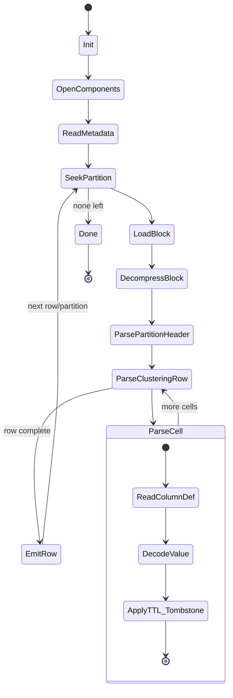

# Architecture: Schema‑Driven, Hybrid State‑Machine Parser for Cassandra 5 SSTables

## 1) Purpose & Scope

Design a Rust library that reads Apache Cassandra 5 SSTables from a directory (potentially thousands of files) and returns typed rows/columns using the live CQL schema. The core ideas:

* **Hybrid flow:** fast *candidate narrowing* across many SSTables + a **schema‑guided state machine** for precise binary parsing of each selected SSTable.
* **Grammar‑driven generation:** derive (or validate) parsers/states from the CQL grammar (ANTLR `.g`), minimizing future rewrites when syntax evolves.
* **Composable engine:** clear boundaries between discovery/indexing, binary parsing, and row materialization.

---

## 2) Key Requirements

* **R1 — Scale:** Efficient with thousands of SSTables in one directory.
* **R2 — Correctness:** Exact decoding of Cassandra 5 SSTable components using the provided table schema (PK, CK, static/regular columns, types).
* **R3 — Version awareness:** Clean separation for format/version quirks (e.g., component sets).
* **R4 — Extensibility:** Grammar updates do not require parser rewrites; states are generated/parameterized from grammar & schema.
* **R5 — Parallelism & backpressure:** Parallel candidate narrowing; controlled concurrency for IO/decompression.
* **R6 — Ergonomics:** Simple API: `open(dir) -> reader`, `reader.scan(query|predicate|key)`.

---

## 3) High‑Level Design

### 3.1 Hybridized Read Flow

1. **Manifest Build (once per directory):** Detect SSTable component groups (`*.Data.db`, `*.Index.db`, `*.Filter.db` (Bloom), `*.Summary.db`, `*.CompressionInfo.db`, `*.Statistics.db`, `*.TOC.txt`, digests).
2. **Candidate Narrowing:** Use **Bloom filter**, **Summary** + **Partition Index** to reduce N SSTables → K candidates for a given key/range/predicate.
3. **Schema‑Guided Parse (per candidate):** A **state machine** walks `Data.db` + `Index.db` (+ `CompressionInfo.db` when needed) to reconstruct partitions/rows/cells according to the table schema and types.
4. **Materialization:** Produce typed rows (Rust structs or columnar iterators), with optional projection and predicate pushdown.
5. **Iteration & Merge:** Multi‑SSTable merge with timestamp/tombstone resolution (read‑path semantics only; no compaction).

### 3.2 Why a State Machine (just for file parsing)

* SSTables are linear binary structures with well‑defined segments and markers. A state machine provides **deterministic control** over reading headers, partition keys, clustering segments, cell blocks, and tombstones—**exactly where correctness matters most**.
* The **hybrid** approach prevents the state machine from shouldering directory‑scale search; it only engages after we’ve narrowed to the right files.

---

## 4) Components

* **Schema Provider:** Consumes CQL schema (or system tables dump) → normalized `TableSpec` (PK/CK order, column types, UDTs, collections).
* **Grammar Adapter (Optional/Pluggable):** Uses ANTLR grammar artifacts to generate or validate the parser/state transitions. Goal: **regenerate** states when grammar evolves.
* **Directory Manifest:** Maps SSTable component sets by generation/level, format version, and table id.
* **Index Layer:** Abstractions over Bloom/summary/partition index; provides `find_candidates(key|range|token)` and optional **predicate hints**.
* **State‑Machine Parser:** Deterministic states for:

  * Open & verify component set
  * Read metadata & version headers
  * Locate partition via index
  * Navigate block offsets & decompress as needed
  * Parse partition header → clustering rows → cells → tombstones & TTLs
  * Decode by **type** (primitives, collections, UDTs) from `TableSpec`
* **Exec Engine:** Orchestrates the pipeline with worker pools, backpressure, and per‑table caches.
* **Result Layer:** Iterators/builders to emit rows (row‑oriented), or columnar batches (for CSV/Parquet/Arrow sinks).

---

## 5) Mermaid Flow (End‑to‑End Read)

```mermaid
flowchart TD
    A[Input:\n- Directory path\n- Table schema (CQL)\n- Query: key/range/predicate] --> B[Build/Load Manifest\n(group SSTable components)]

    B --> C[Candidate Narrowing]
    C --> C1[Check Bloom Filter(s)]
    C1 --> C2[Consult Summary & Partition Index]
    C2 -->|K candidates| D{Any candidates?}
    D -- No --> Z[Return Empty Iterator]
    D -- Yes --> E[Initialize Parser State Machine\n(using TableSpec + Grammar Adapter)]

    E --> F[Open Candidate SSTable Components\n(Data.db, Index.db, CompressionInfo.db, ...)]
    F --> G[Locate Partition Block(s)\nvia Index Offsets]
    G --> H[Map/Read Compressed Chunks]
    H --> I[Decompress Chunks as Needed]
    I --> J[State: Partition Header]
    J --> K[State: Clustering Row Loop]
    K --> L[State: Cell Decode (types, TTLs, tombstones)]
    L --> M{More Rows?}
    M -- Yes --> K
    M -- No --> N[Emit Materialized Rows]
    N --> O{More Candidates?}
    O -- Yes --> F
    O -- No --> P[Merge/Order Results\n(timestamp & tombstone rules)]
    P --> Q[Project/Filter\n(early if possible)]
    Q --> R[Return Row/Batch Iterator]
```

---

## 6) State‑Machine Outline (Parsing Core)

**States (examples):**

* `Init` → `OpenComponents` → `ReadMetadata`
* `SeekPartition` → `LoadBlock` → `DecompressBlock`
* `ParsePartitionHeader`
* `ParseClusteringRow` (loop)
* `ParseCell` (decode value by type; handle LivenessInfo, TTL, tombstones)
* `EmitRow` → `NextClusteringOrEnd`
* `Done` / `Error`

**Transitions** are driven by:

* Offsets from `Index.db`/summary
* Compression chunk boundaries
* On‑disk markers (e.g., end‑of‑partition)
* Column/Type info from `TableSpec`

---

## 7) Rust Implementation Plan

### 7.1 Crate Layout

```
cqlite-sstable/
  ├─ manifest/          # Directory scan & component grouping
  ├─ schema/            # TableSpec, types, UDTs, collections
  ├─ grammar/           # Adapters for ANTLR outputs (optional)
  ├─ index/             # Bloom, Summary, PartitionIndex abstractions
  ├─ io/                # Mmap or buffered IO, decompression
  ├─ parse/             # State machine + binary decoders
  ├─ exec/              # Orchestration, pools, backpressure
  ├─ result/            # Row/columnar iterators, sinks
  └─ api/               # Public API (open, scan, get, range, export)
```

### 7.2 Notable Crates (options)

* **State machine:** `rust-fsm`, `typestate`, or a compact custom enum‑driven state loop (often fastest/clearest for binary parsers).
* **Parsing/decoding:** `nom` (binary parser combinators), or `chumsky`/`pest` for grammar‑heavy layers. For the binary SSTable core, `nom` is a strong fit.
* **Compression:** `lz4_flex` / `snap` (Snappy) as needed by format.
* **Zero‑copy IO:** `memmap2` for read‑only mmap; fall back to buffered reads for portability.
* **Columnar out:** `parquet` / `arrow` (optional export path).

*(Exact choices can be swapped; the interfaces above keep it modular.)*

---

## 8) Performance Strategy

* **Avoid directory‑scale scanning per query:** cache manifest + per‑SSTable summaries/Blooms in memory.
* **Parallel candidate tests:** a pool to probe Blooms/Summaries concurrently; short‑circuit on empty.
* **Mmap hot data; buffered fallback:** prefer `mmap` to reduce syscalls; align reads to compression chunks.
* **Chunk‑aware decompression:** only decompress the chunks that contain the target rows.
* **Early projection & predicate pushdown:** skip decoding unused columns; push predicates into clustering traversal when possible.
* **Object reuse:** arenas/byte buffers to minimize allocations during tight parse loops.
* **Metrics:** time per stage (bloom, index, io, decompress, decode) + cache hit rates.

---

## 9) Error Handling & Observability

* **Typed errors:** `OpenError`, `CorruptComponent`, `VersionMismatch`, `DecodeError{offset,...}`, `UnsupportedFeature`.
* **Recovery:** best‑effort skip of corrupt partitions with counters; configurable strictness.
* **Tracing:** spans around IO/decompression/parse; log file id + offset on failures.
* **Validation tools:** offline verifier to cross‑check decoded rows vs. known test vectors.

---

## 10) Versioning & Compatibility

* **Format traits:** `trait SStableFormat { ... }` implemented per major format; component detection from `TOC.txt` & headers.
* **Schema evolution:** `TableSpec` holds current schema; cell decode honors column definitions in effect for the SSTable’s write time (if available) or the provided schema—configurable policy.
* **Grammar evolution:** the **grammar adapter** regenerates or validates parsers/state maps from updated ANTLR artifacts.

---

## 11) Public API Sketch (ergonomic)

```rust
let reader = SstableReader::open(dir)
    .with_schema(schema)            // TableSpec from CQL
    .build()?;

// Point lookups
if let Some(row) = reader.get(primary_key)? {
    println!("{row:?}");
}

// Range / predicate scan
for row in reader.scan(range).project(&["col_a", "col_b"]).into_iter() {
    // consume
}

// Exports
reader.scan(all).to_parquet("out.parquet")?;
```

---

## 12) Testing Strategy

* **Golden files:** small SSTable fixtures generated by Cassandra 5.
* **Property tests:** random rows round‑trip through encode→parse→normalize.
* **Corruption tests:** truncated chunk, bad CRC, missing component, wrong TOC.
* **Performance baselines:** keys/sec and MiB/sec across N, K, and row widths.
* **Cross‑impl checks:** compare results with `sstabledump` (when available).

---

## 13) Trade‑offs & “Why This Isn’t Over‑Engineered”

* The **state machine** is scoped to **binary decode**, where determinism and correctness dominate; it **does not** manage directory‑level search.
* The **hybrid** candidate narrowing preserves Cassandra’s read‑path virtues (Bloom/summary/index) without entangling them inside the parsing FSM.
* Grammar‑driven generation minimizes long‑term maintenance when CQL syntax or on‑disk encodings evolve.

---

## 14) Future Extensions

* **Row cache hooks** for repeated point lookups.
* **Tombstone pruning hints** during scans.
* **Columnar‑native path** (Arrow) for analytics pipelines.
* **Pluggable compaction‑style merge** (read‑only reconcile today; optional background “offline compaction” later).
* **Corruption detector mode** (scan + anomaly reporting) for ops tooling.

---

## 15) Mermaid: Parser State (Zoom‑In)



---

## 16) “Build vs. Borrow” References (for the codebase)

* **State machine:** `rust-fsm` or custom enum loop with `match state` (often fastest/clearest for tight decoding).
* **Binary parsing:** `nom` for byte‑level parsers; custom combinators for SSTable markers.
* **Compression:** `lz4_flex`, `snap`.
* **IO:** `memmap2` (read‑only mmaps) + buffered fallback.

---

## 17) Delivery Milestones

1. **M1 — Manifest & Candidate Narrowing:** directory scan, Bloom/summary/index probes, API: `find_candidates(key)`.
2. **M2 — Minimal FSM Decoder:** single SSTable, partition lookup → one row end‑to‑end (no collections/UDTs).
3. **M3 — Full Type Coverage:** primitives, collections, UDTs, TTL/tombstones.
4. **M4 — Parallelism & Backpressure:** pool for K candidates, chunk‑aware IO/decompression.
5. **M5 — Exports & Columnar:** CSV/JSON first; Arrow/Parquet next.
6. **M6 — Grammar Adapter:** scaffold to consume ANTLR artifacts → state map validation/generation.

---

### TL;DR

Use **Bloom/summary/index** to find the right files fast, then a **schema‑driven state machine** to decode the binary precisely. Keep grammar changes from becoming rewrites by **generating/validating states from the CQL grammar**. The result is fast at scale and rock‑solid on correctness.
