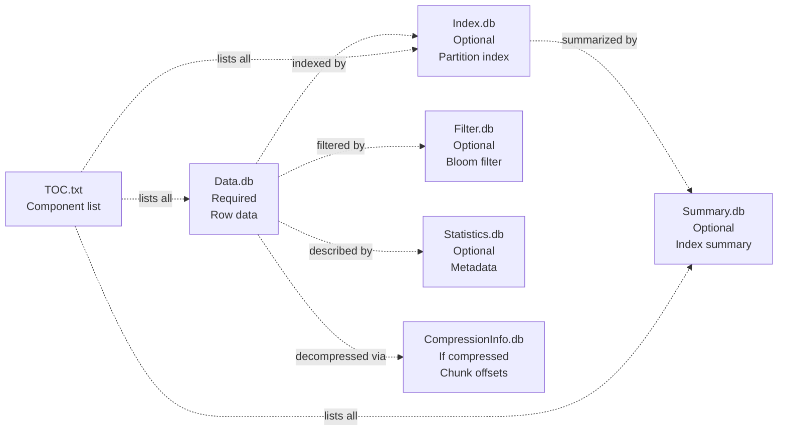

# CQLite-Core Read Path: Overview

**Navigation**: [Overview](./00-overview.md) | [Query Engine →](./01-query-engine.md)

---

## High-Level Architecture

This diagram shows the complete flow of a SELECT query through cqlite-core, from the initial `Database.execute()` call to returning results from disk.

```mermaid
flowchart TD
    Start([User: CQL SELECT query]) --> DB[Database::execute\ncqlite-core/src/lib.rs:302]
    
    DB --> QE[QueryEngine::execute\nquery/engine.rs:102]
    
    QE --> IsSelect{SELECT\nquery?}
    IsSelect -->|Yes| AdvSelect[Advanced SELECT Path\nSee diagram 01]
    IsSelect -->|No| SimpleExec[Simple Executor\nquery/executor.rs]
    
    AdvSelect --> SelectParser[select_parser::parse_select\nquery/select_parser.rs:199]
    SelectParser --> SelectOpt[SelectOptimizer::optimize\nquery/select_optimizer.rs:82]
    SelectOpt --> SelectExec[SelectExecutor::execute\nquery/select_executor.rs:89]
    
    SimpleExec --> Storage[StorageEngine\nSee diagram 02]
    SelectExec --> Storage
    
    Storage --> SSTableMgr[SSTableManager\nstorage/sstable/mod.rs:127]
    
    SSTableMgr --> TableMap{Find SSTable\nby table name}
    TableMap --> Reader[SSTableReader\nSee diagram 03, 04]
    
    Reader --> HasIndex{Has Index.db?}
    HasIndex -->|Yes| IndexPath[Index-Based Lookup\nSee diagram 03]
    HasIndex -->|No| SeqPath[Sequential Scan\nSee diagram 04]
    
    IndexPath --> IsCompressed{Compressed?}
    SeqPath --> IsCompressed
    
    IsCompressed -->|Yes| CompPath[Compressed Read\nSee diagram 05]
    IsCompressed -->|No| UncompPath[Direct Read\nSee diagram 06]
    
    CompPath --> Parse[Parse Binary Data\nSee diagram 07]
    UncompPath --> Parse
    
    Parse --> HasSchema{Schema\navailable?}
    HasSchema -->|Yes| SchemaAware[Schema-Aware Parse\nSee diagram 08]
    HasSchema -->|No| Heuristic[Heuristic Parse\nparser/binary.rs]
    
    SchemaAware --> Results[QueryResult]
    Heuristic --> Results
    
    Results --> End([Return to User])
    
    style Start fill:#e1f5e1
    style End fill:#e1f5e1
    style DB fill:#fff3cd
    style QE fill:#fff3cd
    style Storage fill:#cfe2ff
    style Reader fill:#cfe2ff
    style Parse fill:#f8d7da
    style Results fill:#d1ecf1
```



## Component Overview

### 1. Database Entry Point
**File**: `cqlite-core/src/lib.rs`

The `Database` struct is the main public API. The `execute()` method at line 302 is the entry point for all CQL queries.

```rust
pub async fn execute(&self, cql: &str) -> Result<query::result::QueryResult>
```

### 2. Query Engine
**File**: `cqlite-core/src/query/engine.rs`

The `QueryEngine` orchestrates query parsing, planning, and execution. Key responsibilities:
- Detect SELECT vs other query types (line ~111-125)
- Route to advanced SELECT parser or simple executor
- Manage query plan caching
- Track query statistics

**→ [Detailed view in Diagram 01](./01-query-engine.md)**

### 3. Storage Engine
**File**: `cqlite-core/src/storage/mod.rs`

The `StorageEngine` coordinates access to persistent storage:
- Manages `SSTableManager` for file-based access
- Routes queries to correct SSTable files
- Handles memtable for recent writes (not shown in read path)

**→ [Detailed view in Diagram 02](./02-storage-engine.md)**

### 4. SSTable Reader
**Files**: 
- `cqlite-core/src/storage/sstable/mod.rs` (Manager)
- `cqlite-core/src/storage/sstable/reader/mod.rs` (Reader)

The SSTable layer provides read access to Cassandra 5.0+ format files:
- **Index-based lookup**: Fast point queries using Index.db
- **Sequential scan**: Fallback when no index or for range queries

**→ [Index path in Diagram 03](./03-sstable-index-lookup.md)**  
**→ [Sequential path in Diagram 04](./04-sstable-sequential-scan.md)**

### 5. Compression Handling
**Files**:
- `cqlite-core/src/storage/sstable/reader/compression.rs`
- `cqlite-core/src/storage/sstable/chunked_data_reader.rs`

Compressed SSTables require special handling:
- Detect compression from header or CompressionInfo.db
- Read data in chunks with proper decompression
- Support LZ4, Snappy, Zstd algorithms

**→ [Compressed path in Diagram 05](./05-compressed-data.md)**  
**→ [Uncompressed path in Diagram 06](./06-uncompressed-data.md)**

### 6. Data Parsing
**Files**:
- `cqlite-core/src/parser/binary.rs`
- `cqlite-core/src/storage/sstable/reader/parsing/`

Convert binary SSTable format to Rust `Value` types:
- Parse variable-length integers (vint)
- Extract keys and values
- Handle Cassandra 5.0 format specifics

**→ [Parsing details in Diagram 07](./07-data-parsing.md)**  
**→ [Schema-aware parsing in Diagram 08](./08-schema-aware.md)**

## Key Decision Points

### 1. SELECT Detection (Line ~111 in engine.rs)
```rust
if trimmed_cql.starts_with("SELECT") {
    return self.execute_select_query(cql, start_time).await;
}
```
Determines whether to use advanced SELECT parser or simple executor.

### 2. Index Availability
If `Index.db` exists and is loaded, use index-based lookup for O(log n) performance. Otherwise, fall back to sequential scan O(n).

### 3. Compression Detection
Check header compression field and CompressionInfo.db presence to determine if chunked decompression is needed.

### 4. Schema Availability
With schema metadata, parsing is type-driven and accurate. Without schema, use heuristic detection (less reliable for complex types).

## Component File Dependencies

Each SSTable consists of multiple component files:



**→ [Component details in Diagram 09](./09-component-architecture.md)**

## Performance Characteristics

| Path | Time Complexity | Use Case |
|------|----------------|----------|
| Index Lookup | O(log n) | Point queries with WHERE on partition key |
| Sequential Scan | O(n) | Full table scans, no index available |
| Compressed Read | +30-50% overhead | Saves disk space, adds CPU cost |
| Schema-Aware Parse | -20% parsing time | Accurate types, no heuristics |

## Related Diagrams

1. **[Query Engine Details](./01-query-engine.md)** - CQL parsing and execution planning
2. **[Storage Engine Details](./02-storage-engine.md)** - SSTable file routing
3. **[Index-Based Lookup](./03-sstable-index-lookup.md)** - Fast lookups with Index.db
4. **[Sequential Scan](./04-sstable-sequential-scan.md)** - Fallback scanning path
5. **[Compressed Data Path](./05-compressed-data.md)** - Chunked decompression
6. **[Uncompressed Data Path](./06-uncompressed-data.md)** - Direct binary reads
7. **[Data Parsing](./07-data-parsing.md)** - Binary to Value conversion
8. **[Schema-Aware Reading](./08-schema-aware.md)** - Type-driven parsing
9. **[Component Architecture](./09-component-architecture.md)** - SSTable file ecosystem

---

**Next**: [Query Engine Details →](./01-query-engine.md)

