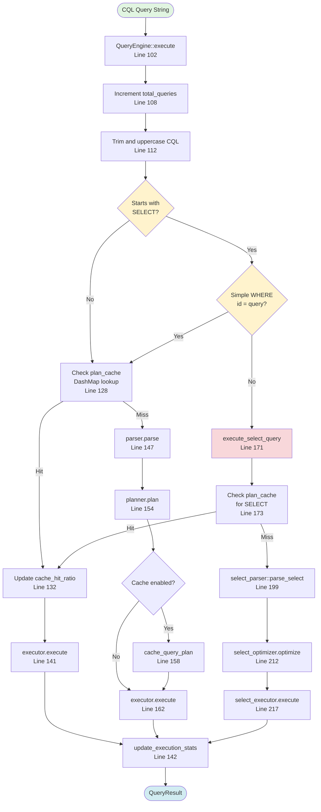
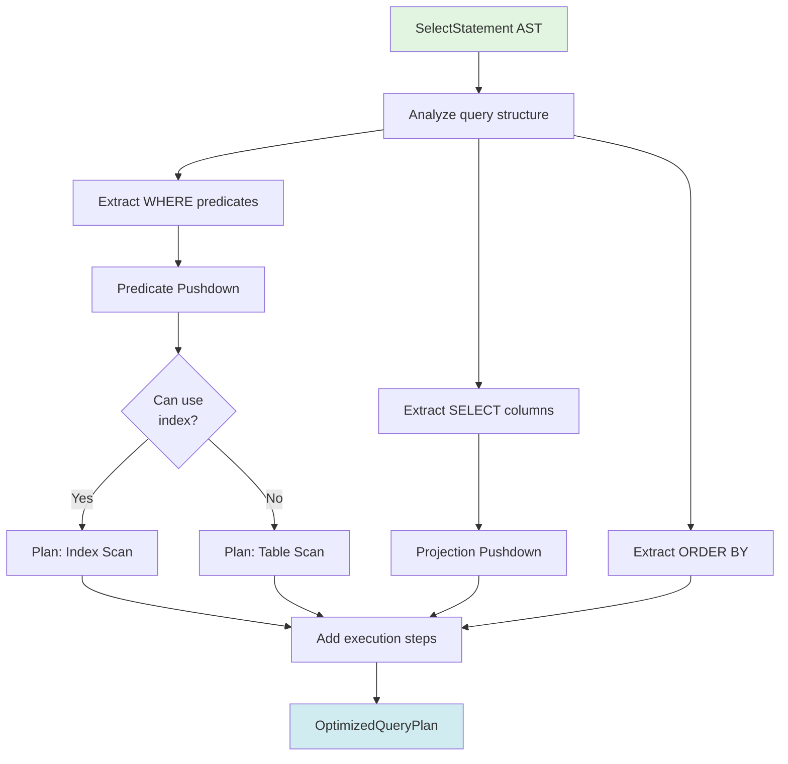
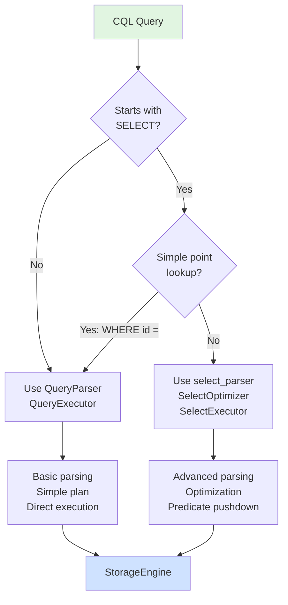

# Query Engine: CQL Parsing and Execution Planning

**Navigation**: [← Overview](./00-overview.md) | [Query Engine](./01-query-engine.md) | [Storage Engine →](./02-storage-engine.md)

---

## Purpose

The Query Engine is responsible for:
1. Parsing CQL queries into AST
2. Optimizing query plans
3. Routing to appropriate executors
4. Managing query caching
5. Tracking execution statistics

**File**: `cqlite-core/src/query/engine.rs`

## Query Execution Flow



## Key Components

### 1. QueryEngine Struct
**File**: `query/engine.rs`, Lines 44-66

```rust
pub struct QueryEngine {
    parser: QueryParser,           // CQL parser
    planner: QueryPlanner,         // Query planner
    executor: QueryExecutor,       // Simple executor
    select_optimizer: SelectOptimizer,  // Advanced optimizer
    select_executor: SelectExecutor,    // Advanced executor
    prepared_cache: DashMap<String, Arc<PreparedQuery>>,
    plan_cache: DashMap<String, QueryCacheEntry>,
    stats: Arc<parking_lot::RwLock<QueryStats>>,
    config: Config,
}
```

### 2. Execute Method Entry Point
**Lines 102-168**

The main entry point that handles:
- Statistics tracking
- SELECT detection
- Plan caching
- Error handling

```rust
pub async fn execute(&self, cql: &str) -> Result<QueryResult> {
    let start_time = Instant::now();
    
    // Update stats
    {
        let mut stats = self.stats.write();
        stats.total_queries += 1;
    }
    
    // Check if SELECT
    let trimmed_cql = cql.trim().to_uppercase();
    if trimmed_cql.starts_with("SELECT") {
        // Route to advanced SELECT handler
        return self.execute_select_query(cql, start_time).await;
    }
    
    // ... cache lookup and execution ...
}
```

### 3. SELECT Query Path
**Lines 171-222**

Advanced path for SELECT statements:

```rust
async fn execute_select_query(&self, cql: &str, start_time: Instant) -> Result<QueryResult> {
    // Check cache
    if let Some(mut cached_entry) = self.plan_cache.get_mut(cql) {
        // Use cached plan
    }
    
    // Parse with advanced SELECT parser
    let select_statement = select_parser::parse_select(cql)?;
    
    // Optimize
    let optimized_plan = self.select_optimizer.optimize(select_statement).await?;
    
    // Execute
    let mut result = self.select_executor.execute(optimized_plan).await?;
    self.update_execution_stats(&mut result, start_time);
    Ok(result)
}
```

## Query Parsing Details

### Simple Query Parser
**File**: `query/parser.rs`

Handles basic CQL parsing for CREATE, INSERT, UPDATE, DELETE:
- Tokenization
- AST construction
- Basic validation

### Advanced SELECT Parser
**File**: `query/select_parser.rs`, Line 199

Specialized parser for SELECT with:
- Column projection
- WHERE clause predicates
- JOIN operations
- GROUP BY / HAVING
- ORDER BY
- LIMIT / OFFSET


## Query Planning and Optimization

### Query Planner
**File**: `query/planner.rs`

Creates execution plans with:
- Cost estimation
- Index selection
- Join order optimization
- Parallelization hints

### SELECT Optimizer
**File**: `query/select_optimizer.rs`, Line 82

Advanced optimization for SELECT:
- **Predicate pushdown**: Move filters to SSTable scan
- **Projection pushdown**: Read only required columns
- **Index selection**: Choose best index for query
- **Partition pruning**: Skip irrelevant SSTables



## Query Execution

### Simple Executor
**File**: `query/executor.rs`, Lines 45-54

Executes plans for non-SELECT queries:
- CREATE TABLE
- INSERT
- UPDATE
- DELETE

### SELECT Executor
**File**: `query/select_executor.rs`, Line 89

Specialized executor for SELECT with:
- SSTable scanning
- Filtering
- Sorting
- Aggregation
- Limiting

**→ [See Storage Engine for SSTable access](./02-storage-engine.md)**

```rust
pub async fn execute(&self, plan: OptimizedQueryPlan) -> Result<QueryResult> {
    // Extract table ID
    let table_id = self.extract_table_id(&plan.statement.from_clause)?;
    
    // Execute each step
    for step in &plan.execution_steps {
        match step {
            ExecutionStep::SSTableScan { table, predicates, projection, .. } => {
                // Scan SSTable with pushdown filters
                self.execute_sstable_scan(table, predicates, projection).await?
            }
            ExecutionStep::Filter { expression, .. } => {
                // Apply filter
            }
            ExecutionStep::Sort { order_by, .. } => {
                // Sort results
            }
            // ... more steps ...
        }
    }
}
```

## Plan Caching

### Cache Structure
**Lines 59-61**

Two caches for performance:

```rust
prepared_cache: DashMap<String, Arc<PreparedQuery>>,  // Prepared statements
plan_cache: DashMap<String, QueryCacheEntry>,          // Query plans
```

### Cache Entry
**Lines 31-41**

```rust
pub struct QueryCacheEntry {
    pub parsed_query: ParsedQuery,
    pub plan: QueryPlan,
    pub cached_at: Instant,
    pub hit_count: u64,
}
```

### Cache Management
**Lines 402-436**

LRU eviction when cache is full:

```rust
fn cache_query_plan(&self, cql: &str, parsed_query: ParsedQuery, plan: QueryPlan) {
    let cache_size = self.config.query.query_cache_size.unwrap_or(0);
    
    if cache_size > 0 {
        // Check if we need to evict
        if self.plan_cache.len() >= cache_size {
            // Find oldest entry
            let oldest_key = self.plan_cache.iter()
                .min_by_key(|entry| entry.cached_at)
                .map(|entry| entry.key().clone());
            
            if let Some(key) = oldest_key {
                self.plan_cache.remove(&key);
            }
        }
        
        // Add new entry
        self.plan_cache.insert(cql.to_string(), QueryCacheEntry { ... });
    }
}
```

## Statistics Tracking

### Query Stats
**Lines 439-463**

Tracks performance metrics:

```rust
fn update_execution_stats(&self, result: &mut QueryResult, start_time: Instant) {
    let execution_time = start_time.elapsed();
    result.execution_time_ms = execution_time.as_millis() as u64;
    
    let mut stats = self.stats.write();
    
    // Update running average
    stats.avg_execution_time_us = 
        ((old_avg * (stats.total_queries - 1)) + new_time_us) 
        / stats.total_queries;
    
    stats.rows_affected += result.rows_affected;
}
```

### Metrics Tracked
- Total queries executed
- Average execution time
- Cache hit ratio
- Error query count
- Rows affected

## Decision Flow: Simple vs Advanced SELECT



**Rationale**: Simple point lookups (`WHERE id = ?`) use the normal executor for consistent key handling. Complex SELECTs use the advanced path for optimization.

## Related Diagrams

- **[← Back to Overview](./00-overview.md)** - High-level architecture
- **[Storage Engine →](./02-storage-engine.md)** - Where queries are executed
- **[Index Lookup](./03-sstable-index-lookup.md)** - How point queries are optimized
- **[Data Parsing](./07-data-parsing.md)** - Converting results to Values

---

**Next**: [Storage Engine Details →](./02-storage-engine.md)

