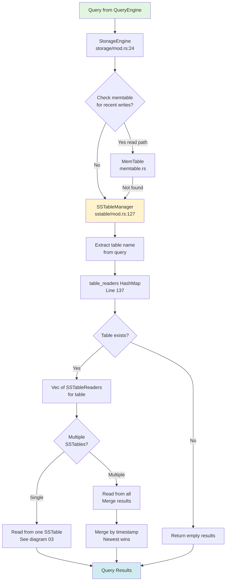
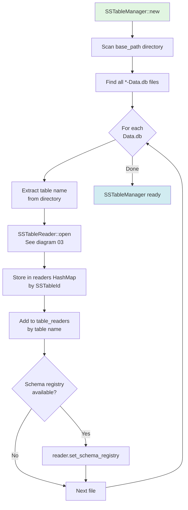
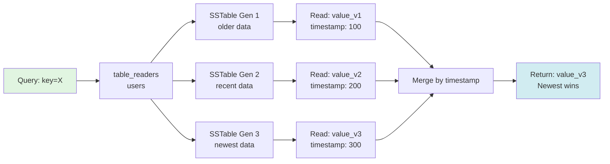
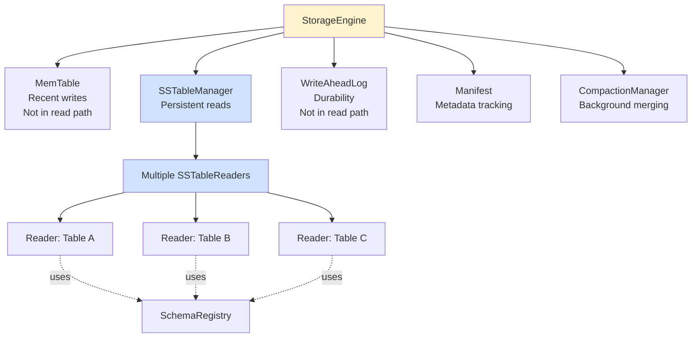

# Storage Engine: SSTable Routing and Management

**Navigation**: [← Query Engine](./01-query-engine.md) | [Storage Engine](./02-storage-engine.md) | [Index Lookup →](./03-sstable-index-lookup.md)

---

## Purpose

The Storage Engine coordinates access to persistent storage by:
1. Managing multiple SSTable files
2. Routing queries to correct tables
3. Coordinating reads across components (memtable, SSTables, WAL)
4. Handling schema registry for type-aware operations

**File**: `cqlite-core/src/storage/mod.rs`

## Storage Engine Architecture



## StorageEngine Struct

**File**: `storage/mod.rs`, Lines 24-55

```rust
pub struct StorageEngine {
    /// In-memory write buffer (not used in read path)
    memtable: Arc<RwLock<memtable::MemTable>>,
    
    /// SSTable manager for persistent storage
    sstables: Arc<sstable::SSTableManager>,
    
    /// Write-ahead log for durability (not used in read path)
    wal: Arc<wal::WriteAheadLog>,
    
    /// Compaction manager (background process)
    compaction: Arc<compaction::CompactionManager>,
    
    /// Manifest for metadata
    manifest: Arc<manifest::Manifest>,
    
    /// Platform abstraction for I/O
    _platform: Arc<Platform>,
    
    /// Configuration
    config: Config,
    
    /// Batch writer (not used in read path)
    batch_writer: Option<BatchWriter>,
    
    /// Schema registry for schema-aware operations
    #[cfg(feature = "state_machine")]
    schema_registry: Arc<RwLock<Option<Arc<RwLock<crate::schema::SchemaRegistry>>>>>,
}
```

## SSTable Manager

**File**: `storage/sstable/mod.rs`, Lines 127-148

The SSTableManager maintains mappings from table names to SSTable files:

```rust
pub struct SSTableManager {
    /// Base directory for SSTable files
    base_path: PathBuf,
    
    /// Active SSTable readers indexed by ID
    readers: Arc<RwLock<HashMap<SSTableId, Arc<reader::SSTableReader>>>>,
    
    /// Table name to SSTable readers mapping
    /// Maps table names (e.g., "simple_table") to their SSTableReaders
    table_readers: Arc<RwLock<HashMap<String, Vec<Arc<reader::SSTableReader>>>>>,
    
    /// Platform abstraction
    platform: Arc<Platform>,
    
    /// Configuration
    config: Config,
    
    /// Schema registry
    #[cfg(feature = "state_machine")]
    schema_registry: Arc<RwLock<Option<Arc<RwLock<crate::schema::SchemaRegistry>>>>>,
}
```

## Table Name Extraction

SSTable files are organized in directories with Cassandra naming convention:

```
/data/keyspace/tablename-UUID/na-1-big-Data.db
```

**File**: `storage/sstable/mod.rs`, Lines 106-124

```rust
pub(crate) fn extract_table_name(sstable_path: &Path) -> Option<String> {
    // Get the parent directory name
    let dir_name = sstable_path.parent()?.file_name()?.to_str()?;
    
    // Find the last occurrence of '-' followed by 32 hex chars (UUID)
    // Example: "simple_table-6aa08200a25111f0a3fef1a551383fb9"
    if let Some(uuid_start) = dir_name.rfind('-') {
        let potential_uuid = &dir_name[uuid_start + 1..];
        
        // Check if this looks like a UUID (32 hex characters)
        if potential_uuid.len() == 32 
            && potential_uuid.chars().all(|c| c.is_ascii_hexdigit()) {
            // Extract everything before the UUID
            return Some(dir_name[..uuid_start].to_string());
        }
    }
    
    // If no UUID pattern found, return whole directory name
    Some(dir_name.to_string())
}
```

### Directory Structure Example

```mermaid
graph TD
    Root[/data/cassandra/data] --> KS[keyspace_name/]
    
    KS --> Table1[users-abc123.../]
    KS --> Table2[orders-def456.../]
    KS --> Table3[products-ghi789.../]
    
    Table1 --> Data1[na-1-big-Data.db]
    Table1 --> Index1[na-1-big-Index.db]
    Table1 --> Summary1[na-1-big-Summary.db]
    Table1 --> Filter1[na-1-big-Filter.db]
    
    Table2 --> Data2[na-1-big-Data.db]
    Table2 --> Data2b[na-2-big-Data.db<br/>Multiple generations]
    
    Table3 --> Data3[na-1-big-Data.db]
    
    style Root fill:#e1f5e1
    style Table1 fill:#fff3cd
    style Table2 fill:#fff3cd
    style Table3 fill:#fff3cd
```

## SSTable Discovery and Loading

### Initialization
**File**: `storage/sstable/mod.rs`, Lines 150-223

```rust
impl SSTableManager {
    pub async fn new(
        base_path: &Path,
        config: &Config,
        platform: Arc<Platform>,
        schema_registry: Option<Arc<RwLock<crate::schema::SchemaRegistry>>>,
    ) -> Result<Self> {
        let manager = Self {
            base_path: base_path.to_path_buf(),
            readers: Arc::new(RwLock::new(HashMap::new())),
            table_readers: Arc::new(RwLock::new(HashMap::new())),
            platform,
            config: config.clone(),
            schema_registry,
        };
        
        // Discover and load SSTables
        manager.discover_and_load_sstables().await?;
        
        Ok(manager)
    }
}
```

### Discovery Process
**Lines 225-300**



## Read Operations

### Getting a Value by Key
**File**: `storage/sstable/mod.rs`, Lines 400-450 (approximate)

```rust
pub async fn get(&self, table_id: &TableId, key: &RowKey) -> Result<Option<Value>> {
    // Get table name from table_id
    let table_name = table_id.as_str();
    
    // Look up readers for this table
    let readers = self.table_readers.read();
    let table_sstables = readers.get(table_name)?;
    
    // Try each SSTable (newest first)
    for reader in table_sstables.iter().rev() {
        if let Some(value) = reader.get(table_id, key).await? {
            return Ok(Some(value));
        }
    }
    
    Ok(None)
}
```

### Scanning a Range
**Lines 450-500 (approximate)**

```rust
pub async fn scan(
    &self,
    table_id: &TableId,
    start_key: Option<&RowKey>,
    end_key: Option<&RowKey>,
    limit: Option<usize>,
    schema: Option<&TableSchema>,
) -> Result<Vec<(RowKey, Value)>> {
    let table_name = table_id.as_str();
    let readers = self.table_readers.read();
    let table_sstables = readers.get(table_name)?;
    
    let mut all_results = Vec::new();
    
    // Scan each SSTable
    for reader in table_sstables.iter() {
        let results = reader.scan(table_id, start_key, end_key, limit, schema).await?;
        all_results.extend(results);
    }
    
    // Merge and deduplicate by timestamp (newest wins)
    merge_sstable_results(&mut all_results);
    
    Ok(all_results)
}
```

## Multiple SSTable Handling

When multiple SSTables exist for the same table (due to compaction or multiple writes):



### Merge Strategy

Cassandra semantics: **Last Write Wins (LWW)**

1. Read from all SSTables
2. Group results by key
3. For each key, keep value with highest timestamp
4. Apply tombstones (deletion markers)

## Schema Registry Integration

**Lines 260-280 (approximate)**

When available, schema registry provides type information:

```rust
// During SSTable loading
if let Some(schema_reg) = &self.schema_registry {
    let schema_guard = schema_reg.read();
    if let Some(registry) = schema_guard.as_ref() {
        // Set schema on reader for type-aware parsing
        reader.set_schema_registry(registry.clone());
    }
}
```

**→ [See Schema-Aware Reading for details](./08-schema-aware.md)**

## Component Coordination

The StorageEngine coordinates multiple storage components:



## Performance Considerations

### Table Lookup Optimization

HashMap-based lookup is O(1):
```rust
table_readers: HashMap<String, Vec<Arc<SSTableReader>>>
```

### Parallel Reading

When multiple SSTables exist:
- Can read in parallel (tokio async)
- Merge results after all reads complete
- Cache results to avoid repeated reads

### Generation Ordering

SSTables are ordered by generation number:
- Higher generation = newer data
- Read in reverse order for faster "newest wins"
- Early termination possible for point queries

## Related Diagrams

- **[← Query Engine](./01-query-engine.md)** - How queries arrive
- **[Index Lookup →](./03-sstable-index-lookup.md)** - Fast reads with index
- **[Sequential Scan](./04-sstable-sequential-scan.md)** - Fallback read path
- **[Component Architecture](./09-component-architecture.md)** - SSTable file ecosystem

---

**Next**: [SSTable Index Lookup →](./03-sstable-index-lookup.md)

