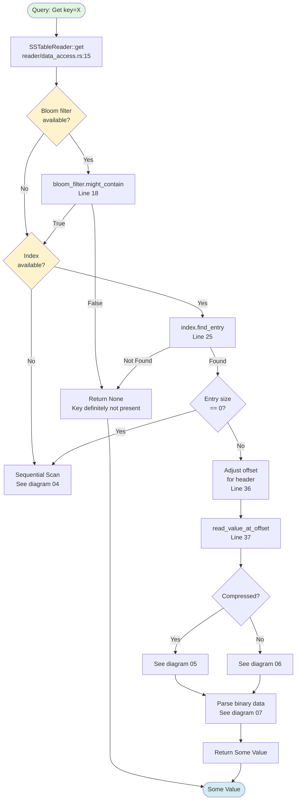
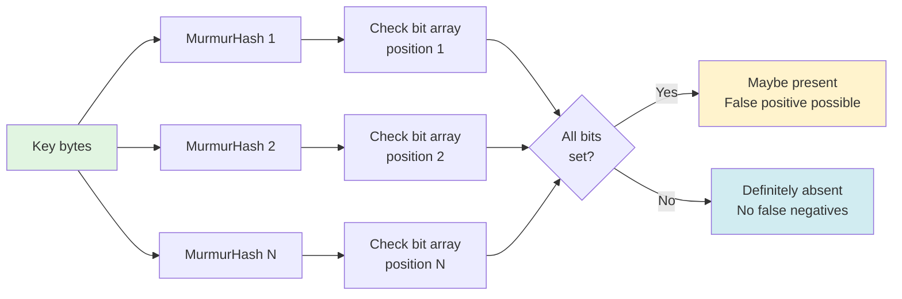
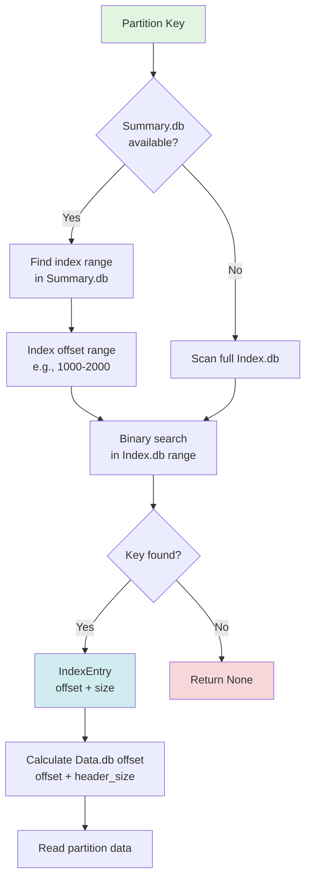

# SSTable Index-Based Lookup

**Navigation**: [← Storage Engine](./02-storage-engine.md) | [Index Lookup](./03-sstable-index-lookup.md) | [Sequential Scan →](./04-sstable-sequential-scan.md)

---

## Purpose

Index-based lookup provides O(log n) query performance using Cassandra's index structures:
- **Filter.db**: Bloom filter for negative lookups
- **Index.db**: Partition index mapping keys to data offsets
- **Summary.db**: Index summary for efficient index navigation
- **Statistics.db**: Metadata and statistics

**Primary File**: `cqlite-core/src/storage/sstable/reader/mod.rs`

## Index Lookup Flow



## Component Files

### File Naming Convention

For an SSTable with generation 1:
```
na-1-big-Data.db            # Row data (required)
na-1-big-Index.db           # Partition index (optional)
na-1-big-Summary.db         # Index summary (optional)
na-1-big-Filter.db          # Bloom filter (optional)
na-1-big-Statistics.db      # Stats metadata (optional)
na-1-big-CompressionInfo.db # Compression chunks (if compressed)
na-1-big-TOC.txt            # Table of contents
```

**→ [See Component Architecture for details](./09-component-architecture.md)**

## SSTableReader Initialization

**File**: `storage/sstable/reader/mod.rs`, Lines 62-208

```rust
impl SSTableReader {
    pub async fn open(path: &Path, _config: &Config, platform: Arc<Platform>) -> Result<Self> {
        // 1. Open and parse header
        let file = File::open(path).await?;
        let header = parse_header_with_version_detection(&header_buffer, path).await?;
        
        // 2. Initialize compression
        let compression_reader = detect_and_initialize_compression(&header, path).await?;
        let compression_info = Self::load_compression_info_metadata(path, &platform).await?;
        
        // 3. Detect component files
        let components = Self::detect_component_files(path).await?;
        
        // 4. Load index structures
        let index = Self::load_index(&file, &header, &platform, path).await?;
        let bloom_filter = Self::load_bloom_filter(&file, &header, &platform, path).await?;
        
        // 5. Load spec-compliant readers
        let index_reader = Self::load_index_reader(path, &platform).await;
        let summary_reader = Self::load_summary_reader(path, &platform).await;
        let statistics_reader = Self::load_statistics_reader(path, &platform).await;
        
        Ok(Self { /* ... */ })
    }
}
```

## Component Loading

### 1. Bloom Filter Loading

**File**: `storage/sstable/reader/component_loading.rs`

```rust
async fn load_bloom_filter(
    file: &Arc<Mutex<BufReader<File>>>,
    header: &SSTableHeader,
    platform: &Arc<Platform>,
    path: &Path,
) -> Result<Option<Arc<BloomFilter>>> {
    // Try to load from separate Filter.db file
    let filter_path = find_component_file(path, "Filter.db")?;
    
    if filter_path.exists() {
        let filter_data = platform.fs().read(filter_path).await?;
        let bloom = BloomFilter::parse(&filter_data)?;
        return Ok(Some(Arc::new(bloom)));
    }
    
    // Fall back to integrated filter in header
    if header.has_bloom_filter {
        let bloom = BloomFilter::from_header(header)?;
        return Ok(Some(Arc::new(bloom)));
    }
    
    Ok(None)
}
```

### 2. Index Loading

**File**: `storage/sstable/reader/component_loading.rs`

```rust
async fn load_index(
    file: &Arc<Mutex<BufReader<File>>>,
    header: &SSTableHeader,
    platform: &Arc<Platform>,
    path: &Path,
) -> Result<Option<Arc<Index>>> {
    // Try to load Index.db
    let index_path = find_component_file(path, "Index.db")?;
    
    if index_path.exists() {
        let index = Index::load_from_file(&index_path, platform).await?;
        return Ok(Some(Arc::new(index)));
    }
    
    // Fall back to integrated index
    if header.has_index {
        let index = Index::from_header(header, file).await?;
        return Ok(Some(Arc::new(index)));
    }
    
    Ok(None)
}
```

### 3. Spec-Compliant Index Reader

**File**: `storage/sstable/reader/mod.rs`, Lines 163-164

```rust
let index_reader = Self::load_index_reader(path, &platform).await;
```

**File**: `storage/sstable/index_reader.rs`

Provides enhanced index access with:
- Proper key digest computation
- BTI (Binary Tree Index) support
- Promoted index handling

## Data Access Methods

### Point Lookup: get()

**File**: `storage/sstable/reader/data_access.rs`, Lines 14-45

```rust
pub async fn get(&self, table_id: &TableId, key: &RowKey) -> Result<Option<Value>> {
    // Step 1: Bloom filter check (if available)
    if let Some(bloom_filter) = &self.bloom_filter {
        if !bloom_filter.might_contain(key.as_bytes()) {
            // Key definitely not present
            return Ok(None);
        }
    }
    
    // Step 2: Index lookup (if available)
    if let Some(index) = &self.index {
        if let Some(entry) = index.find_entry(table_id, key).await? {
            // Cassandra 5.0 quirk: Index reports size=0
            if entry.size == 0 {
                log::debug!("Index reports size=0, using sequential scan");
                return self.scan_for_key(table_id, key).await;
            }
            
            // Adjust offset for header size
            let file_offset = entry.offset + self.actual_header_size as u64;
            
            // Read value at offset
            return self.read_value_at_offset(file_offset, entry.size).await;
        }
    } else {
        // No index: fall back to sequential scan
        return self.scan_for_key(table_id, key).await;
    }
    
    Ok(None)
}
```

### Enhanced Partition Lookup

**File**: `storage/sstable/reader/partition_lookup.rs`, Lines 13-45

```rust
pub async fn lookup_partition_with_index(
    &self,
    partition_key: &[u8],
) -> Result<Option<(u64, u32)>> {
    if let Some(index_reader) = &self.index_reader {
        // Compute proper key digest for Index.db
        let key_digest = self.compute_partition_key_digest(partition_key).await?;
        
        // Lookup in Index.db using digest
        if let Some(entry) = index_reader.lookup_partition(&key_digest) {
            debug!(
                "Found partition via Index.db: offset={}, size={}",
                entry.data_offset, entry.data_size
            );
            return Ok(Some((entry.data_offset, entry.data_size)));
        } else {
            debug!("Partition not found in Index.db");
        }
    }
    
    Ok(None)
}
```

## Bloom Filter Details

**File**: `storage/sstable/bloom.rs`

### Structure
```rust
pub struct BloomFilter {
    /// Bit array for filter
    bits: Vec<u8>,
    /// Number of hash functions
    num_hashes: u32,
    /// Total bits
    num_bits: u64,
}
```

### Operation



### False Positive Rate

Cassandra configures bloom filters for ~1% false positive rate:
- Reduces disk I/O by 99% for absent keys
- Small memory overhead (~10 bits per key)
- No false negatives (all present keys found)

## Index.db Structure

**File**: `storage/sstable/index.rs`

### Index Entry
```rust
pub struct IndexEntry {
    /// Partition key
    pub key: RowKey,
    /// Offset in Data.db (relative to data section start)
    pub offset: u64,
    /// Size in bytes
    pub size: u32,
    /// Optional promoted index
    pub promoted_index: Option<Vec<u8>>,
}
```

### Index Lookup Process



## Summary.db Optimization

**File**: `storage/sstable/summary_reader.rs`

### Purpose
Reduces Index.db reads by providing coarse-grained navigation:
- Samples every Nth partition from Index.db
- Provides offset ranges for binary search
- Typical sampling: 1 entry per 128 index entries

### Structure
```rust
pub struct SummaryEntry {
    /// Partition key sample
    pub partition_key: Vec<u8>,
    /// Token for range queries
    pub token: i64,
    /// Offset in Index.db
    pub index_offset: u64,
}
```

### Two-Level Lookup

```mermaid
graph TD
    Query[Query: key=X] --> Sum[Summary.db\n~100 entries]
    
    Sum --> Range[Find: entries[i] <= X < entries[i+1]]
    
    Range --> IdxRange[Index.db offset range:\n5000 - 5500 bytes]
    
    IdxRange --> Idx[Index.db\n~10,000 entries]
    
    Idx --> Search[Binary search in\noffset 5000-5500]
    
    Search --> Entry[Exact partition entry]
    
    Entry --> Data[Data.db\nRead partition]
    
    style Query fill:#e1f5e1
    style Data fill:#d1ecf1
```

**Performance**: O(log M) + O(log N/M) where N = index entries, M = summary entries

## Offset Calculation

### Header Size Adjustment

Index.db offsets are **relative to data section start**, not file start:

```rust
// Index reports: offset = 1000
// Header size: 256 bytes
// Actual file offset: 1000 + 256 = 1256

let file_offset = entry.offset + self.actual_header_size as u64;
```

### Header Size Determination

**File**: `storage/sstable/reader/header.rs`

```rust
pub fn calculate_actual_header_size(
    header: &SSTableHeader,
    buffer: &[u8],
) -> Result<usize> {
    // Parse serialization header to find data section start
    match header.cassandra_version {
        CassandraVersion::V5_0NewBig => {
            // V5 has complex variable-length header
            parse_v5_header_size(buffer)
        }
        CassandraVersion::V5_0Bti => {
            // BTI format has different structure
            parse_bti_header_size(buffer)
        }
        _ => {
            // Legacy formats have fixed sizes
            Ok(256)
        }
    }
}
```

## Cassandra 5.0 Format Quirks

### Size=0 Issue

Some Cassandra 5.0 SSTables report `size=0` in Index.db:

```rust
if entry.size == 0 {
    // Index is unreliable, fall back to sequential scan
    return self.scan_for_key(table_id, key).await;
}
```

**→ [See Sequential Scan for fallback handling](./04-sstable-sequential-scan.md)**

### BTI Format

Cassandra 5.0+ uses BTI (Binary Trie Index) for improved lookup:

**File**: `storage/sstable/bti/`

- More efficient indexing structure
- Better compression
- Faster lookups for large SSTables

## Performance Characteristics

| Operation | Without Index | With Index | With Summary |
|-----------|---------------|------------|--------------|
| Point Lookup | O(n) | O(log n) | O(log m + log n/m) |
| Range Scan | O(n) | O(log n + k) | O(log m + log n/m + k) |
| Bloom False Positive | N/A | ~1% | ~1% |

Where:
- n = total partitions
- m = summary entries (typically n/128)
- k = results in range

## Related Diagrams

- **[← Storage Engine](./02-storage-engine.md)** - How we get to SSTableReader
- **[Sequential Scan →](./04-sstable-sequential-scan.md)** - Fallback when no index
- **[Compressed Data](./05-compressed-data.md)** - Reading compressed partitions
- **[Uncompressed Data](./06-uncompressed-data.md)** - Reading uncompressed partitions
- **[Component Architecture](./09-component-architecture.md)** - All SSTable files

---

**Next**: [Sequential Scan Fallback →](./04-sstable-sequential-scan.md)

