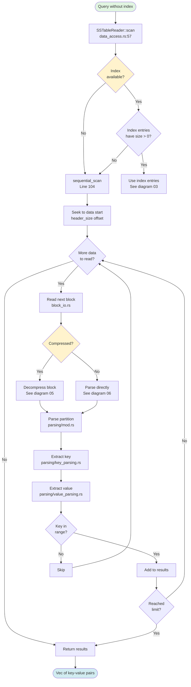
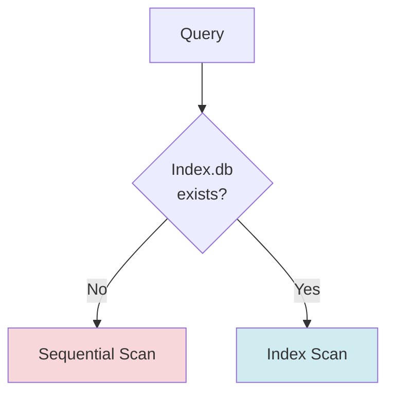
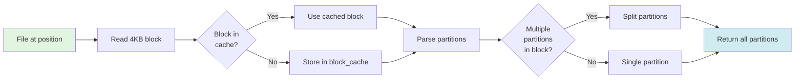
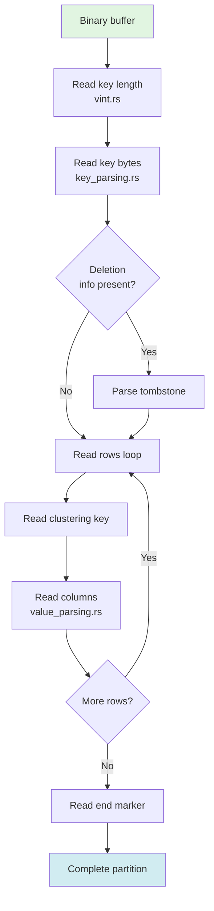

# SSTable Sequential Scan

**Navigation**: [← Index Lookup](./03-sstable-index-lookup.md) | [Sequential Scan](./04-sstable-sequential-scan.md) | [Compressed Data →](./05-compressed-data.md)

---

## Purpose

Sequential scanning is the fallback path when:
1. No Index.db file exists
2. Index reports `size=0` (Cassandra 5.0 quirk)
3. Range scans where index is inefficient
4. Full table scans without WHERE clause

**Primary File**: `cqlite-core/src/storage/sstable/reader/data_access.rs`

## Sequential Scan Flow



## Scan Method Entry Point

**File**: `storage/sstable/reader/data_access.rs`, Lines 57-150

```rust
pub async fn scan(
    &self,
    table_id: &TableId,
    start_key: Option<&RowKey>,
    end_key: Option<&RowKey>,
    limit: Option<usize>,
    schema: Option<&crate::schema::TableSchema>,
) -> Result<Vec<(RowKey, Value)>> {
    eprintln!("[DEBUG] SSTableReader::scan starting");
    eprintln!("[DEBUG] File path: {:?}", self.file_path);
    eprintln!("[DEBUG] Has index: {}", self.index.is_some());
    
    let mut results = Vec::new();
    let mut count = 0;
    
    // Try to use index if available
    if let Some(index) = &self.index {
        let entries = index.get_range(table_id, start_key, end_key)?;
        
        // Check if any entry has size=0 (Cassandra 5.0 format issue)
        let has_zero_size = entries.iter().any(|e| e.size == 0);
        
        if has_zero_size {
            eprintln!("[DEBUG] Index has size=0 entries, falling back to sequential");
            return self.sequential_scan(table_id, start_key, end_key, limit, schema).await;
        }
        
        // Use index entries
        for entry in entries.iter() {
            if let Some(limit) = limit {
                if count >= limit {
                    break;
                }
            }
            
            let file_offset = entry.offset + self.actual_header_size as u64;
            
            if let Some(value) = self.read_value_at_offset(file_offset, entry.size).await? {
                results.push((entry.key.clone(), value));
                count += 1;
            }
        }
    } else {
        // No index: use sequential scan
        eprintln!("[DEBUG] No index, using sequential scan");
        results = self.sequential_scan(table_id, start_key, end_key, limit, schema).await?;
    }
    
    Ok(results)
}
```

## Sequential Scan Implementation

**File**: `storage/sstable/reader/data_access.rs`, Lines 152-250

```rust
async fn sequential_scan(
    &self,
    table_id: &TableId,
    start_key: Option<&RowKey>,
    end_key: Option<&RowKey>,
    limit: Option<usize>,
    schema: Option<&crate::schema::TableSchema>,
) -> Result<Vec<(RowKey, Value)>> {
    let mut results = Vec::new();
    let mut file_guard = self.file.lock().await;
    
    // Seek to data section start (after header)
    file_guard.seek(SeekFrom::Start(self.actual_header_size as u64)).await?;
    
    let mut buffer = vec![0u8; 4096]; // Read buffer
    let mut position = self.actual_header_size as u64;
    
    loop {
        // Read next chunk
        let bytes_read = file_guard.read(&mut buffer).await?;
        if bytes_read == 0 {
            break; // EOF
        }
        
        // Parse partitions from buffer
        let mut offset = 0;
        while offset < bytes_read {
            // Try to parse a partition
            match self.parse_partition_at(&buffer[offset..], schema) {
                Ok((partition_key, partition_value, bytes_consumed)) => {
                    // Check if key is in range
                    let in_range = self.key_in_range(
                        &partition_key,
                        start_key,
                        end_key
                    );
                    
                    if in_range {
                        results.push((partition_key, partition_value));
                        
                        // Check limit
                        if let Some(limit) = limit {
                            if results.len() >= limit {
                                return Ok(results);
                            }
                        }
                    }
                    
                    offset += bytes_consumed;
                    position += bytes_consumed as u64;
                }
                Err(e) if e.is_incomplete() => {
                    // Need more data, read next chunk
                    break;
                }
                Err(e) => {
                    return Err(e);
                }
            }
        }
    }
    
    Ok(results)
}
```

## When Sequential Scan is Used

### 1. No Index Available



**Scenarios**:
- Legacy SSTables without indexes
- Test data without indexes
- Corrupted or missing Index.db

### 2. Index Size=0 Issue

Cassandra 5.0 sometimes reports `size=0` in Index.db:

```rust
if entry.size == 0 {
    log::debug!("Index reports size=0 for key {:?}, using sequential scan", key);
    return self.scan_for_key(table_id, key).await;
}
```

**Root Cause**: Format changes in Cassandra 5.0 where size calculation changed.

### 3. Full Table Scans

```cql
SELECT * FROM users;  -- No WHERE clause
```

For queries without filters, sequential scan may be more efficient than index lookups for every row.

### 4. Range Queries on Non-Indexed Columns

```cql
SELECT * FROM users WHERE age > 30;  -- age not in partition key
```

Index only helps with partition key lookups, not arbitrary column filters.

## Block-Based Reading

**File**: `storage/sstable/reader/block_io.rs`

### Read Strategy



### Block Cache

```rust
pub struct SSTableReader {
    // ...
    block_cache: HashMap<u64, CachedBlock>,  // offset -> block data
    block_meta_cache: HashMap<u64, BlockMeta>,  // offset -> metadata
    // ...
}

pub struct CachedBlock {
    data: Vec<u8>,
    compressed: bool,
    cached_at: Instant,
}
```

**Benefits**:
- Avoid repeated disk I/O
- Amortize decompression cost
- Better performance for nearby keys

## Partition Parsing

**File**: `storage/sstable/reader/parsing/mod.rs`

### Partition Structure

```
┌─────────────────────────────────────┐
│ Partition Header                     │
├─────────────────────────────────────┤
│ - Key length (vint)                  │
│ - Key data                           │
│ - Deletion info (optional)           │
├─────────────────────────────────────┤
│ Row 1                                │
│ - Clustering key                     │
│ - Columns                            │
├─────────────────────────────────────┤
│ Row 2                                │
│ ...                                  │
├─────────────────────────────────────┤
│ End marker                           │
└─────────────────────────────────────┘
```

### Parse Flow



## Key Parsing

**File**: `storage/sstable/reader/parsing/key_parsing.rs`

```rust
pub fn parse_partition_key(data: &[u8]) -> Result<(RowKey, usize)> {
    let mut offset = 0;
    
    // Read key length (variable-length integer)
    let (key_len, vint_bytes) = vint::read_unsigned(data)?;
    offset += vint_bytes;
    
    // Read key data
    let key_data = &data[offset..offset + key_len as usize];
    offset += key_len as usize;
    
    // Convert to RowKey
    let key = RowKey::from_bytes(key_data);
    
    Ok((key, offset))
}
```

## Value Parsing

**File**: `storage/sstable/reader/parsing/value_parsing.rs`

```rust
pub fn parse_partition_value(
    data: &[u8],
    schema: Option<&TableSchema>,
) -> Result<(Value, usize)> {
    let mut offset = 0;
    let mut columns = HashMap::new();
    
    // Parse columns in partition
    loop {
        // Read column name length
        let (name_len, bytes) = vint::read_unsigned(&data[offset..])?;
        offset += bytes;
        
        if name_len == 0 {
            break; // End of columns marker
        }
        
        // Read column name
        let name = String::from_utf8(
            data[offset..offset + name_len as usize].to_vec()
        )?;
        offset += name_len as usize;
        
        // Read column value
        let (value, bytes) = parse_column_value(&data[offset..], schema)?;
        offset += bytes;
        
        columns.insert(name, value);
    }
    
    Ok((Value::Map(columns), offset))
}
```

## Schema-Aware Parsing

When schema is available, parsing is more accurate:

```rust
// With schema
if let Some(schema) = schema {
    let column_type = schema.get_column_type(&column_name)?;
    let value = parse_typed_value(&data, column_type)?;
} else {
    // Without schema: heuristic detection
    let value = parse_value_heuristic(&data)?;
}
```

**→ [See Schema-Aware Reading for details](./08-schema-aware.md)**

## Range Filtering

```rust
fn key_in_range(
    &self,
    key: &RowKey,
    start_key: Option<&RowKey>,
    end_key: Option<&RowKey>,
) -> bool {
    // Check start bound
    if let Some(start) = start_key {
        if key < start {
            return false;
        }
    }
    
    // Check end bound
    if let Some(end) = end_key {
        if key > end {
            return false;
        }
    }
    
    true
}
```

## Performance Characteristics

### Time Complexity
- **Best case**: O(1) if target is at start
- **Average case**: O(n/2) - scan half the file
- **Worst case**: O(n) - scan entire file

### Memory Usage
- Buffer: ~4KB per read
- Parsed partitions: Depends on size
- Block cache: Configurable (default 100 blocks)

### I/O Characteristics
- Sequential reads (good for HDDs)
- Large block reads (minimize syscalls)
- Cached blocks (avoid re-reading)

## Optimization Strategies

### 1. Increase Block Size
```rust
let mut buffer = vec![0u8; 64 * 1024]; // 64KB instead of 4KB
```
Trade-off: Memory vs. syscall overhead

### 2. Parallel Scanning
For multiple SSTables, scan in parallel:
```rust
let futures: Vec<_> = sstables.iter()
    .map(|sstable| sstable.sequential_scan(...))
    .collect();

let results = futures::future::join_all(futures).await;
```

### 3. Early Termination
```rust
if let Some(limit) = limit {
    if results.len() >= limit {
        return Ok(results); // Stop scanning
    }
}
```

### 4. Bloom Filter Bypass
Sequential scan doesn't benefit from bloom filters (checking every key anyway).

## Comparison: Index vs Sequential

| Aspect | Index Scan | Sequential Scan |
|--------|-----------|-----------------|
| Setup | Load Index.db, Summary.db, Filter.db | None |
| Point Lookup | O(log n) | O(n) |
| Range Scan (small) | O(log n + k) | O(n) |
| Range Scan (large) | O(log n + k) | O(n) |
| Full Table Scan | O(n) index lookups | O(n) direct reads |
| Memory | Index + Summary in RAM | Small buffer only |
| Disk I/O | Random access | Sequential access |

**When Sequential is Better**:
- Full table scans (no WHERE clause)
- Large range scans (>10% of table)
- No index available
- Sequential storage media (HDD, tape)

## Related Diagrams

- **[← Index Lookup](./03-sstable-index-lookup.md)** - Efficient indexed path
- **[Compressed Data →](./05-compressed-data.md)** - Handling compressed blocks
- **[Uncompressed Data](./06-uncompressed-data.md)** - Direct binary reads
- **[Data Parsing](./07-data-parsing.md)** - Converting binary to Values
- **[Storage Engine](./02-storage-engine.md)** - How queries are routed

---

**Next**: [Compressed Data Handling →](./05-compressed-data.md)

