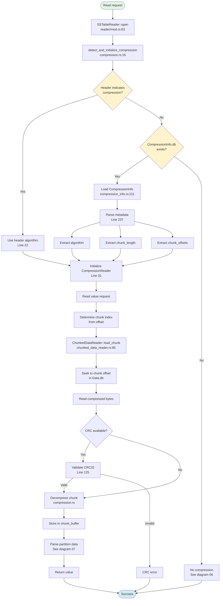
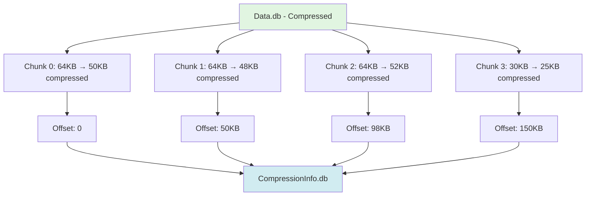
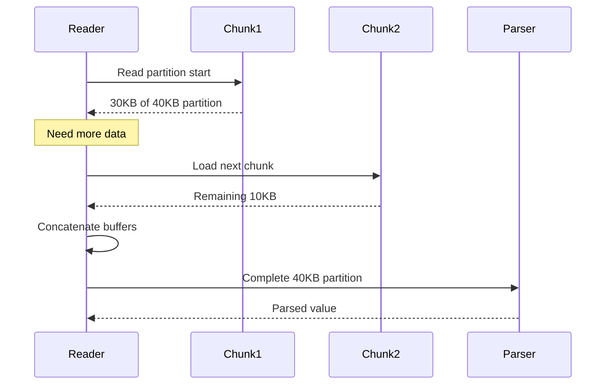
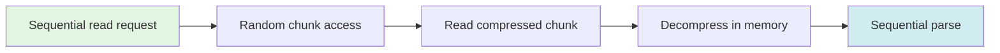

# Compressed Data Reading

**Navigation**: [← Sequential Scan](./04-sstable-sequential-scan.md) | [Compressed Data](./05-compressed-data.md) | [Uncompressed Data →](./06-uncompressed-data.md)

---

## Purpose

Compressed SSTables save disk space at the cost of CPU overhead. CQLite supports:
- **LZ4**: Fast compression/decompression (default)
- **Snappy**: Moderate compression ratio
- **Zstd**: High compression ratio
- **Deflate**: Legacy support

**Key Files**:
- `cqlite-core/src/storage/sstable/reader/compression.rs` - Detection
- `cqlite-core/src/storage/sstable/chunked_data_reader.rs` - Chunked reading
- `cqlite-core/src/storage/sstable/compression_info.rs` - Metadata parsing

## Compressed Read Flow



## Compression Detection

**File**: `storage/sstable/reader/compression.rs`, Lines 16-67

### Multi-Strategy Approach

```rust
pub(crate) async fn detect_and_initialize_compression(
    header: &SSTableHeader,
    path: &Path,
) -> Result<Option<CompressionReader>> {
    // Strategy 1: Check header compression info
    if header.compression.algorithm != "NONE" {
        let algorithm = CompressionAlgorithm::from(header.compression.algorithm.as_str());
        debug!("Header indicates compression: {:?}", algorithm);
        
        match algorithm {
            CompressionAlgorithm::Lz4
            | CompressionAlgorithm::Snappy
            | CompressionAlgorithm::Deflate
            | CompressionAlgorithm::Zstd => {
                return Ok(Some(CompressionReader::new(algorithm)));
            }
            CompressionAlgorithm::None => {
                // Continue to other detection methods
            }
        }
    }
    
    // Strategy 2: Check for CompressionInfo.db file
    let parent_dir = path.parent().unwrap_or(Path::new("."));
    if let Some(compression_reader) = discover_compression_info(path, parent_dir).await? {
        return Ok(Some(compression_reader));
    }
    
    // Strategy 3: Heuristic detection (legacy only)
    #[cfg(feature = "legacy-heuristics")]
    {
        if let Some(algorithm) = detect_compression_heuristic(header, path).await? {
            return Ok(Some(CompressionReader::new(algorithm)));
        }
    }
    
    debug!("No compression detected for {:?}", path);
    Ok(None)
}
```

## CompressionInfo.db Structure

**File**: `storage/sstable/compression_info.rs`

### File Format

```
┌──────────────────────────────────────┐
│ Algorithm name (UTF-8 string)        │
│ - Length prefix (4 bytes)            │
│ - Algorithm bytes (e.g., "LZ4")      │
├──────────────────────────────────────┤
│ Chunk length (4 bytes)               │
│ - Uncompressed chunk size            │
│ - Typically 64KB                     │
├──────────────────────────────────────┤
│ Data length (8 bytes)                │
│ - Total uncompressed size            │
├──────────────────────────────────────┤
│ Chunk count (4 bytes)                │
│ - Number of chunks in file           │
├──────────────────────────────────────┤
│ Chunk offsets (array)                │
│ - Offset 0 (8 bytes)                 │
│ - Offset 1 (8 bytes)                 │
│ - ... (chunk_count entries)          │
├──────────────────────────────────────┤
│ Optional CRC32 checksums             │
│ - CRC for chunk 0 (4 bytes)          │
│ - CRC for chunk 1 (4 bytes)          │
│ - ...                                │
└──────────────────────────────────────┘
```

### Parsing

```rust
pub struct CompressionInfo {
    pub algorithm: String,       // "LZ4", "Snappy", etc.
    pub chunk_length: u32,       // Uncompressed chunk size
    pub data_length: u64,        // Total uncompressed size
    pub chunk_offsets: Vec<u64>, // Offset of each compressed chunk
    pub chunk_crcs: Vec<u32>,    // Optional CRC32 per chunk
}

impl CompressionInfo {
    pub fn parse(data: &[u8]) -> Result<Self> {
        let mut offset = 0;
        
        // Read algorithm name
        let algo_len = u32::from_be_bytes(data[0..4].try_into()?);
        offset += 4;
        let algorithm = String::from_utf8(
            data[offset..offset + algo_len as usize].to_vec()
        )?;
        offset += algo_len as usize;
        
        // Read chunk length
        let chunk_length = u32::from_be_bytes(data[offset..offset+4].try_into()?);
        offset += 4;
        
        // Read data length
        let data_length = u64::from_be_bytes(data[offset..offset+8].try_into()?);
        offset += 8;
        
        // Read chunk count
        let chunk_count = u32::from_be_bytes(data[offset..offset+4].try_into()?);
        offset += 4;
        
        // Read chunk offsets
        let mut chunk_offsets = Vec::with_capacity(chunk_count as usize);
        for _ in 0..chunk_count {
            let offset_val = u64::from_be_bytes(data[offset..offset+8].try_into()?);
            chunk_offsets.push(offset_val);
            offset += 8;
        }
        
        // Read optional CRCs
        let mut chunk_crcs = Vec::new();
        if offset + (chunk_count as usize * 4) <= data.len() {
            for _ in 0..chunk_count {
                let crc = u32::from_be_bytes(data[offset..offset+4].try_into()?);
                chunk_crcs.push(crc);
                offset += 4;
            }
        }
        
        Ok(Self {
            algorithm,
            chunk_length,
            data_length,
            chunk_offsets,
            chunk_crcs,
        })
    }
}
```

## Chunked Data Reader

**File**: `storage/sstable/chunked_data_reader.rs`, Lines 55-439

### Architecture

Compressed data is divided into fixed-size chunks for efficient random access:



### State Machine

```rust
pub struct ChunkedDataReader<R: Read + Seek> {
    /// Underlying file reader
    reader: R,
    /// Total file size
    file_size: u64,
    /// Compression metadata
    compression_info: Arc<CompressionInfo>,
    /// Compression handler
    compression: Compression,
    
    // State
    /// Current chunk index
    current_chunk: usize,
    /// Decompressed buffer for current chunk
    chunk_buffer: Vec<u8>,
    /// Position within chunk_buffer
    buffer_pos: usize,
    /// Logical position in decompressed stream
    global_pos: u64,
}
```

### Loading a Chunk

**Lines 95-150**

```rust
fn load_chunk(&mut self, chunk_index: usize) -> Result<()> {
    // Check bounds
    if chunk_index >= self.compression_info.chunk_offsets.len() {
        self.chunk_buffer.clear();
        return Ok(()); // EOF
    }
    
    // Get chunk boundaries
    let chunk_start = self.compression_info.chunk_offsets[chunk_index];
    let chunk_end = if chunk_index + 1 < self.compression_info.chunk_offsets.len() {
        self.compression_info.chunk_offsets[chunk_index + 1]
    } else {
        self.file_size
    };
    
    let compressed_size = (chunk_end - chunk_start) as usize;
    
    // Seek to chunk position
    self.reader.seek(SeekFrom::Start(chunk_start))?;
    
    // Read compressed data
    let mut compressed_data = vec![0u8; compressed_size];
    self.reader.read_exact(&mut compressed_data)?;
    
    // Validate CRC if available
    if chunk_index < self.compression_info.chunk_crcs.len() {
        let expected_crc = self.compression_info.chunk_crcs[chunk_index];
        let actual_crc = crc32(&compressed_data);
        
        if expected_crc != actual_crc {
            return Err(Error::corruption(format!(
                "CRC mismatch for chunk {}: expected {}, got {}",
                chunk_index, expected_crc, actual_crc
            )));
        }
    }
    
    // Decompress
    let uncompressed_size = self.compression_info.chunk_length as usize;
    self.chunk_buffer = vec![0u8; uncompressed_size];
    
    let decompressed_size = self.compression.decompress(
        &compressed_data,
        &mut self.chunk_buffer
    )?;
    
    self.chunk_buffer.truncate(decompressed_size);
    self.buffer_pos = 0;
    self.current_chunk = chunk_index;
    
    Ok(())
}
```

## Compression Algorithms

**File**: `storage/sstable/compression.rs`

### Algorithm Dispatch

```rust
pub enum CompressionAlgorithm {
    None,
    Lz4,
    Snappy,
    Zstd,
    Deflate,
}

pub struct Compression {
    algorithm: CompressionAlgorithm,
}

impl Compression {
    pub fn decompress(&self, input: &[u8], output: &mut [u8]) -> Result<usize> {
        match self.algorithm {
            CompressionAlgorithm::Lz4 => {
                lz4::block::decompress_to_buffer(input, Some(output.len() as i32), output)
                    .map_err(|e| Error::decompression(e.to_string()))
            }
            CompressionAlgorithm::Snappy => {
                let decompressed = snap::raw::Decoder::new()
                    .decompress_vec(input)
                    .map_err(|e| Error::decompression(e.to_string()))?;
                output[..decompressed.len()].copy_from_slice(&decompressed);
                Ok(decompressed.len())
            }
            CompressionAlgorithm::Zstd => {
                zstd::block::decompress_to_buffer(input, output)
                    .map_err(|e| Error::decompression(e.to_string()))
            }
            CompressionAlgorithm::Deflate => {
                use flate2::read::DeflateDecoder;
                use std::io::Read;
                
                let mut decoder = DeflateDecoder::new(input);
                decoder.read(output)
                    .map_err(|e| Error::decompression(e.to_string()))
            }
            CompressionAlgorithm::None => {
                let len = input.len().min(output.len());
                output[..len].copy_from_slice(&input[..len]);
                Ok(len)
            }
        }
    }
}
```

## Reading Across Chunks

When a partition spans multiple chunks:



### Implementation

```rust
impl Read for ChunkedDataReader<R> {
    fn read(&mut self, buf: &mut [u8]) -> std::io::Result<usize> {
        let mut total_read = 0;
        
        while total_read < buf.len() {
            // Check if current chunk buffer is exhausted
            if self.buffer_pos >= self.chunk_buffer.len() {
                // Load next chunk
                self.current_chunk += 1;
                self.load_chunk(self.current_chunk)?;
                
                if self.chunk_buffer.is_empty() {
                    break; // EOF
                }
            }
            
            // Copy from chunk buffer to output
            let available = self.chunk_buffer.len() - self.buffer_pos;
            let to_copy = (buf.len() - total_read).min(available);
            
            buf[total_read..total_read + to_copy]
                .copy_from_slice(
                    &self.chunk_buffer[self.buffer_pos..self.buffer_pos + to_copy]
                );
            
            self.buffer_pos += to_copy;
            total_read += to_copy;
            self.global_pos += to_copy as u64;
        }
        
        Ok(total_read)
    }
}
```

## CRC Validation

**Lines 125-135**

Each chunk has an optional CRC32 checksum:

```rust
fn validate_crc(data: &[u8], expected: u32) -> Result<()> {
    let actual = crc32(data);
    
    if actual != expected {
        return Err(Error::corruption(format!(
            "CRC mismatch: expected 0x{:08x}, got 0x{:08x}",
            expected, actual
        )));
    }
    
    Ok(())
}

fn crc32(data: &[u8]) -> u32 {
    let mut hasher = crc32fast::Hasher::new();
    hasher.update(data);
    hasher.finalize()
}
```

## Performance Characteristics

### Compression Ratios (Typical)

| Algorithm | Ratio | Speed | Use Case |
|-----------|-------|-------|----------|
| LZ4 | 2-3x | Very Fast | Default, balanced |
| Snappy | 2-2.5x | Fast | Legacy compatibility |
| Zstd | 3-5x | Medium | High compression |
| Deflate | 2.5-3.5x | Slow | Legacy |

### Memory Usage

```
Memory per read = chunk_length + overhead
Default chunk_length = 64KB
Overhead ≈ 10KB (buffers, state)
Total ≈ 74KB per active read
```

### I/O Pattern



## Trade-offs

### Benefits
- 2-5x disk space savings
- Reduced I/O bandwidth
- Better cache utilization (more data in RAM)

### Costs
- CPU overhead for decompression
- Chunk buffer memory
- CRC validation overhead
- Complexity in random access

## Related Diagrams

- **[← Sequential Scan](./04-sstable-sequential-scan.md)** - How we reach compressed data
- **[Uncompressed Data →](./06-uncompressed-data.md)** - Simpler alternative
- **[Data Parsing](./07-data-parsing.md)** - What happens after decompression
- **[Component Architecture](./09-component-architecture.md)** - CompressionInfo.db file

---

**Next**: [Uncompressed Data Reading →](./06-uncompressed-data.md)

