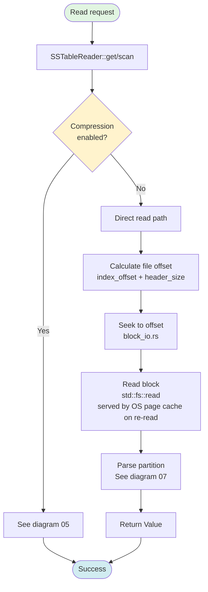
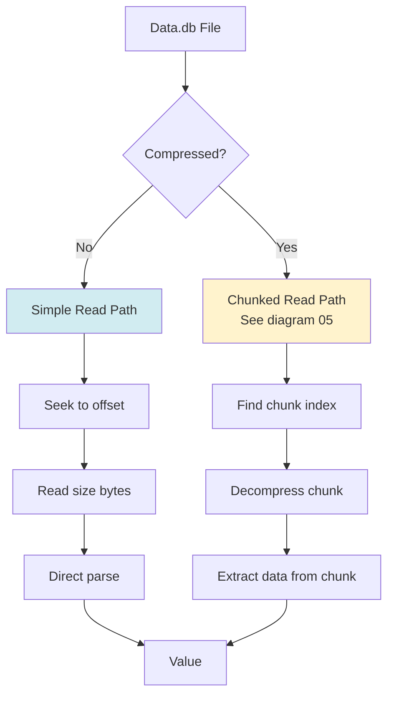
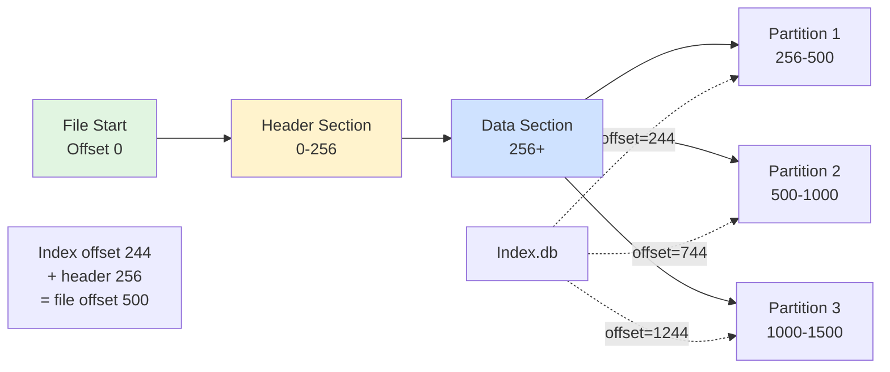
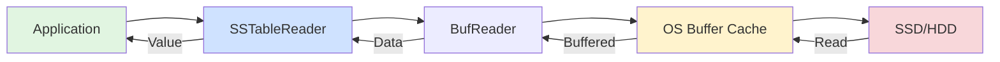

# Uncompressed Data Reading

**Navigation**: [← Compressed Data](./05-compressed-data.md) | [Uncompressed Data](./06-uncompressed-data.md) | [Data Parsing →](./07-data-parsing.md)

---

## Purpose

Uncompressed SSTables offer simpler and faster read paths without decompression overhead. This is the default for many workloads where disk space is not a concern.

**Key Files**:
- `cqlite-core/src/storage/sstable/reader/block_io.rs` - Block I/O operations
- `cqlite-core/src/storage/sstable/reader/data_access.rs` - Value reading

## Uncompressed Read Flow



## Direct File Reading

### read_value_at_offset()

**File**: `storage/sstable/reader/data_access.rs`, Lines 250-300 (approximate)

```rust
async fn read_value_at_offset(
    &self,
    offset: u64,
    size: u32,
) -> Result<Option<Value>> {
    eprintln!("[DEBUG] Reading value at offset: {}, size: {}", offset, size);
    
    // Lock file for reading
    let mut file_guard = self.file.lock().await;
    
    // Seek to position
    file_guard.seek(SeekFrom::Start(offset)).await?;
    
    // Read exact number of bytes
    let mut buffer = vec![0u8; size as usize];
    file_guard.read_exact(&mut buffer).await?;
    
    // Parse the partition data
    match self.parse_partition_data(&buffer) {
        Ok(value) => Ok(Some(value)),
        Err(e) => {
            eprintln!("[DEBUG] Failed to parse value: {}", e);
            Err(e)
        }
    }
}
```

### Simple vs Chunked Reading



## Block I/O Operations

**File**: `storage/sstable/reader/block_io.rs`

### Block Reading Strategy

```rust
/// Read a block of data from the SSTable
pub async fn read_block(
    file: &Arc<Mutex<BufReader<File>>>,
    offset: u64,
    size: usize,
) -> Result<Vec<u8>> {
    let mut file_guard = file.lock().await;
    
    // Seek to block start
    file_guard.seek(SeekFrom::Start(offset)).await?;
    
    // Read block data
    let mut buffer = vec![0u8; size];
    file_guard.read_exact(&mut buffer).await?;
    
    Ok(buffer)
}
```

### Buffered Reading

The `BufReader` wrapper provides automatic buffering:

```rust
use tokio::io::BufReader;
use tokio::fs::File;

let file = File::open(path).await?;
let file = Arc::new(Mutex::new(BufReader::new(file)));
```

**Benefits**:
- Reduces system calls
- Amortizes seek overhead
- Better performance for sequential reads

## Caching

### No per-reader block cache

The uncompressed read path has **no application-level block cache**. Repeated
reads of the same file region are served by the `BufReader` and the kernel page
cache (see [Direct I/O Path](#direct-io-path) below).

An earlier design carried a per-reader `block_cache: HashMap<u64, CachedBlock>`
(with a `block_meta_cache: HashMap<u64, BlockMeta>` companion and a `CachedBlock`
type) on `SSTableReader`. That map was **dead code** — nothing ever inserted into
it, so it produced a structural 0.0 hit rate while still costing memory — and it
was **removed in #1568** (B2). Do not reintroduce it.

### The real read cache: shared `DecompressedChunkCache`

The one application-level cache in the read path is the shared
**`DecompressedChunkCache`** (Epic B / B1, issue #1567). It lives *outside* the
per-reader struct and is shared across readers, caching decompressed chunks on the
*compressed* read path (uncompressed reads bypass it — they have no chunks to
decompress). Its byte budget is configured via `block_cache.max_size`, and its
hit-rate/eviction statistics come from the real B1 instrumentation. See
[Compressed Data](./05-compressed-data.md) for the chunk-cache flow.

## File Seeking

### Offset Calculation

Remember that Index.db offsets are relative to data section start:

```rust
// Index.db entry
let index_offset = 1000;  // Relative to data section

// Actual file offset
let header_size = self.actual_header_size;  // e.g., 256 bytes
let file_offset = index_offset + header_size;  // 1256 bytes

// Seek to position
file.seek(SeekFrom::Start(file_offset)).await?;
```

### Seek Patterns



## Performance Characteristics

### Read Performance

| Aspect | Uncompressed | Compressed |
|--------|-------------|------------|
| Seek Time | Same | Same |
| Read Size | Exact data size | Full chunk size |
| CPU Overhead | Minimal | Decompression |
| Memory Usage | Block size | Chunk buffer |
| Throughput | I/O bound | CPU/I/O bound |

### Typical Timings (SSD)

```
Seek: 0.1 ms
Read 4KB: 0.05 ms
Read 64KB: 0.5 ms
Total point lookup: ~0.15-0.6 ms

vs. Compressed:
Seek: 0.1 ms
Read 64KB chunk: 0.5 ms
Decompress: 0.3-1.0 ms
Total: 0.9-1.6 ms
```

**Uncompressed is 3-4x faster** for point queries but uses more disk space.

## Buffer Management

### Read Buffer Sizing

```rust
// Small reads: 4KB buffer (typical page size)
let buffer = vec![0u8; 4096];

// Large reads: 64KB buffer (typical chunk size)
let buffer = vec![0u8; 65536];

// Exact reads: size from index
let buffer = vec![0u8; index_entry.size as usize];
```

### Memory Layout

```
┌─────────────────────────────────────┐
│ SSTableReader                       │
├─────────────────────────────────────┤
│ file: Arc<Mutex<BufReader<File>>>  │ ← OS buffer (8KB)
└─────────────────────────────────────┘

Per-reader footprint ≈ 8KB (the BufReader window).
No per-reader block cache — the dead block_cache/block_meta_cache maps were
removed in #1568. Decompressed-chunk caching (compressed reads only) lives in
the shared DecompressedChunkCache, budgeted by block_cache.max_size (Epic B/B1,
issue #1567), not in this struct.
```

## Direct I/O Path



**Layers**:
1. **Application**: `SSTableReader::get()`
2. **Buffered I/O**: `BufReader` (tokio)
3. **OS Cache**: Kernel page cache
4. **Storage**: Physical disk

## Async I/O

Using Tokio for non-blocking I/O:

```rust
use tokio::io::{AsyncReadExt, AsyncSeekExt};
use tokio::fs::File;

async fn read_async(file: &mut File, offset: u64, size: usize) -> Result<Vec<u8>> {
    // Non-blocking seek
    file.seek(SeekFrom::Start(offset)).await?;
    
    // Non-blocking read
    let mut buffer = vec![0u8; size];
    file.read_exact(&mut buffer).await?;
    
    Ok(buffer)
}
```

**Benefits**:
- No blocking on I/O
- Better concurrency
- Efficient for multiple concurrent queries

## Comparison with Compression

### When to Use Uncompressed

**Advantages**:
- ✅ 3-4x faster reads
- ✅ Lower CPU usage
- ✅ Simpler implementation
- ✅ Predictable performance

**Disadvantages**:
- ❌ 2-5x more disk space
- ❌ Higher I/O bandwidth
- ❌ Worse cache utilization

### When to Use Compressed

**Advantages**:
- ✅ 2-5x disk savings
- ✅ Better cache efficiency
- ✅ Lower I/O bandwidth
- ✅ More data in memory

**Disadvantages**:
- ❌ CPU overhead
- ❌ Slower reads
- ❌ Complex chunk management
- ❌ Larger read granularity

## Code Example: Full Read Path

```rust
// 1. Get partition offset from index
let entry = index.find_entry(&table_id, &key).await?;

// 2. Calculate file offset
let file_offset = entry.offset + self.actual_header_size as u64;

// 3. Read from disk (repeat reads served by the OS page cache; there is no
//    per-reader block cache — the dead one was removed in #1568)
let mut file = self.file.lock().await;
file.seek(SeekFrom::Start(file_offset)).await?;

let mut buffer = vec![0u8; entry.size as usize];
file.read_exact(&mut buffer).await?;

// 4. Parse and return
parse_value(&buffer)
```

## Related Diagrams

- **[← Compressed Data](./05-compressed-data.md)** - Alternative with compression
- **[Data Parsing →](./07-data-parsing.md)** - What happens after reading
- **[Index Lookup](./03-sstable-index-lookup.md)** - Finding the right offset
- **[Sequential Scan](./04-sstable-sequential-scan.md)** - Reading without index

---

**Next**: [Data Parsing →](./07-data-parsing.md)

