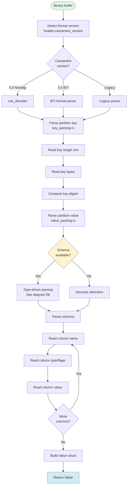
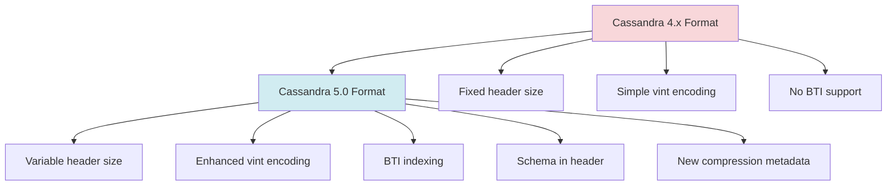

# Data Parsing: Binary to Rust Values

**Navigation**: [← Uncompressed Data](./06-uncompressed-data.md) | [Data Parsing](./07-data-parsing.md) | [Schema-Aware →](./08-schema-aware.md)

---

## Purpose

Convert binary SSTable data to Rust `Value` types. This involves:
1. Parsing variable-length integers (vint)
2. Extracting partition and clustering keys
3. Parsing column values with type detection
4. Handling Cassandra 5.0 format specifics

**Key Files**:
- `cqlite-core/src/parser/binary.rs` - Binary format parsing
- `cqlite-core/src/parser/vint.rs` - Variable-length integers
- `cqlite-core/src/storage/sstable/reader/parsing/` - SSTable-specific parsing

## Parsing Flow Overview



## Variable-Length Integers (vint)

**File**: `parser/vint.rs`

### Format

Cassandra uses variable-length encoding to save space:

```
Value Range          | Bytes | First Byte Pattern
---------------------|-------|-------------------
0-127                | 1     | 0xxxxxxx
128-16,383           | 2     | 10xxxxxx xxxxxxxx
16,384-2,097,151     | 3     | 110xxxxx ...
2,097,152-268,435,455| 4     | 1110xxxx ...
...                  | ...   | ...
```

### Reading Vint

```rust
pub fn read_unsigned(data: &[u8]) -> Result<(u64, usize)> {
    if data.is_empty() {
        return Err(Error::incomplete("Not enough data for vint"));
    }
    
    let first_byte = data[0];
    
    // Count leading 1 bits to determine length
    let num_bytes = if first_byte < 0x80 {
        // 0xxxxxxx: 1 byte
        return Ok((first_byte as u64, 1));
    } else if first_byte < 0xC0 {
        // 10xxxxxx: 2 bytes
        2
    } else if first_byte < 0xE0 {
        // 110xxxxx: 3 bytes
        3
    } else if first_byte < 0xF0 {
        // 1110xxxx: 4 bytes
        4
    } else {
        // ... more bytes
        count_leading_ones(first_byte) + 1
    };
    
    if data.len() < num_bytes {
        return Err(Error::incomplete("Incomplete vint"));
    }
    
    // Decode value
    let mut value = (first_byte & (0xFF >> num_bytes)) as u64;
    for i in 1..num_bytes {
        value = (value << 8) | data[i] as u64;
    }
    
    Ok((value, num_bytes))
}
```

### Example Encodings

```
Value    | Hex Encoding      | Binary
---------|-------------------|------------------
0        | 00                | 00000000
100      | 64                | 01100100
200      | 80 C8             | 10000000 11001000
10,000   | C2 71 00          | 11000010 01110001 00000000
```

## Partition Key Parsing

**File**: `storage/sstable/reader/parsing/key_parsing.rs`

### Key Structure

```
┌─────────────────────────────────────┐
│ Key Length (vint)                   │  1-9 bytes
├─────────────────────────────────────┤
│ Key Data (bytes)                    │  variable
│ - Can be composite (multiple parts) │
└─────────────────────────────────────┘
```

### Parsing Implementation

```rust
pub fn parse_partition_key(data: &[u8]) -> Result<(RowKey, usize)> {
    let mut offset = 0;
    
    // Read key length
    let (key_len, vint_bytes) = vint::read_unsigned(&data[offset..])?;
    offset += vint_bytes;
    
    if key_len == 0 {
        return Err(Error::invalid_format("Zero-length partition key"));
    }
    
    // Read key data
    if data.len() < offset + key_len as usize {
        return Err(Error::incomplete("Incomplete key data"));
    }
    
    let key_data = &data[offset..offset + key_len as usize];
    offset += key_len as usize;
    
    // Create RowKey
    let key = RowKey::from_bytes(key_data);
    
    Ok((key, offset))
}
```

### Composite Keys

For multi-column partition keys:

```
┌─────────────────────────────────────┐
│ Total Length (vint)                 │
├─────────────────────────────────────┤
│ Component 1 Length (2 bytes)        │
├─────────────────────────────────────┤
│ Component 1 Data                    │
├─────────────────────────────────────┤
│ End-of-component marker (0x00)      │
├─────────────────────────────────────┤
│ Component 2 Length (2 bytes)        │
├─────────────────────────────────────┤
│ Component 2 Data                    │
├─────────────────────────────────────┤
│ ... more components ...             │
└─────────────────────────────────────┘
```

## Value Parsing

**File**: `storage/sstable/reader/parsing/value_parsing.rs`

### Partition Value Structure

```
┌─────────────────────────────────────┐
│ Deletion Info (optional)            │
│ - Timestamp (8 bytes)               │
│ - Local deletion time (4 bytes)     │
├─────────────────────────────────────┤
│ Row 1                               │
│ ├─ Clustering key (if any)          │
│ ├─ Liveness info (timestamp/TTL)    │
│ └─ Columns                          │
│    ├─ Column 1                      │
│    │  ├─ Name (vint + bytes)        │
│    │  ├─ Timestamp (8 bytes)        │
│    │  ├─ Value length (vint)        │
│    │  └─ Value data                 │
│    ├─ Column 2                      │
│    └─ ...                           │
├─────────────────────────────────────┤
│ Row 2 (if clustering key exists)    │
├─────────────────────────────────────┤
│ End marker                          │
└─────────────────────────────────────┘
```

### Column Parsing

```rust
pub fn parse_column(
    data: &[u8],
    schema: Option<&TableSchema>,
) -> Result<(String, Value, i64, usize)> {
    let mut offset = 0;
    
    // Read column name
    let (name_len, bytes) = vint::read_unsigned(&data[offset..])?;
    offset += bytes;
    
    let name = String::from_utf8(
        data[offset..offset + name_len as usize].to_vec()
    )?;
    offset += name_len as usize;
    
    // Read timestamp
    let timestamp = i64::from_be_bytes(data[offset..offset+8].try_into()?);
    offset += 8;
    
    // Read value length
    let (value_len, bytes) = vint::read_unsigned(&data[offset..])?;
    offset += bytes;
    
    // Parse value based on type
    let value = if let Some(schema) = schema {
        // Type-driven parsing
        let column_type = schema.get_column_type(&name)?;
        parse_typed_value(&data[offset..offset + value_len as usize], column_type)?
    } else {
        // Heuristic parsing
        parse_value_heuristic(&data[offset..offset + value_len as usize])?
    };
    
    offset += value_len as usize;
    
    Ok((name, value, timestamp, offset))
}
```

## Type Detection

### With Schema (Preferred)

```rust
fn parse_typed_value(data: &[u8], cql_type: &CqlType) -> Result<Value> {
    match cql_type {
        CqlType::Int => {
            let val = i32::from_be_bytes(data.try_into()?);
            Ok(Value::Integer(val))
        }
        CqlType::BigInt => {
            let val = i64::from_be_bytes(data.try_into()?);
            Ok(Value::Long(val))
        }
        CqlType::Text | CqlType::Varchar => {
            let text = String::from_utf8(data.to_vec())?;
            Ok(Value::Text(text))
        }
        CqlType::Uuid => {
            let uuid = parse_uuid(data)?;
            Ok(Value::Uuid(uuid))
        }
        CqlType::List(inner_type) => {
            parse_list(data, inner_type)
        }
        CqlType::Map(key_type, val_type) => {
            parse_map(data, key_type, val_type)
        }
        // ... more types ...
    }
}
```

**→ [See Schema-Aware Reading for details](./08-schema-aware.md)**

### Without Schema (Heuristic)

```rust
fn parse_value_heuristic(data: &[u8]) -> Result<Value> {
    // Try to detect type from data patterns
    
    // Integer (4 bytes)
    if data.len() == 4 {
        let val = i32::from_be_bytes(data.try_into()?);
        return Ok(Value::Integer(val));
    }
    
    // Long (8 bytes)
    if data.len() == 8 {
        let val = i64::from_be_bytes(data.try_into()?);
        return Ok(Value::Long(val));
    }
    
    // UUID (16 bytes)
    if data.len() == 16 {
        let uuid = parse_uuid(data)?;
        return Ok(Value::Uuid(uuid));
    }
    
    // Text (valid UTF-8)
    if let Ok(text) = String::from_utf8(data.to_vec()) {
        return Ok(Value::Text(text));
    }
    
    // Blob (fallback)
    Ok(Value::Blob(data.to_vec()))
}
```

**Problems with Heuristic**:
- Ambiguous types (is 4 bytes an int or float?)
- Collections are hard to detect
- UDTs are impossible without schema
- Can misidentify binary data as text

## Cassandra 5.0 Format

**File**: `storage/sstable/reader/parsing/row_decoder.rs`

### Format Changes

Cassandra 5.0 introduced format changes:



### V5 Parser

```rust
pub fn parse_v5_partition(
    data: &[u8],
    header: &SSTableHeader,
) -> Result<(RowKey, Value, usize)> {
    let mut offset = 0;
    
    // V5 has additional flags byte
    let flags = data[offset];
    offset += 1;
    
    // Check for tombstone
    if flags & 0x01 != 0 {
        let (deletion_time, bytes) = parse_deletion_info(&data[offset..])?;
        offset += bytes;
        return Ok((RowKey::empty(), Value::Tombstone(deletion_time), offset));
    }
    
    // Parse key with V5 format
    let (key, bytes) = parse_v5_key(&data[offset..], header)?;
    offset += bytes;
    
    // Parse value with V5 format
    let (value, bytes) = parse_v5_value(&data[offset..], header)?;
    offset += bytes;
    
    Ok((key, value, offset))
}
```

## Complex Type Parsing

### Lists

```rust
fn parse_list(data: &[u8], element_type: &CqlType) -> Result<Value> {
    let mut offset = 0;
    
    // Read element count
    let (count, bytes) = vint::read_unsigned(&data[offset..])?;
    offset += bytes;
    
    let mut elements = Vec::new();
    
    for _ in 0..count {
        // Read element length
        let (elem_len, bytes) = vint::read_unsigned(&data[offset..])?;
        offset += bytes;
        
        // Parse element
        let elem = parse_typed_value(
            &data[offset..offset + elem_len as usize],
            element_type
        )?;
        offset += elem_len as usize;
        
        elements.push(elem);
    }
    
    Ok(Value::List(elements))
}
```

### Maps

```rust
fn parse_map(
    data: &[u8],
    key_type: &CqlType,
    value_type: &CqlType,
) -> Result<Value> {
    let mut offset = 0;
    
    // Read entry count
    let (count, bytes) = vint::read_unsigned(&data[offset..])?;
    offset += bytes;
    
    let mut entries = HashMap::new();
    
    for _ in 0..count {
        // Read key
        let (key_len, bytes) = vint::read_unsigned(&data[offset..])?;
        offset += bytes;
        let key = parse_typed_value(&data[offset..offset + key_len as usize], key_type)?;
        offset += key_len as usize;
        
        // Read value
        let (val_len, bytes) = vint::read_unsigned(&data[offset..])?;
        offset += bytes;
        let val = parse_typed_value(&data[offset..offset + val_len as usize], value_type)?;
        offset += val_len as usize;
        
        entries.insert(key.to_string(), val);
    }
    
    Ok(Value::Map(entries))
}
```

## Error Handling

### Incomplete Data

```rust
if data.len() < required_bytes {
    return Err(Error::incomplete(format!(
        "Need {} bytes but only {} available",
        required_bytes,
        data.len()
    )));
}
```

### Invalid Format

```rust
if magic_number != EXPECTED_MAGIC {
    return Err(Error::invalid_format(format!(
        "Invalid magic number: expected 0x{:08x}, got 0x{:08x}",
        EXPECTED_MAGIC,
        magic_number
    )));
}
```

### Corruption Detection

```rust
// Validate vint encoding
if !is_valid_vint_encoding(&data) {
    return Err(Error::corruption("Invalid vint encoding detected"));
}

// Validate UTF-8 for text
if let Err(e) = str::from_utf8(&data) {
    return Err(Error::corruption(format!("Invalid UTF-8: {}", e)));
}
```

## Performance Considerations

### Zero-Copy Parsing

Where possible, avoid copying data:

```rust
// Good: Reference to slice
let text = str::from_utf8(&data[offset..offset+len])?;

// Bad: Unnecessary copy
let text = String::from_utf8(data[offset..offset+len].to_vec())?;
```

### Batch Parsing

Parse multiple columns in one pass:

```rust
let mut columns = HashMap::with_capacity(expected_columns);
while offset < data.len() {
    let (name, value, timestamp, bytes) = parse_column(&data[offset..])?;
    columns.insert(name, value);
    offset += bytes;
}
```

### Type Hints

Use schema to avoid ambiguity:

```rust
// With schema: O(1) type lookup
let column_type = schema.get_column_type(&name)?;
let value = parse_typed_value(data, column_type)?;

// Without schema: O(n) heuristics
let value = try_parse_as_int(data)
    .or_else(|_| try_parse_as_text(data))
    .or_else(|_| try_parse_as_blob(data))?;
```

## Related Diagrams

- **[← Uncompressed Data](./06-uncompressed-data.md)** - How we got the binary data
- **[Schema-Aware →](./08-schema-aware.md)** - Better parsing with schema
- **[Compressed Data](./05-compressed-data.md)** - Decompression before parsing
- **[Component Architecture](./09-component-architecture.md)** - File format overview

---

**Next**: [Schema-Aware Reading →](./08-schema-aware.md)

