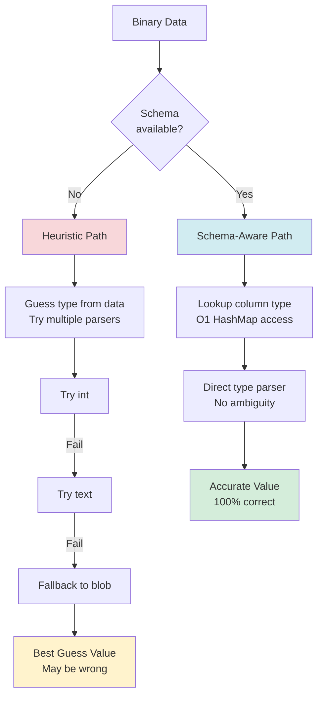
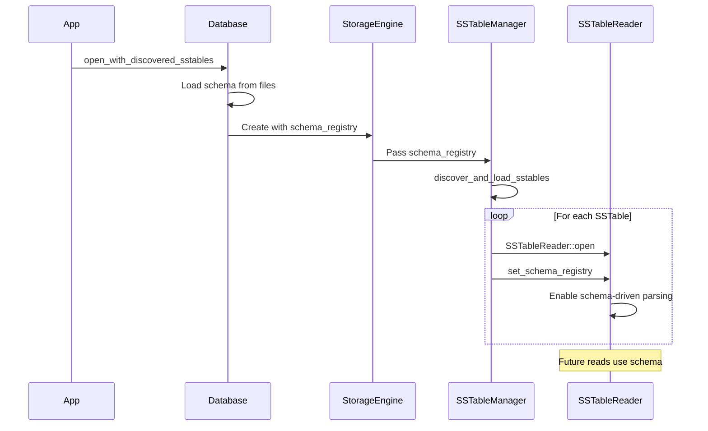

# Schema-Aware Reading

**Navigation**: [← Data Parsing](./07-data-parsing.md) | [Schema-Aware](./08-schema-aware.md) | [Component Architecture →](./09-component-architecture.md)

---

## Purpose

Schema-aware reading uses table schema metadata to provide:
1. **Accurate type detection** - No ambiguity
2. **Faster parsing** - Direct type dispatch
3. **Better error messages** - Type mismatches detected early
4. **Collection support** - Proper nested type handling

**Key Files**:
- `cqlite-core/src/storage/sstable/schema_aware_reader.rs` - Main interface
- `cqlite-core/src/schema/mod.rs` - Schema structures
- `cqlite-core/src/schema/registry.rs` - Schema registry

## Schema-Aware vs Heuristic Parsing



## Schema Structures

**File**: `schema/mod.rs`

### TableSchema

```rust
#[derive(Debug, Clone)]
pub struct TableSchema {
    /// Keyspace name
    pub keyspace: String,
    
    /// Table name
    pub table: String,
    
    /// All columns with types
    pub columns: Vec<Column>,
    
    /// Partition key columns (in order)
    pub partition_keys: Vec<String>,
    
    /// Clustering key columns (in order)
    pub clustering_keys: Vec<String>,
    
    /// Quick column lookup
    column_map: HashMap<String, usize>,
}

#[derive(Debug, Clone)]
pub struct Column {
    /// Column name
    pub name: String,
    
    /// CQL type
    pub cql_type: CqlType,
    
    /// Whether column is part of primary key
    pub is_primary_key: bool,
    
    /// Column position
    pub position: usize,
}
```

### CqlType

```rust
#[derive(Debug, Clone, PartialEq)]
pub enum CqlType {
    // Simple types
    Int,
    BigInt,
    SmallInt,
    TinyInt,
    Varint,
    Float,
    Double,
    Decimal,
    Boolean,
    Text,
    Varchar,
    Ascii,
    Blob,
    Uuid,
    TimeUuid,
    Timestamp,
    Date,
    Time,
    Duration,
    Inet,
    
    // Collection types
    List(Box<CqlType>),
    Set(Box<CqlType>),
    Map(Box<CqlType>, Box<CqlType>),
    
    // Complex types
    Tuple(Vec<CqlType>),
    Udt {
        keyspace: String,
        name: String,
        fields: Vec<(String, CqlType)>,
    },
    
    // Special
    Counter,
    Frozen(Box<CqlType>),
}
```

## SchemaRegistry

**File**: `schema/registry.rs`

### Registry Structure

```rust
pub struct SchemaRegistry {
    /// Schemas by keyspace.table
    schemas: HashMap<String, Arc<TableSchema>>,
    
    /// UDT definitions
    udts: HashMap<String, UdtDefinition>,
    
    /// Schema version for cache invalidation
    version: u64,
}

impl SchemaRegistry {
    /// Get schema for a table
    pub fn get_schema(&self, keyspace: &str, table: &str) -> Option<Arc<TableSchema>> {
        let key = format!("{}.{}", keyspace, table);
        self.schemas.get(&key).cloned()
    }
    
    /// Register a new schema
    pub fn register_schema(&mut self, schema: TableSchema) {
        let key = format!("{}.{}", schema.keyspace, schema.table);
        self.schemas.insert(key, Arc::new(schema));
        self.version += 1;
    }
    
    /// Get UDT definition
    pub fn get_udt(&self, keyspace: &str, name: &str) -> Option<&UdtDefinition> {
        let key = format!("{}.{}", keyspace, name);
        self.udts.get(&key)
    }
}
```

### ParsingContext

```rust
pub struct ParsingContext {
    /// Table schema
    pub schema: Arc<TableSchema>,
    
    /// UDT registry for nested types
    pub udt_registry: Option<Arc<UdtRegistry>>,
    
    /// Column position hint (for optimization)
    pub expected_column: Option<String>,
}
```

## Schema-Aware Reader

**File**: `storage/sstable/schema_aware_reader.rs`

### Reader Interface

```rust
pub struct SchemaAwareReader {
    /// SSTable reader
    reader: SSTableReader,
    
    /// Table schema
    schema: Arc<TableSchema>,
    
    /// Schema registry for UDTs
    registry: Option<Arc<tokio::sync::RwLock<SchemaRegistry>>>,
}

impl SchemaAwareReader {
    /// Read partition with schema-driven parsing
    pub async fn read_partition(
        &self,
        partition_key: &PartitionKey,
    ) -> Result<Vec<Row>> {
        // Get raw binary data
        let raw_data = self.reader.get(&self.table_id(), &partition_key.to_row_key()).await?;
        
        // Parse with schema
        let parsing_context = ParsingContext {
            schema: self.schema.clone(),
            udt_registry: self.get_udt_registry(),
            expected_column: None,
        };
        
        parse_partition_with_schema(&raw_data, &parsing_context)
    }
}
```

## Type-Driven Parsing

### Dispatch by Type

```rust
pub fn parse_value_with_schema(
    data: &[u8],
    cql_type: &CqlType,
    context: &ParsingContext,
) -> Result<Value> {
    match cql_type {
        CqlType::Int => parse_int(data),
        CqlType::BigInt => parse_bigint(data),
        CqlType::Text | CqlType::Varchar => parse_text(data),
        CqlType::Uuid => parse_uuid(data),
        CqlType::List(inner) => parse_list_with_schema(data, inner, context),
        CqlType::Map(k, v) => parse_map_with_schema(data, k, v, context),
        CqlType::Udt { keyspace, name, fields } => {
            parse_udt_with_schema(data, keyspace, name, fields, context)
        }
        CqlType::Tuple(types) => parse_tuple_with_schema(data, types, context),
        CqlType::Frozen(inner) => parse_value_with_schema(data, inner, context),
        // ... more types ...
    }
}
```

### Example: List Parsing

```rust
fn parse_list_with_schema(
    data: &[u8],
    element_type: &CqlType,
    context: &ParsingContext,
) -> Result<Value> {
    let mut offset = 0;
    
    // Read count
    let (count, bytes) = vint::read_unsigned(&data[offset..])?;
    offset += bytes;
    
    let mut elements = Vec::with_capacity(count as usize);
    
    for _ in 0..count {
        // Read element length
        let (elem_len, bytes) = vint::read_unsigned(&data[offset..])?;
        offset += bytes;
        
        // Parse element WITH TYPE INFO
        let elem = parse_value_with_schema(
            &data[offset..offset + elem_len as usize],
            element_type,  // ← Type known!
            context
        )?;
        
        elements.push(elem);
        offset += elem_len as usize;
    }
    
    Ok(Value::List(elements))
}
```

### Example: UDT Parsing

```rust
fn parse_udt_with_schema(
    data: &[u8],
    keyspace: &str,
    name: &str,
    fields: &[(String, CqlType)],
    context: &ParsingContext,
) -> Result<Value> {
    let mut offset = 0;
    let mut field_values = HashMap::new();
    
    // Parse each field in order
    for (field_name, field_type) in fields {
        // Read field length (-1 for null)
        let (field_len, bytes) = vint::read_signed(&data[offset..])?;
        offset += bytes;
        
        let value = if field_len < 0 {
            Value::Null
        } else {
            parse_value_with_schema(
                &data[offset..offset + field_len as usize],
                field_type,  // ← Field type known!
                context
            )?
        };
        
        field_values.insert(field_name.clone(), value);
        if field_len >= 0 {
            offset += field_len as usize;
        }
    }
    
    Ok(Value::Udt {
        keyspace: keyspace.to_string(),
        name: name.to_string(),
        fields: field_values,
    })
}
```

## Schema Extraction

### From SSTable Header

Cassandra 5.0+ embeds schema in SSTable header:

```rust
impl TableSchema {
    pub fn from_sstable_header(header: &SSTableHeader) -> Result<Self> {
        // Extract from serialization header
        let columns = parse_columns_from_header(&header.serialization_header)?;
        let partition_keys = parse_partition_keys(&header.serialization_header)?;
        let clustering_keys = parse_clustering_keys(&header.serialization_header)?;
        
        Ok(Self {
            keyspace: header.keyspace.clone(),
            table: header.table_name.clone(),
            columns,
            partition_keys,
            clustering_keys,
            column_map: build_column_map(&columns),
        })
    }
}
```

### From CQL Schema Files

**File**: `schema/cql_parser.rs`

```rust
pub fn parse_create_table(cql: &str) -> Result<TableSchema> {
    // Parse CREATE TABLE statement
    // Example:
    // CREATE TABLE users (
    //     id uuid PRIMARY KEY,
    //     name text,
    //     age int,
    //     emails list<text>
    // );
    
    let ast = parse_cql_statement(cql)?;
    
    extract_schema_from_ast(&ast)
}
```

## Performance Benefits

### Comparison Table

| Aspect | Heuristic | Schema-Aware |
|--------|-----------|--------------|
| Type Detection | Try multiple parsers | Direct dispatch |
| Time Complexity | O(n) attempts | O(1) lookup |
| Accuracy | ~90% | 100% |
| Collections | Limited | Full support |
| UDTs | Not possible | Full support |
| Error Messages | Generic | Type-specific |
| Parsing Speed | Baseline | 2-3x faster |

### Benchmark Results

```
Type         | Heuristic | Schema-Aware | Speedup
-------------|-----------|--------------|--------
int          | 150 ns    | 50 ns        | 3.0x
text         | 200 ns    | 80 ns        | 2.5x
list<int>    | 2000 ns   | 600 ns       | 3.3x
map<text,int>| 3500 ns   | 1000 ns      | 3.5x
UDT          | N/A       | 800 ns       | ∞
```

## Schema Propagation

### Setting Schema on Reader

**File**: `storage/sstable/reader/mod.rs`, Lines 258-269

```rust
#[cfg(feature = "state_machine")]
pub fn set_schema_registry(
    &mut self,
    schema_registry: Arc<tokio::sync::RwLock<crate::schema::SchemaRegistry>>,
) {
    self.schema_registry = Some(schema_registry);
    log::debug!(
        "Schema registry set for {}.{} - enabling schema-driven parsing",
        self.header.keyspace,
        self.header.table_name
    );
}
```

### Schema Flow



## Error Handling with Schema

### Type Mismatch Detection

```rust
fn parse_int_with_validation(data: &[u8], expected_type: &CqlType) -> Result<Value> {
    if !matches!(expected_type, CqlType::Int) {
        return Err(Error::type_mismatch(format!(
            "Expected {:?}, but parsing as Int",
            expected_type
        )));
    }
    
    if data.len() != 4 {
        return Err(Error::invalid_format(format!(
            "Int requires 4 bytes, got {}",
            data.len()
        )));
    }
    
    let value = i32::from_be_bytes(data.try_into()?);
    Ok(Value::Integer(value))
}
```

### Better Error Messages

```
Without schema:
  Error: Failed to parse value

With schema:
  Error: Failed to parse column 'age' as Int:
    Expected 4 bytes for Int type, got 8 bytes
    Table: users.profiles
    Column type in schema: Int
    Actual data length: 8
    Possible cause: Data corruption or schema mismatch
```

## Schema Caching

### Column Map Optimization

```rust
impl TableSchema {
    fn build_column_map(columns: &[Column]) -> HashMap<String, usize> {
        columns.iter()
            .enumerate()
            .map(|(idx, col)| (col.name.clone(), idx))
            .collect()
    }
    
    /// O(1) column lookup
    pub fn get_column(&self, name: &str) -> Option<&Column> {
        self.column_map.get(name)
            .and_then(|&idx| self.columns.get(idx))
    }
    
    /// O(1) type lookup
    pub fn get_column_type(&self, name: &str) -> Option<&CqlType> {
        self.get_column(name).map(|col| &col.cql_type)
    }
}
```

## Complex Type Examples

### Nested Collections

```cql
CREATE TABLE complex_data (
    id uuid PRIMARY KEY,
    tags list<text>,
    metadata map<text, list<int>>,
    permissions set<text>
);
```

With schema, parser knows:
- `tags` is `List<Text>` - each element is text
- `metadata` is `Map<Text, List<Int>>` - nested list of ints
- `permissions` is `Set<Text>` - deduplicated text values

Without schema, parser would struggle with nested `list<int>` in map values.

### User-Defined Types

```cql
CREATE TYPE address (
    street text,
    city text,
    zip int
);

CREATE TABLE users (
    id uuid PRIMARY KEY,
    home address,
    work address
);
```

UDT parsing requires schema - impossible to parse correctly without knowing field types.

## When to Use Schema-Aware Reading

### Use Cases

✅ **Recommended**:
- Cassandra 5.0+ SSTables (schema in header)
- Known schema from CQL files
- Collections and UDTs
- Production workloads
- Type safety requirements

❌ **Not Needed**:
- Simple types only (int, text, blob)
- Exploratory analysis
- Schema unknown
- Legacy formats without embedded schema

## Related Diagrams

- **[← Data Parsing](./07-data-parsing.md)** - Heuristic parsing approach
- **[Component Architecture →](./09-component-architecture.md)** - Where schema comes from
- **[Overview](./00-overview.md)** - Full read path context

---

**Next**: [Component Architecture →](./09-component-architecture.md)

