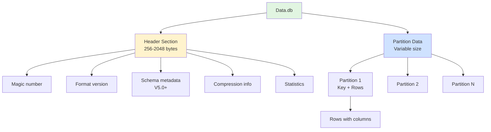
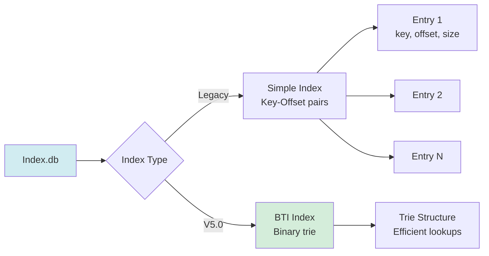
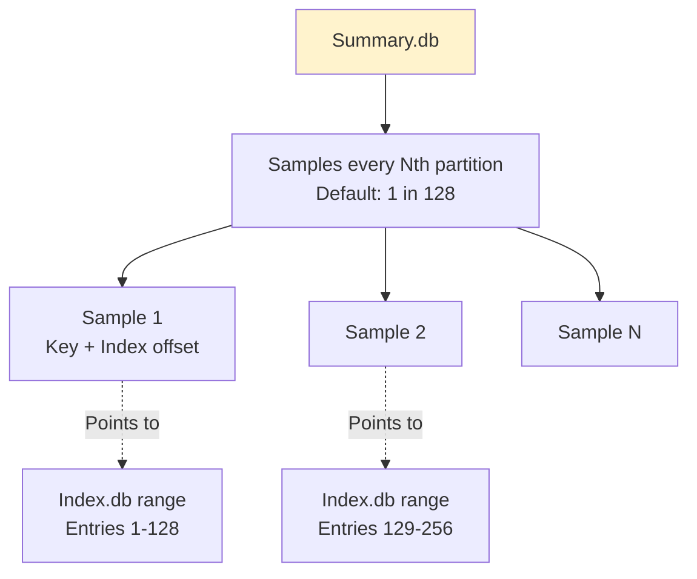
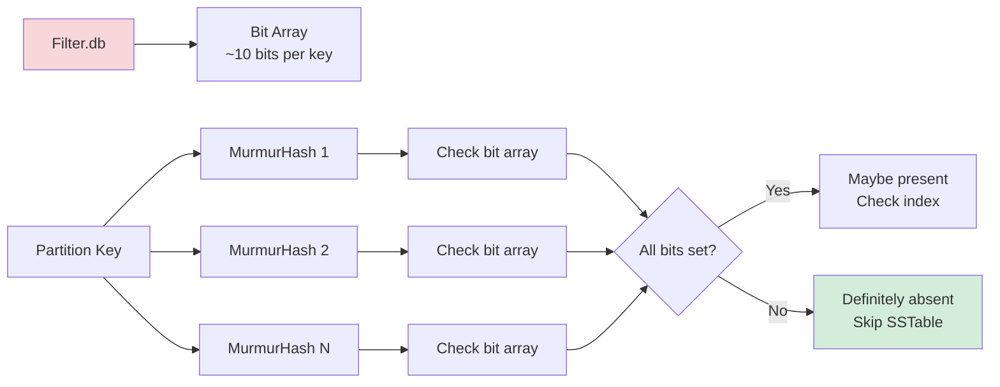
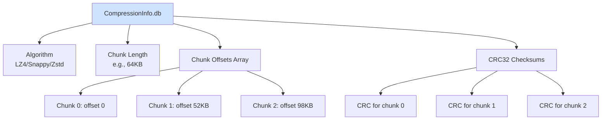
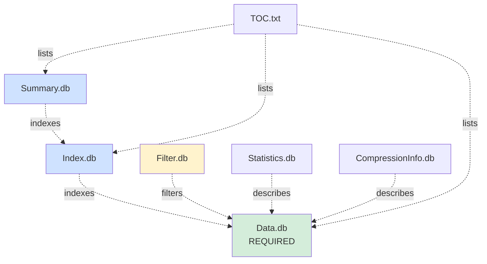
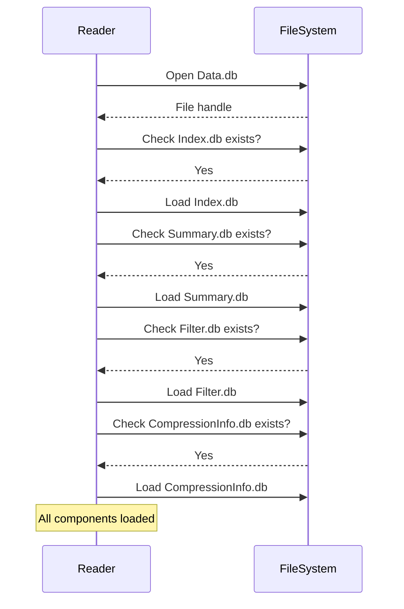
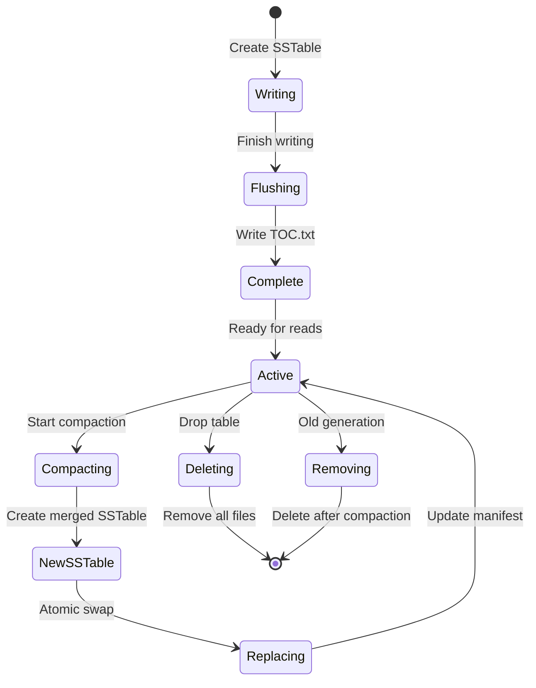

# SSTable Component Architecture

**Navigation**: [← Schema-Aware](./08-schema-aware.md) | [Component Architecture](./09-component-architecture.md) | [Back to Overview →](./00-overview.md)

---

## Purpose

Understand the SSTable file ecosystem: what files exist, how they're named, what they contain, and how they work together.

**Key Files**:
- `cqlite-core/src/storage/sstable/directory/` - Component discovery
- `cqlite-core/src/storage/sstable/reader/component_loading.rs` - Loading logic

## SSTable Component Files

### Complete File Set Example

```
/data/keyspace/tablename-UUID/
├── nb-1-big-Data.db           ← Row data (REQUIRED)
├── nb-1-big-Index.db          ← Partition index
├── nb-1-big-Summary.db        ← Index summary
├── nb-1-big-Filter.db         ← Bloom filter
├── nb-1-big-Statistics.db     ← Table statistics
├── nb-1-big-CompressionInfo.db ← Compression metadata
├── nb-1-big-TOC.txt           ← Table of contents
└── nb-1-big-Digest.crc32      ← File checksums
```

## File Naming Convention

### Format Pattern

```
<prefix>-<generation>-<format>-<component>.db
```

**Examples**:
- `nb-1-big-Data.db` - "nb" prefix, generation 1, "big" format
- `na-42-big-Index.db` - "na" prefix, generation 42
- `mc-7-big-Filter.db` - "mc" prefix, generation 7

### Prefix Meanings

| Prefix | Meaning | Cassandra Version |
|--------|---------|-------------------|
| `ma` | "Modern A" | 3.0 |
| `mb` | "Modern B" | 3.0-3.11 |
| `mc` | "Modern C" | 3.11 |
| `md` | "Modern D" | 4.0 |
| `me` | "Modern E" | 4.0 |
| `na` | "New A" (BTI) | 5.0 |
| `nb` | "New B" | 5.0 |

### Generation Number

- Increments with each compaction
- Higher generation = newer data
- Used for "last write wins" semantics

## Component Files

### 1. Data.db (Required)

**Purpose**: Contains actual row data



**Structure**:
- **Header**: Metadata about SSTable
- **Partitions**: Sorted by token/key
- **Rows**: Within each partition

**Size**: Typically largest file (GBs)

### 2. Index.db (Optional but Common)

**Purpose**: Maps partition keys to data offsets



**Format**:
```
┌────────────────────────────────┐
│ Index Header                   │
├────────────────────────────────┤
│ Entry 1                        │
│ - Partition key (bytes)        │
│ - Data offset (8 bytes)        │
│ - Data size (4 bytes)          │
├────────────────────────────────┤
│ Entry 2                        │
├────────────────────────────────┤
│ ...                            │
└────────────────────────────────┘
```

**Size**: ~1-5% of Data.db size

### 3. Summary.db (Optional)

**Purpose**: Index of the index for faster lookups



**Purpose**: Reduces Index.db reads
- Store every 128th partition key
- Binary search in Summary → range in Index
- Typical size: <1% of Index.db

### 4. Filter.db (Optional)

**Purpose**: Bloom filter for negative lookups



**Configuration**:
- False positive rate: ~1% (configurable)
- Typically 10 bits per key
- Size: ~1MB per 1M keys

### 5. Statistics.db (Optional)

**Purpose**: Metadata about the SSTable

```rust
pub struct SSTableStatistics {
    /// Estimated partition count
    pub partition_count: u64,
    
    /// Min/max timestamps
    pub min_timestamp: i64,
    pub max_timestamp: i64,
    
    /// Min/max clustering keys
    pub min_clustering: Vec<u8>,
    pub max_clustering: Vec<u8>,
    
    /// Compression ratio
    pub compression_ratio: f64,
    
    /// Cardinality estimates
    pub estimated_partition_size: EstimatedHistogram,
    pub estimated_column_count: EstimatedHistogram,
    
    /// Tombstone information
    pub estimated_tombstone_drop_time: EstimatedHistogram,
}
```

**Uses**:
- Query planning
- Compaction decisions
- Time range filtering
- Statistics

### 6. CompressionInfo.db (If Compressed)

**Purpose**: Chunk boundaries and offsets



**Format** (See [Diagram 05](./05-compressed-data.md) for details):
- Algorithm name
- Chunk length (uncompressed)
- Array of chunk offsets
- Optional CRC32 per chunk

### 7. TOC.txt (Table of Contents)

**Purpose**: Lists all component files

```
Data.db
Index.db
Summary.db
Filter.db
Statistics.db
CompressionInfo.db
TOC.txt
Digest.crc32
```

**Usage**:
- Validate SSTable completeness
- Discovery of available components
- Atomic operations (file appears = complete)

### 8. Digest.crc32 (Optional)

**Purpose**: CRC32 checksums for all files

```
<filename>: <crc32-hex>
Data.db: a3f5c892
Index.db: 7b23e941
...
```

## Component Dependencies



**Key Points**:
- Only Data.db is required
- Other files improve performance
- Can function without optional files (slower)

## Component Discovery

**File**: `storage/sstable/directory/scan.rs`

### Discovery Process

```rust
pub async fn discover_sstable_components(path: &Path) -> Result<Components> {
    let parent = path.parent().ok_or_else(|| Error::invalid_path("No parent"))?;
    let base_name = extract_base_name(path)?; // e.g., "nb-1-big"
    
    let mut components = Components::default();
    
    // Required: Data.db
    components.data = path.to_path_buf();
    
    // Optional components
    components.index = find_component(parent, &base_name, "Index.db").await?;
    components.summary = find_component(parent, &base_name, "Summary.db").await?;
    components.filter = find_component(parent, &base_name, "Filter.db").await?;
    components.statistics = find_component(parent, &base_name, "Statistics.db").await?;
    components.compression_info = find_component(parent, &base_name, "CompressionInfo.db").await?;
    components.toc = find_component(parent, &base_name, "TOC.txt").await?;
    
    Ok(components)
}
```

### Component Detection

```rust
async fn find_component(dir: &Path, base: &str, suffix: &str) -> Result<Option<PathBuf>> {
    let component_path = dir.join(format!("{}-{}", base, suffix));
    
    if component_path.exists() {
        Ok(Some(component_path))
    } else {
        Ok(None)
    }
}
```

## Loading Strategy

### Sequential Loading

**File**: `storage/sstable/reader/component_loading.rs`



### Parallel Loading (Optimization)

```rust
pub async fn load_components_parallel(components: &Components) -> Result<LoadedComponents> {
    let (index, summary, filter, compression_info) = tokio::try_join!(
        load_index_async(&components.index),
        load_summary_async(&components.summary),
        load_filter_async(&components.filter),
        load_compression_info_async(&components.compression_info),
    )?;
    
    Ok(LoadedComponents {
        index,
        summary,
        filter,
        compression_info,
    })
}
```

## File Size Estimates

### Typical Sizes

For a 1GB Data.db file:

| Component | Size | % of Data.db |
|-----------|------|--------------|
| Data.db | 1.0 GB | 100% |
| Index.db | 20-50 MB | 2-5% |
| Summary.db | 200-500 KB | 0.02-0.05% |
| Filter.db | 5-10 MB | 0.5-1% |
| Statistics.db | 10-50 KB | <0.01% |
| CompressionInfo.db | 10-100 KB | <0.01% |
| TOC.txt | 1 KB | <0.001% |

**Total overhead**: ~3-7% for all components

### Compression Impact

| Configuration | Data.db Size | Index.db | Total Size |
|---------------|--------------|----------|------------|
| Uncompressed | 1.0 GB | 30 MB | 1.03 GB |
| LZ4 (2.5x) | 400 MB | 30 MB | 430 MB |
| Zstd (4x) | 250 MB | 30 MB | 280 MB |

*Note: Index.db doesn't compress as much as Data.db*

## Multi-Generation Handling

### Multiple SSTables for Same Table

```
/data/keyspace/users-UUID/
├── nb-1-big-Data.db      ← Generation 1 (oldest)
├── nb-1-big-Index.db
├── nb-2-big-Data.db      ← Generation 2
├── nb-2-big-Index.db
├── nb-5-big-Data.db      ← Generation 5 (newest)
└── nb-5-big-Index.db
```

**Why Multiple**:
- Compaction in progress
- Recent writes not yet compacted
- Incremental backups

**Read Strategy**:
```rust
// Read from all generations
for gen in [5, 2, 1] {  // Newest first
    if let Some(value) = read_from_generation(gen, &key).await? {
        return Ok(Some(value));  // Newest wins
    }
}
```

## Component Validation

**File**: `storage/sstable/directory/validation.rs`

### Integrity Checks

```rust
pub fn validate_components(components: &Components) -> Result<ValidationReport> {
    let mut report = ValidationReport::new();
    
    // 1. Data.db must exist
    if !components.data.exists() {
        report.add_error("Data.db missing");
    }
    
    // 2. If CompressionInfo exists, validate it matches Data.db
    if let Some(ref comp_info) = components.compression_info {
        validate_compression_info(comp_info, &components.data)?;
    }
    
    // 3. If Index exists, validate it can be read
    if let Some(ref index) = components.index {
        validate_index_format(index)?;
    }
    
    // 4. Check TOC.txt lists all present files
    if let Some(ref toc) = components.toc {
        validate_toc(toc, components)?;
    }
    
    Ok(report)
}
```

## Component Lifecycle



## Best Practices

### For Readers

✅ **Always Check**:
- Data.db exists (required)
- Load Index.db if available (huge speedup)
- Use Filter.db for negative lookups
- Check CompressionInfo.db for compressed files

✅ **Graceful Degradation**:
- Function without Index.db (use sequential scan)
- Function without Filter.db (more disk I/O)
- Validate but don't fail on missing optional files

### For Writers

✅ **Atomic Creation**:
- Write all files before TOC.txt
- TOC.txt = "SSTable is complete"
- Never partial SSTables visible

✅ **Component Order**:
1. Write Data.db completely
2. Build and write Index.db
3. Build and write Summary.db from Index
4. Build and write Filter.db
5. Collect and write Statistics.db
6. Write CompressionInfo.db if compressed
7. Write TOC.txt (makes SSTable visible)

## Related Diagrams

- **[Overview](./00-overview.md)** - How components fit in read path
- **[Index Lookup](./03-sstable-index-lookup.md)** - Using Index.db and Summary.db
- **[Compressed Data](./05-compressed-data.md)** - Using CompressionInfo.db
- **[Schema-Aware](./08-schema-aware.md)** - Schema from Data.db header

---

**Complete!** [Return to Overview →](./00-overview.md)

