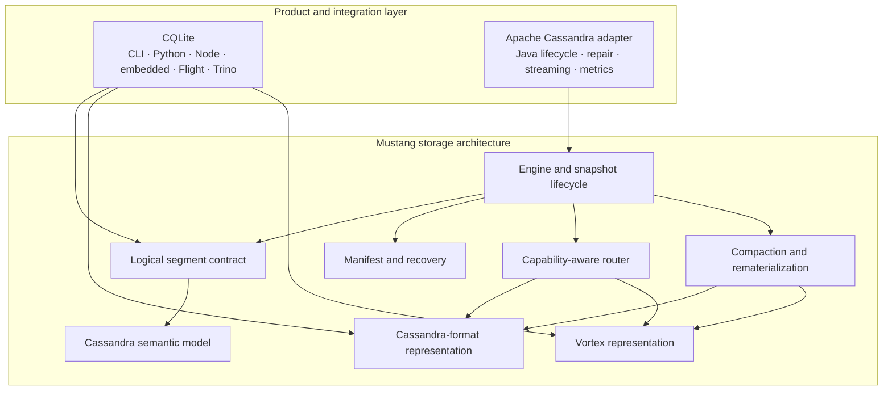
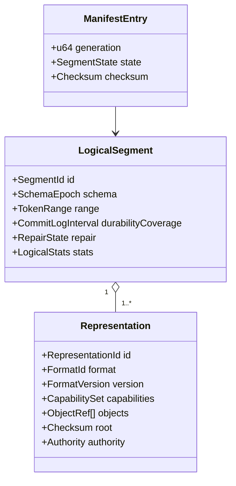

# Mustang: A Multi-Representation Storage Architecture for Apache Cassandra

**Architecture and feasibility paper**  
**Author:** Patrick McFadin  
**Research draft:** July 21, 2026  
**Status:** Proposal for discussion; not an accepted Apache Cassandra design

## Abstract

Apache Cassandra couples a mature distributed database with an increasingly modular local storage layer. Cassandra 4.1 introduced pluggable memtables through CEP-11. Cassandra 5.0 introduced an SSTable format API through CEP-17, a new Trie-Indexed SSTable format through CEP-25, and Unified Compaction Strategy through CEP-26. These changes provide credible entry points for storage experimentation, but they do not form a general storage-engine interface.

This paper proposes **Mustang**, a storage architecture in which one immutable logical segment may have one or more physical representations. A Cassandra-compatible row representation can serve point and slice reads, while a Vortex columnar representation can serve projections, scans, and aggregations. Both derive from the same ordered mutation stream and share a logical identity, lifecycle, and correctness contract. A versioned manifest publishes representation sets atomically. A capability-aware router selects a representation only when it can preserve Cassandra's reconciliation semantics.

Mustang is technically plausible because its parts have strong precedent: LSM trees use immutable runs and background transformations; Fractured Mirrors and HTAP systems maintain workload-specific layouts; Iceberg, Delta Lake, and Hudi publish immutable files through metadata; Arrow and Velox provide columnar interchange and execution contracts; and Vortex offers extensible compressed arrays and file layouts. The complete composition remains unproven. In particular, no cited system establishes that synchronous row-and-column materialization will improve total cost under Cassandra's flush, compaction, repair, and tail-latency constraints.

The proposed path therefore keeps a Cassandra SSTable authoritative at first and treats Vortex as a rebuildable accelerator. An external CQLite/Flight prototype can prove semantic fidelity and workload value. A Cassandra 5.0 CEP-17 format can then exercise the in-process boundary without a general engine fork. Coordinated representation lifecycle, native read routing, and multi-output compaction require a focused new Cassandra Enhancement Proposal. A full engine replacement should remain a research fork until evidence justifies a stable interface.

## 1. Thesis

Mustang should be a **storage architecture**, not merely another Cassandra storage engine and not a synonym for a new SSTable format.

Its central object is an immutable logical segment: a bounded set of Cassandra mutations, together with the schema, token coverage, time metadata, repair state, and durability interval needed to interpret them. A segment may be materialized as:

- a Cassandra-compatible row representation for native replica reads, repair, and streaming;
- a Vortex representation for compressed columnar scans;
- a future Cassandra format, Parquet export, object-store form, or specialized index;
- one representation only when duplication has no measured benefit.

Representations are policy choices, not the identity of the data. Compaction transforms logical segments and emits a new representation set. The manifest defines what is visible. The router uses capabilities and cost, in that order: semantic fitness is mandatory; estimated speed is secondary.

The strongest feasible initial design is deliberately asymmetric. The Cassandra-compatible SSTable is authoritative. Vortex is derived and rebuildable. This avoids making a new manifest the sole durability boundary before the design has survived crash, repair, streaming, and upgrade tests. Symmetric or independently authoritative representations are later research questions.

## 2. Scope and claims

### 2.1 What this paper claims

1. Cassandra 5.0 has enough extension surface to prototype a Mustang-backed **single SSTable format** without replacing Cassandra's distributed-system machinery.
2. CQLite already contains useful proof points: Rust SSTable code, a CLI, Python and Node bindings, Arrow Flight, Trino integration, snapshot handling, validation tools, and a substantial correctness corpus. Its current workspace exposes `cqlite-core`, `cqlite-cli`, `cqlite-flight`, Python and Node bindings, compatibility tests, and validation tools.[^cqlite]
3. Multi-representation storage is technically plausible by composition of known designs.
4. A production-ready multi-representation lifecycle is not available through Cassandra's current public interfaces. It needs prototype evidence and one or more new CEPs.
5. Incremental adoption within Apache Cassandra is more credible than proposing a monolithic Rust storage-engine replacement.

### 2.2 What this paper does not claim

- Row-plus-column storage is novel by itself. Fractured Mirrors described differently organized replicas in 2002.[^fractured]
- Vortex is proven for Cassandra workloads. Its design is promising, but Cassandra-specific results do not yet exist.
- Dual materialization is free. It consumes CPU, I/O, storage, cache, and operational attention.
- CEP-11 and CEP-17 together form a complete engine SPI. CEP-11 explicitly excludes full engine replacement, and CEP-17 retains Cassandra's surrounding mechanics.
- Rust must become a mandatory Cassandra dependency. A Rust implementation can remain optional while Cassandra owns the Java-facing contracts.

### 2.3 Initial non-goals

The first prototype should exclude counters, materialized views, SAI integration, CDC-specific behavior, transient replication, pending repair, object-store authority, and alternative commit logs unless each feature receives a separate semantic design and test plan. LWT and Accord should remain unchanged control paths because Mustang initially changes local materialization, not distributed coordination.

## 3. Project boundary: CQLite and Mustang

CQLite and Mustang serve different users.

**CQLite** answers: *How can a developer read, write, inspect, query, or convert Cassandra data without running a Cassandra cluster?* It should remain approachable: CLI, Python, Node, embedded APIs, Arrow Flight, Trino, validators, and file conversion.

**Mustang** answers: *How should immutable storage segments be represented, transformed, published, recovered, and routed inside a storage system?* It owns the neutral storage contracts and engine policy. Cassandra is its first host and proving environment.

The dependency direction should be one way: CQLite consumes Mustang libraries; Mustang never depends on CQLite product code.



Extraction should preserve CQLite's public API while moving neutral internals behind new crates. A repository split is optional at first. Cargo packages provide a sufficient architectural boundary and allow gradual migration.

## 4. Cassandra's current extension surface

### 4.1 CEP-11: pluggable memtables

[CEP-11](https://cwiki.apache.org/confluence/spaces/CASSANDRA/pages/184617682/CEP-11%2BPluggable%2Bmemtable%2Bimplementations) shipped in Cassandra 4.1. A table can select a configured memtable implementation. The `org.apache.cassandra.db.memtable.Memtable` interface covers the operations `ColumnFamilyStore` performs on memtables, with factory and lifecycle hooks. The official feature description shows per-table selection and describes the shipped sharded skip-list implementation.[^memtable-blog]

This API can support Mustang ingestion experiments, alternative buffering, ordered mutation export, and commit-log coverage tests. It cannot justify a broad engine claim. CEP-11 states: “We are not aiming to fully replace Cassandra's storage engine.” That sentence should govern the scope of any initial proposal.

### 4.2 CEP-17: SSTable format API

[CEP-17](https://cwiki.apache.org/confluence/display/CASSANDRA/CEP-17%3A%2BSSTable%2Bformat%2BAPI) shipped in Cassandra 5.0 through [CASSANDRA-17056](https://issues.apache.org/jira/browse/CASSANDRA-17056). Its central Java interface is `org.apache.cassandra.io.sstable.format.SSTableFormat<R extends SSTableReader, W extends SSTableWriter>`.[^sstable-source] It exposes reader and writer factories, format-owned components, scrubbers, verification, deletion behavior, metrics, and cache serialization. The nested factory constructs a format from configuration.

CEP-17 describes its scope as keeping Cassandra's mechanics while allowing the stored data and indexes to change. This is Mustang's strongest supported in-process entry point. A Java adapter can present one Cassandra-visible SSTable identity while Rust implements encoding, decoding, statistics, and optional derived Vortex components.

CEP-17 does **not** define:

- one logical segment with several peer representations;
- an atomic representation-set manifest understood by Cassandra;
- a cost- or capability-based native read router;
- coordinated multi-output compaction;
- representation-aware repair, streaming, snapshots, and cleanup.

### 4.3 CEP-25: proof that a new format can land

[CEP-25](https://cwiki.apache.org/confluence/pages/viewpage.action?pageId=235834837) used CEP-17 to introduce Trie-Indexed SSTables (BTI) in Cassandra 5.0. Old BIG SSTables remain readable; operators can switch the written format and use controlled rewrite and streaming paths. BTI therefore supplies a practical template: preserve mixed-format readability, exercise the full test suite, support upgrades and downgrades, and make adoption explicit.

Mustang's first Cassandra proposal should resemble CEP-25 more than a whole-engine rewrite.

### 4.4 Compaction: useful policy seam, incomplete execution seam

Cassandra chooses a compaction strategy per table. [CEP-26](https://cwiki.apache.org/confluence/x/UZMODg) introduced Unified Compaction Strategy in 5.0 and demonstrates that workload-sensitive compaction policy can evolve within the project. It does not replace the underlying compaction execution machinery and excludes tiered storage from its scope.

A Mustang strategy can initially choose inputs and schedule conventional tasks. Coordinated logical compaction that emits several representations, publishes one manifest generation, and accounts for combined resource use exceeds the present strategy boundary.

### 4.5 Earlier storage-engine and columnar work

[CASSANDRA-13474](https://issues.apache.org/jira/browse/CASSANDRA-13474) tracks a still-unresolved pluggable storage-engine effort. Its design issue, [CASSANDRA-13475](https://issues.apache.org/jira/browse/CASSANDRA-13475), and RocksDB implementation issue, [CASSANDRA-13476](https://issues.apache.org/jira/browse/CASSANDRA-13476), document the required surface: writes, reads, streaming, repair, table lifecycle, compaction, metrics, and `ColumnFamilyStore` operations. The work recorded production experience from Instagram's Rocksandra and reported large tail-latency gains, but important read, compaction, lifecycle, and metrics tasks remained open.

This history supports two conclusions. A different local engine can work under Cassandra. A stable abstraction must be validated by a second implementation before Cassandra commits to it.

[CASSANDRA-7447](https://issues.apache.org/jira/browse/CASSANDRA-7447), an open issue targeted at 6.x at the time of writing, proposes an SSTable format with composable row and column-oriented value layouts, specialized timestamp/TTL/tombstone encoding, and staged adoption. It demonstrates long-standing community interest in columnar local storage. It is backlog and design precedent, not a delivered capability.

### 4.6 Feasibility classification

| Mustang capability | Existing Cassandra mechanism | New CEP | Prototype or fork first |
|---|---:|---:|---:|
| Alternative single SSTable format | CEP-17, Cassandra 5.0+ | No | Recommended before upstreaming |
| Format reader/writer, components, scrubber, verifier, metrics | CEP-17 | No | Adapter validation required |
| Alternative memtable | CEP-11, Cassandra 4.1+ | No | Optional experiment |
| Table-selectable compaction policy | Current strategy API / CEP-26 precedent | No | Yes, for policy data |
| SSTable-authoritative format with rebuildable Vortex side component | Plausibly internal to a CEP-17 format | Maybe, depending on lifecycle behavior | Yes |
| Atomic logical segment with multiple Cassandra-visible representations | No | **Yes** | **Yes** |
| Native capability discovery and read routing | No general seam | **Yes** | **Yes** |
| Multi-output compaction and shared backpressure accounting | No complete seam | **Yes** | **Yes** |
| Representation-aware repair, streaming, snapshots, cleanup, upgrades | Partial format hooks only | **Yes** | **Yes** |
| Stable native Rust plugin lifecycle and packaging | No | Likely | **Yes** |
| Replace `ColumnFamilyStore` or commit log | No supported general SPI | **Yes, broad** | **Fork first** |

The table is intentionally conservative. A prototype may discover that a narrow capability fits within existing internal hooks, but implementation convenience is not the same as a supported public contract.

## 5. Related work

### 5.1 LSM trees and the cost triangle

The original Log-Structured Merge-Tree organizes writes into memory and immutable disk components that merge in the background.[^lsm] Mustang retains this foundation but generalizes an output from “one run in one format” to “one logical run with a policy-selected representation set.”

Modern work shows why policy matters. Monkey allocates Bloom-filter memory across LSM levels to reduce lookup cost.[^monkey] Dostoevsky presents an LSM design continuum rather than one universal compaction optimum.[^dostoevsky] RocksDB exposes leveled, universal/tiered, and FIFO compaction, each trading read, write, and space amplification.[^rocks-compaction] Pebble demonstrates continued LSM evolution behind a key-value interface, including L0 sublevels and flush splitting, while warning that feature-level format compatibility remains delicate.[^pebble]

Mustang adds another dimension to the same trade space. A second representation can reduce analytical read cost while increasing write, space, and scheduling cost. The architecture must expose this cost; it cannot hide it behind the word “materialization.”

### 5.2 Multi-representation and hybrid layouts

Fractured Mirrors stores row- and column-oriented mirrors and routes queries between them.[^fractured] It is the clearest prior art against a broad novelty claim. HYRISE chooses vertical partitions of different widths and reports gains over pure row or column layouts for its evaluated workload, while also exposing the synchronization and systems complexity around adaptive layouts.[^hyrise]

Mustang's proposed contribution is narrower: a Cassandra-compatible logical segment with policy-controlled immutable representations, explicit semantic capabilities, atomic lifecycle metadata, and a path through Cassandra's existing format API.

### 5.3 HTAP systems

TiDB separates row-oriented TiKV from the columnar TiFlash replica and uses Raft replication to maintain the analytical copy.[^tidb] This validates workload-specific representations and query routing. It does not validate synchronous local co-materialization; replication changes freshness, failure, and resource economics.

SAP HANA's column store uses a write-optimized delta and compressed main store, joined by delta merge.[^hana-paper][^hana-delta] SingleStore columnstores accumulate rows in memory and flush compressed columnar segments, while rowstore and columnstore remain table choices.[^singlestore] Google F1 Lightning adds a columnar, vectorized analytical serving layer over operational data.[^f1]

These systems support the value of specialized layouts. They also supply counterevidence to mandatory dual storage: production systems often choose one primary form and derive, replicate, or merge into another asynchronously.

The 2024 HTAP survey provides a broader taxonomy of resource sharing, freshness, and row/column organization.[^htap-survey]

### 5.4 Arrow, Velox, Umbra, and Vortex

Apache Arrow defines a “language-agnostic in-memory data structure specification.”[^arrow] Its layout supports vectorized scans, constant-time random access for most types, and zero-copy interchange. Arrow does not define database durability, mutation coordination, tombstone reconciliation, or a storage lifecycle. Mustang should use Arrow as a batch boundary, not as its transaction model.

Velox shows the value of separating reusable vectorized execution from storage. It operates on encoded and lazy vectors and interoperates with Arrow-like data without requiring every storage system to adopt the same durable format.[^velox] Umbra demonstrates a modern disk-backed architecture with variable-size pages and a buffer manager designed for in-memory performance when the working set is cached.[^umbra] Arrow's BinaryView layout credits Umbra's string representation, illustrating how execution and representation ideas can cross system boundaries.

Vortex separates logical types from physical encodings and layouts. Its arrays can remain compressed in memory, on disk, and over the wire; its scan interface supports projection and filter pushdown.[^vortex-concepts][^vortex-spec] This makes Vortex a strong experimental columnar representation for Mustang. Results must be interpreted cautiously. A 2026 DuckDB evaluation reported a geometric-mean advantage over Parquet on its SF100 setup, while also reporting a larger file than one Parquet configuration and emphasizing benchmark variability.[^duckdb-vortex] Those results motivate a Cassandra experiment; they do not predict it.

A 2025 survey of analytical file formats likewise finds workload-dependent performance tradeoffs rather than one universal winner.[^formats] “Mainlining Databases” provides direct research precedent for transactional systems that emit Arrow-oriented columnar blocks, but remains a research design rather than proof under Cassandra operations.[^mainlining]

### 5.5 Lakehouse metadata and immutable files

Iceberg manages immutable data files through snapshots and reusable manifests; a table update creates metadata and atomically changes the current state.[^iceberg] Delta Lake uses immutable data objects plus a transaction log and MVCC snapshots.[^delta] Hudi organizes file groups and file slices along a timeline and coordinates compaction and clustering.[^hudi]

These systems validate immutable objects plus metadata publication. Their commit granularity and latency differ from Cassandra's local flush path. Delta's transaction rate depends on transaction-log storage latency, a warning that Mustang's manifest can become a serialization point. Mustang therefore needs small metadata records, per-table sharding, measured fsync cost, and recovery tests.

## 6. Logical model and correctness contract

A logical segment cannot be a generic table of rows. It must preserve the information Cassandra uses to reconcile overlapping data:

- partitioner and token range;
- partition and clustering order;
- static rows and complex columns;
- per-cell timestamps;
- TTL and local deletion time;
- row, partition, range, and cell tombstones;
- schema identity and comparator rules;
- commit-log lower and upper positions;
- repaired and pending-repair state;
- logical statistics and validation checksums;
- explicit capability exclusions, such as counters in an early version.

Each physical representation declares a `CapabilitySet`. Examples include point lookup, clustering slice, full scan, projection pushdown, predicate pushdown, complete tombstone fidelity, repair-digest participation, native streaming, and schema-evolution support. The router must reject a representation that lacks any capability required for a request.

This design prevents a fast analytical copy from silently becoming a weaker consistency model. Unsupported semantics trigger the authoritative SSTable path or a clear error in an analytical-only interface.



## 7. Rust crate architecture

Avoid a single `core` crate. Large core crates collect unrelated dependencies and make stable boundaries harder to see.

| Crate or module | Responsibility | Must not own |
|---|---|---|
| `mustang-types` | Scalar/byte types, validated IDs, token and key bounds, timestamps | Cassandra lifecycle or I/O |
| `mustang-cassandra-model` | Exact mutation and reconciliation model, schemas, tombstones, TTL, comparators | File formats |
| `mustang-segment` | Segment identity, coverage, statistics, reader/writer traits, capability declarations | Cassandra Java objects |
| `mustang-manifest` | Versioned records, checksums, prepare/publish/retire/recover protocol, backend abstraction | Query planning |
| `mustang-format-cassandra` | BIG/BTI-compatible or new CEP-17 format readers and writers | Engine policy |
| `mustang-format-vortex` | Vortex encoding, hidden reconciliation metadata, projection/filter pushdown | Authority decisions |
| `mustang-engine` | Segment-set snapshots, flush orchestration, publication, quotas, recovery | Product-facing CLI or bindings |
| `mustang-compaction` | Selection policy, reconciliation merge, output representation policy | Independent per-format truth |
| `mustang-router` | Request classification, capability filter, cost model, fallback | Format implementation details |
| `mustang-cassandra-ffi` | Narrow versioned C ABI, handles, ownership, status codes, panic containment | Cassandra policy |
| Java `mustang-cassandra-adapter` | CEP-17 factories/readers/writers, Cassandra lifecycle translation, metrics | Rust internals |
| `mustang-flight` | Optional Arrow Flight analytical service | Durability authority |
| `cqlite-*` | CLI, language bindings, friendly file/table APIs, Trino-facing product features | Mustang engine policy |

The extraction path should start from CQLite's existing `cqlite-core`, not rewrite it. First isolate the Cassandra model and SSTable I/O behind internal modules. Then publish or move crates while keeping compatibility re-exports in CQLite. Existing validators, fuzzers, corpus tools, Python/Node bindings, Flight code, and Trino tests become migration guards.

## 8. Manifest and publication protocol

Every representation is immutable and checksummed. A versioned manifest is the authority for the segment set visible at an epoch. Filenames remain implementation details.

For a local filesystem flush:

1. Freeze the memtable and capture its commit-log interval and schema epoch.
2. Produce one ordered logical mutation stream.
3. Feed the stream to the authoritative Cassandra builder and, in parallel or sequence, to optional builders such as Vortex.
4. Write each output under a unique temporary identity; compute checksums; flush and synchronize required files.
5. Open and minimally validate each required representation.
6. Write and synchronize a `PREPARED` manifest record containing coverage, capabilities, object identities, sizes, and checksums.
7. Atomically publish a new manifest generation and synchronize the containing directory where the filesystem requires it. This is the visibility point.
8. Notify Cassandra that the authoritative flush is durable. Only then may commit-log recycling advance past the segment's covered interval.
9. Delete abandoned temporary objects and retired generations only after readers and snapshots release their epochs.

“Simultaneous materialization” means deriving representations from the same frozen logical stream and publishing the required set in one manifest transaction. It does not mean that the final bytes reach disk at the same instant.

```mermaid
sequenceDiagram
  participant CL as Cassandra CommitLog
  participant MT as Frozen Memtable
  participant FE as Mustang Flush Executor
  participant S as SSTable builder
  participant V as Vortex builder
  participant M as Manifest

  CL->>MT: durable mutations and log positions
  MT->>FE: ordered logical mutation stream
  par authoritative output
    FE->>S: encode full Cassandra semantics
  and optional analytical output
    FE->>V: encode columns and reconciliation metadata
  end
  S-->>FE: checksum and capabilities
  V-->>FE: checksum and capabilities
  FE->>M: prepare generation
  FE->>M: atomically publish generation
  M-->>CL: authoritative segment durable; recycling eligible
```

On restart, Mustang ignores unpublished temporary objects, verifies the latest complete generation, and falls back to the previous valid generation if publication is incomplete. Filesystem rename and directory-sync semantics vary; the implementation must state and test its platform contract. Object storage requires immutable objects plus a conditional pointer update, not a pretend POSIX rename, and belongs in a later phase.

### 8.1 Degraded publication policy

The default policy should preserve Cassandra availability:

- If the authoritative SSTable succeeds and optional Vortex fails, publish the SSTable, record the missing accelerator, and enqueue rematerialization.
- If `require_all_representations=true`, failure of any required builder blocks publication and applies flush backpressure.
- If the authoritative output fails, publish nothing and follow Cassandra's existing flush-failure policy.

This policy makes the cost and availability tradeoff a table-level choice.

## 9. Compaction and rematerialization

Compaction must operate on logical segments, not let every representation compact itself independently.

The compactor selects input segments, reconciles their mutations under Cassandra's timestamp, TTL, and tombstone rules at a declared garbage-collection horizon, and emits a replacement logical segment with policy-selected representations. One manifest update replaces the inputs with the output. Readers holding an older epoch may finish before garbage collection removes retired objects.

Independent row and column compaction is unsafe because tombstone purging, expiration time, overlap, and repaired state can diverge. A columnar rebuild that preserves the same logical contents is a distinct **rematerialization** operation. It changes representation metadata without advancing logical compaction history.

Representation policy can be:

- `row_only` for write-heavy or latency-sensitive tables;
- `row_plus_column_async` for a durable row form and eventually fresh analytics;
- `row_plus_column_required` when analytical freshness justifies flush coupling;
- `adaptive` after workload telemetry and budgets prove safe;
- future policies that choose formats by level, age, temperature, or storage tier.

## 10. Read routing

The router follows five steps:

1. Classify the request: point, clustering slice, token range, scan, projection, predicate, aggregation, and required snapshot.
2. Filter representations by semantic capabilities.
3. Estimate cost from statistics, selectivity, cache state, locality, decode cost, and concurrency budgets.
4. Choose one representation per logical segment and reconcile across overlapping segments exactly once.
5. Fall back to the authoritative SSTable on unsupported operations, stale/missing derived data, checksum failure, or uncertain cost.

The first production-shaped version should keep native Cassandra point and slice reads on SSTables. CQLite Flight and Trino can route analytical scans to Vortex outside Cassandra. Native columnar routing belongs in a later CEP because Cassandra's read path spans `ColumnFamilyStore`, memtables, SSTable readers, reconciliation, consistency handling, and index integration.

## 11. Java/Rust integration

### 11.1 Recommended prototype: Java adapter plus narrow native ABI

Cassandra remains a Java project and should own the lifecycle-facing interface. A small Java CEP-17 adapter translates Cassandra metadata and operations into a versioned C ABI implemented by Rust.

The boundary should use:

- opaque handles with explicit create/close ownership;
- coarse Arrow or direct-buffer batches, never one native call per cell;
- fixed-width status codes and separately retrieved structured errors;
- ABI version and feature negotiation;
- panic containment; Rust must never unwind through native frames;
- platform artifact checksums and explicit load diagnostics;
- cancellation, deadlines, memory budgets, and metrics at the boundary.

A native memory error still terminates the JVM. Sanitizers, Miri where applicable, fuzzing, canary deployments, and fault injection are required. `panic=abort` is unsuitable for an embedded library if a recoverable Rust panic should become a Java error; the native crate needs a carefully audited unwind/catch boundary.

### 11.2 Out-of-process sidecar or Flight

A sidecar provides better crash isolation and naturally moves Arrow batches. It also adds IPC, deployment, authentication, version skew, and a two-process failure protocol. It is well suited to derived Vortex building and analytical scans, but poorly suited to synchronous authoritative point reads and flush completion.

### 11.3 Pure Java adapter with offline Rust builder

This path carries the lowest upstream risk. Cassandra uses a Java format implementation or the existing format while Rust builds and validates derived artifacts outside the hot path. It is a strong phase-zero baseline and a useful reference even if JNI later wins.

### 11.4 Foreign Function and Memory API

The JDK Foreign Function and Memory API may simplify long-term bindings, but Mustang must follow Cassandra's supported JDK baseline and release policy. The first prototype should not depend on a newer JDK than its target Cassandra branch.

### 11.5 Subprocess per operation

A command-line subprocess is useful for experiments and repair tools. Process startup, streaming overhead, cancellation, and cross-process atomicity make it unsuitable as the core engine boundary.

## 12. Feasibility within the Apache Cassandra project

### 12.1 Why the design is feasible

The claim rests on cumulative evidence, not one API:

- CEP-11 proves per-table storage-memory implementations can become configurable.
- CEP-17 provides a supported abstraction for alternative SSTable readers, writers, components, validation, deletion, and metrics.
- CEP-25 proves a materially different SSTable implementation can ship while old formats remain readable.
- CEP-26 proves compaction policy can evolve through a CEP without replacing Cassandra's distributed protocols.
- CASSANDRA-13474 records serious prior work on a different local engine and identifies the remaining integration surface.
- CASSANDRA-7447 shows continuing interest in composable columnar SSTable layout.
- CQLite provides a Rust codebase and compatibility tooling from which to build a prototype.

None of these facts makes upstream acceptance automatic. Together, they make a staged proposal technically credible.

### 12.2 Governance path

The [Cassandra Enhancement Proposal process](https://cwiki.apache.org/confluence/spaces/CASSANDRA/pages/95652201/Cassandra%2BEnhancement%2BProposals%2BCEP) allows anyone who intends and can complete the work to initiate a CEP. The proposer creates a design page, starts a `[DISCUSS]` thread on `dev@cassandra.apache.org`, obtains a committer shepherd, iterates with stakeholders, and proceeds to a vote. Acceptance requires community consensus and binding committer support. A CEP should cover scope, goals and non-goals, approach, operational implications, test plan, timeline, communication channels, and related JIRA issues.

Cassandra treats rolling compatibility as a first-class concern across SSTable components, commit logs, configuration, metrics, tooling, and operational routines. New dependencies also require community discussion under the project's dependency policy.[^dependencies]

Mustang should therefore propose small contracts backed by measurements:

1. Use CEP-17 without changing Cassandra's public architecture.
2. Publish prototype results and failure semantics.
3. Propose a **Multi-Representation SSTable Lifecycle CEP**, not a universal engine SPI.
4. Scope capability discovery, atomic representation publication, rematerialization, and lifecycle hooks precisely.
5. Defer native read routing and coordinated compaction until the first CEP has production-shaped evidence.
6. Keep Rust and Vortex optional. Preserve the default Java path.

### 12.3 What requires a fork

A fork is justified as a temporary laboratory when Mustang must intercept `ColumnFamilyStore`, change commit-log durability, replace repair or streaming semantics, or make a non-SSTable representation independently authoritative. The fork should produce data, tests, and API requirements. It should not become the default distribution strategy if a smaller upstream seam can solve the proven need.

## 13. Phased implementation plan

### Phase 0 — Semantic specification and corpus

- Specify the mutation model, segment identity, capabilities, manifest records, and failure states.
- Build golden BIG and BTI corpora covering static rows, collections, UDTs, wide partitions, all tombstone forms, TTL boundaries, schema evolution, repaired data, and corruption.
- Differentially compare CQLite with `sstabledump`, Cassandra reads, and round trips.
- Record explicit exclusions.

**Exit criterion:** deterministic semantic equivalence for the supported corpus; no Cassandra changes.

### Phase 1 — Extract neutral crates from CQLite

- Split types, Cassandra model, SSTable format, segment, and manifest contracts from `cqlite-core`.
- Preserve CQLite CLI, Python, Node, Flight, and Trino APIs through compatibility layers.
- Move current fuzzers, validators, and compatibility tests with the code they protect.

**Exit criterion:** CQLite behavior and performance remain within declared regression budgets.

### Phase 2 — External dual materialization

- Keep SSTables authoritative.
- Produce Vortex from the same logical stream, initially asynchronously.
- Publish an external manifest used by CQLite Flight and Trino.
- Measure scan benefit, freshness, storage cost, rebuild time, and failure recovery.

**Exit criterion:** Vortex provides a repeatable net benefit on at least one declared workload without semantic divergence.

### Phase 3 — Cassandra 5.0 CEP-17 prototype

- Implement a Java `SSTableFormat` adapter with one Cassandra-visible reader/writer identity.
- Keep standard commit log, repair, streaming, snapshots, and compaction authoritative.
- Run on a single opt-in table and canary node class.
- Exclude counters, SAI, CDC, and pending repair until tested.

**Exit criterion:** native correctness, restart, repair, streaming, snapshot, and mixed-format tests pass; tail latency and resource use are measured.

### Phase 4 — Focused lifecycle CEP

- Present phase 2 and 3 data to the Cassandra community.
- Propose the minimum new hooks for capability metadata, atomic representation publication, rebuildable format-owned components, snapshot/scrub/stream behavior, and resource accounting.
- Preserve old-format readability and rolling upgrades.

**Exit criterion:** community acceptance or a documented decision that identifies a smaller acceptable seam.

### Phase 5 — Upstream hardening

- Add upgrade/downgrade, mixed-version, repair, bootstrap, rebuild, backup, corruption, disk-full, and resource-governance coverage.
- Ship disabled by default with explicit table configuration.
- Maintain pure-Java or stock-format fallback behavior.

### Phase 6 — Research branch

- Explore native columnar read routing, independently authoritative forms, object storage, tiering, and alternative durability.
- Propose further CEPs only after each mechanism proves correctness and operational value.

## 14. Benchmark and validation plan

### 14.1 Compared configurations

1. Stock Cassandra BIG.
2. Stock Cassandra BTI.
3. Mustang Cassandra representation only.
4. Mustang Cassandra representation plus asynchronous Vortex.
5. Mustang Cassandra representation plus required synchronous Vortex.

Use identical hardware and data, then add an equal-cost comparison that accounts for the extra storage and CPU of dual representation.

### 14.2 Workloads

**Operational:** Cassandra-stress or NoSQLBench uniform and Zipfian point reads; clustering slices; mixed reads and writes; wide partitions; overwrites; TTL-heavy tables; range and partition deletes; tombstone-heavy reads; flush storms; and an unchanged LWT control.

**Analytical:** full scans; 0.01%, 1%, 10%, and 100% predicate selectivity; one-column, ten-column, and all-column projections; grouping and aggregation through Flight and Trino; cold and warm cache.

**Lifecycle:** flush throughput; compaction debt and throughput; boot/open time; repair and streaming throughput; bootstrap; snapshot and restore; rolling restart; mixed-version upgrade; rematerialization; and missing-derived-representation recovery.

### 14.3 Metrics

- p50, p95, p99, and p99.9 latency;
- operations per second and analytical time to first/last batch;
- CPU cycles, instructions, allocation, GC, and native memory;
- JNI calls and bytes transferred;
- disk and network bytes, IOPS, queue depth, and cache misses;
- compression ratio;
- read, write, and space amplification;
- compaction backlog and stall time;
- manifest publication latency;
- restart and recovery time;
- derived-representation freshness and rebuild time.

Report confidence intervals, run order, warmup, hardware, filesystem, kernel, JVM, Rust compiler, dataset generator, and all configuration. Separate the cost of producing Vortex from the benefit of querying it.

### 14.4 Correctness oracle

Generate randomized mutation histories and load them into stock Cassandra and Mustang. Compare logical partitions at a chosen `nowInSec`, including TTL expiry, shadowed cells, static rows, collections, range tombstones, partition deletions, schema changes, and overlapping segments. Compare repair digests where integration claims compatibility. Round-trip streamed data. Require byte compatibility only when claimed; otherwise require exact semantic equivalence.

### 14.5 Failure injection

Terminate the process at every publication step. Inject disk full, short write, checksum corruption, missing component, torn/truncated manifest, directory-sync failure, native panic, process crash, stale sidecar, and concurrent snapshot/compaction. After every fault, assert:

- visible data is either the old complete generation or the new complete generation;
- commit-log recycling never passes an unpublished authoritative segment;
- no reader observes a mixed representation set;
- repair and snapshot state remains explainable;
- orphan cleanup never deletes a live object.

## 15. Risks and mitigations

| Risk | Consequence | Mitigation |
|---|---|---|
| Columnar encoding loses Cassandra timestamp, TTL, or tombstone semantics | Incorrect reads | SSTable authority; hidden metadata; capability gating; differential tests |
| Added write and space amplification | Worse tail latency and cost | Per-table policy; async derivation; budgets; backpressure; adaptive materialization only after evidence |
| Independent compaction diverges | Irrecoverable row/column disagreement | One logical compaction transaction; rematerialize derived forms separately |
| Manifest becomes a serialization or fsync bottleneck | Flush stalls | Small records; per-table generations; group commit experiments; measure publication latency |
| Commit-log recycling races publication | Acknowledged data loss after crash | Recycle only after authoritative manifest publication |
| Repair, streaming, and snapshot code assumes SSTable identity | Operational failure | Preserve SSTable identity first; change lifecycle only through a CEP |
| Native ABI bug crashes JVM | Node outage | Narrow versioned ABI; coarse batches; fuzzing; sanitizers; canaries; optional sidecar fallback |
| Schema evolution changes interpretation | Silent corruption | Bind schema digest/epoch; stable column identity; reject or rebuild incompatible forms |
| Derived form becomes stale or corrupt | Wrong analytical answer | Visible freshness metadata; checksum; fallback; rebuild tooling |
| New dependency burdens Cassandra release/security process | Upstream rejection or maintenance cost | Keep optional; discuss dependencies early; upstream interfaces and tests separately |
| Scope overwhelms review | Project stalls | Stage CEPs; keep defaults unchanged; demonstrate each seam before widening it |

## 16. Research questions

1. At what write rate and analytical duty cycle does a second local representation beat asynchronous replication or on-demand conversion?
2. Should Vortex build synchronously at flush, asynchronously from the SSTable, or adapt by table and compaction level?
3. Can a columnar representation encode every supported Cassandra reconciliation case compactly enough to retain its scan advantage?
4. Which representation statistics allow safe routing without an optimizer larger than the storage system?
5. Does one manifest per table serialize flush or compaction under production concurrency?
6. Can repair and streaming transfer a logical segment once and regenerate derived forms locally, or is transfer cheaper?
7. How should space and background-work budgets divide between compaction, repair, Vortex build, and rematerialization?
8. Does a dual representation improve total cluster cost when replica count, cache pollution, backup size, and operator effort are included?
9. Which hooks belong in Cassandra's public SPI, and which should remain private to one format implementation?

## 17. Conclusion

Mustang is feasible, but only under a precise definition of feasibility.

It is feasible today to extract storage primitives from CQLite, define an immutable segment model, materialize Cassandra and Vortex files externally, and serve analytical scans through Flight and Trino. It is feasible on Cassandra 5.0 to prototype a new SSTable format through CEP-17 while retaining Cassandra's commit log, replication, repair, streaming, and surrounding lifecycle. The Cassandra project has already accepted the relevant direction in smaller pieces: pluggable memtables, a format API, a new on-disk format, and a unified compaction policy.

It is not feasible today to install Mustang as a complete, supported multi-representation engine through existing APIs alone. Atomic representation groups, native capability routing, coordinated multi-output compaction, and lifecycle semantics require a new CEP. Replacing `ColumnFamilyStore` or durability mechanisms requires a research fork before any stable interface can be proposed responsibly.

The credible path is therefore incremental: CQLite proves file semantics and user-facing access; Mustang extracts neutral storage contracts; Vortex remains a rebuildable accelerator; CEP-17 supplies the first in-process bridge; benchmarks and failure tests establish value; and narrow CEPs upstream only the missing contracts. That path makes a strong case for Mustang within Apache Cassandra without claiming that the hard integration work has already been solved.

## References

[^cqlite]: Patrick McFadin, [CQLite repository](https://github.com/pmcfadin/cqlite), current workspace inspected July 21, 2026.

[^memtable-blog]: Branimir Lambov, [“Apache Cassandra 4.1 Features: Pluggable Memtable Implementations”](https://cassandra.apache.org/_/blog/Apache-Cassandra-4.1-Features-Pluggable-Memtable-Implementations.html), Apache Cassandra, 2022.

[^sstable-source]: Apache Cassandra, [`SSTableFormat.java`, Cassandra 5.0 branch](https://github.com/apache/cassandra/blob/cassandra-5.0/src/java/org/apache/cassandra/io/sstable/format/SSTableFormat.java).

[^lsm]: Patrick O'Neil, Edward Cheng, Dieter Gawlick, and Elizabeth O'Neil, “The Log-Structured Merge-Tree (LSM-Tree),” *Acta Informatica* 33, 1996. [DOI: 10.1007/s002360050048](https://doi.org/10.1007/s002360050048).

[^monkey]: Niv Dayan, Manos Athanassoulis, and Stratos Idreos, “Monkey: Optimal Navigable Key-Value Store,” *SIGMOD 2017*. [DOI: 10.1145/3035918.3064054](https://doi.org/10.1145/3035918.3064054).

[^dostoevsky]: Niv Dayan and Stratos Idreos, [“Dostoevsky: Better Space-Time Trade-Offs for LSM-Tree Based Stores”](https://scholar.harvard.edu/files/stratos/files/dostoevskykv.pdf), *SIGMOD 2018*. [DOI: 10.1145/3183713.3196927](https://doi.org/10.1145/3183713.3196927).

[^rocks-compaction]: RocksDB, [Compaction](https://github.com/facebook/rocksdb/wiki/Compaction) and [Universal Compaction](https://github.com/facebook/rocksdb/wiki/Universal-Compaction), official documentation.

[^pebble]: Cockroach Labs, [Pebble repository and compatibility notes](https://github.com/cockroachdb/pebble).

[^fractured]: Ravishankar Ramamurthy, David DeWitt, and Qi Su, [“A Case for Fractured Mirrors”](https://www.vldb.org/conf/2002/S12P03.pdf), *VLDB 2002*, pp. 430–441. [DOI: 10.1016/B978-155860869-6/50045-7](https://doi.org/10.1016/B978-155860869-6/50045-7).

[^hyrise]: Martin Grund et al., [“HYRISE—A Main Memory Hybrid Storage Engine”](https://www.vldb.org/pvldb/vol4/p105-grund.pdf), *PVLDB* 4(2), 2010, pp. 105–116.

[^tidb]: Dongxu Huang et al., [“TiDB: A Raft-based HTAP Database”](https://www.vldb.org/pvldb/vol13/p3072-huang.pdf), *PVLDB* 13, 2020.

[^hana-paper]: Vishal Sikka et al., [“Efficient Transaction Processing in SAP HANA Database”](https://15721.courses.cs.cmu.edu/spring2016/papers/p731-sikka.pdf), *SIGMOD 2012*.

[^hana-delta]: SAP, [“Delta Tables and Main Tables”](https://help.sap.com/docs/hana-cloud-database/sap-hana-cloud-sap-hana-database-performance-guide-for-developers/delta-tables-and-main-tables), SAP HANA Cloud documentation.

[^singlestore]: SingleStore, [“Storage in SingleStore”](https://support.singlestore.com/hc/en-us/articles/4409180992916-Storage-in-SingleStore) and [“How the Columnstore Works”](https://docs.singlestore.com/db/v8.0/create-a-database/columnstore/how-the-columnstore-works/), official documentation.

[^f1]: Xianqiang Yang et al., [“F1 Lightning: HTAP as a Service”](https://www.vldb.org/pvldb/vol13/p3313-yang.pdf), *PVLDB* 13, 2020.

[^htap-survey]: Xiangyao Li et al., [“A Survey on Hybrid Transactional and Analytical Processing”](https://link.springer.com/article/10.1007/s00778-024-00858-9), *The VLDB Journal*, 2024. [DOI: 10.1007/s00778-024-00858-9](https://doi.org/10.1007/s00778-024-00858-9).

[^arrow]: Apache Arrow, [Columnar Format Specification](https://arrow.apache.org/docs/format/Columnar.html).

[^velox]: Pedro Pedreira et al., [“Velox: Meta's Unified Execution Engine”](https://www.vldb.org/pvldb/vol15/p3372-pedreira.pdf), *PVLDB* 15, 2022.

[^umbra]: Thomas Neumann and Michael Freitag, [“Umbra: A Disk-Based System with In-Memory Performance”](https://umbra.db.in.tum.de/), *CIDR 2020*.

[^vortex-concepts]: Vortex project, [Concepts](https://docs.vortex.dev/concepts/) and [File Format](https://docs.vortex.dev/concepts/file-format), official documentation.

[^vortex-spec]: Vortex project, [File Format Specification](https://docs.vortex.dev/specs/file-format) and [source repository](https://github.com/spiraldb/vortex).

[^duckdb-vortex]: DuckDB, [“DuckDB Vortex Extension”](https://duckdb.org/2026/01/23/duckdb-vortex-extension), January 23, 2026.

[^formats]: Huanchen Zhang et al., [“Data Formats in Analytical DBMSs: Performance Trade-offs and Future Directions”](https://link.springer.com/article/10.1007/s00778-025-00911-1), *The VLDB Journal*, 2025. [DOI: 10.1007/s00778-025-00911-1](https://doi.org/10.1007/s00778-025-00911-1).

[^mainlining]: Andrew Crotty et al., [“Mainlining Databases: Supporting Fast Transactional Workloads on Universal Columnar Data File Formats”](https://arxiv.org/abs/2004.14471), 2020.

[^iceberg]: Apache Iceberg, [Table Specification](https://iceberg.apache.org/spec/).

[^delta]: Michael Armbrust et al., [“Delta Lake: High-Performance ACID Table Storage over Cloud Object Stores”](https://www.vldb.org/pvldb/vol13/p3411-armbrust.pdf), *PVLDB* 13, 2020; [Delta Transaction Log Protocol](https://github.com/delta-io/delta/blob/master/PROTOCOL.md).

[^hudi]: Apache Hudi, [Technical Specification](https://hudi.apache.org/learn/tech-specs/).

[^dependencies]: Apache Cassandra, [Dependency Management Policy](https://cassandra.apache.org/_/development/dependencies.html).

### Cassandra primary sources

- [Cassandra Enhancement Proposal process and index](https://cwiki.apache.org/confluence/spaces/CASSANDRA/pages/95652201/Cassandra%2BEnhancement%2BProposals%2BCEP)
- [CEP-11: Pluggable memtable implementations](https://cwiki.apache.org/confluence/spaces/CASSANDRA/pages/184617682/CEP-11%2BPluggable%2Bmemtable%2Bimplementations)
- [CEP-17: SSTable format API](https://cwiki.apache.org/confluence/display/CASSANDRA/CEP-17%3A%2BSSTable%2Bformat%2BAPI)
- [CEP-25: Trie-Indexed SSTable format](https://cwiki.apache.org/confluence/pages/viewpage.action?pageId=235834837)
- [CEP-26: Unified Compaction Strategy](https://cwiki.apache.org/confluence/x/UZMODg)
- [Cassandra storage engine documentation](https://cassandra.apache.org/doc/stable/cassandra/architecture/storage-engine.html)
- [CASSANDRA-13474: Pluggable Storage Engine API](https://issues.apache.org/jira/browse/CASSANDRA-13474)
- [CASSANDRA-13475: Pluggable Storage Engine API design](https://issues.apache.org/jira/browse/CASSANDRA-13475)
- [CASSANDRA-13476: RocksDB-based storage engine](https://issues.apache.org/jira/browse/CASSANDRA-13476)
- [CASSANDRA-17056: SSTable format API implementation](https://issues.apache.org/jira/browse/CASSANDRA-17056)
- [CASSANDRA-7447: Columnar-layout SSTable proposal](https://issues.apache.org/jira/browse/CASSANDRA-7447)
