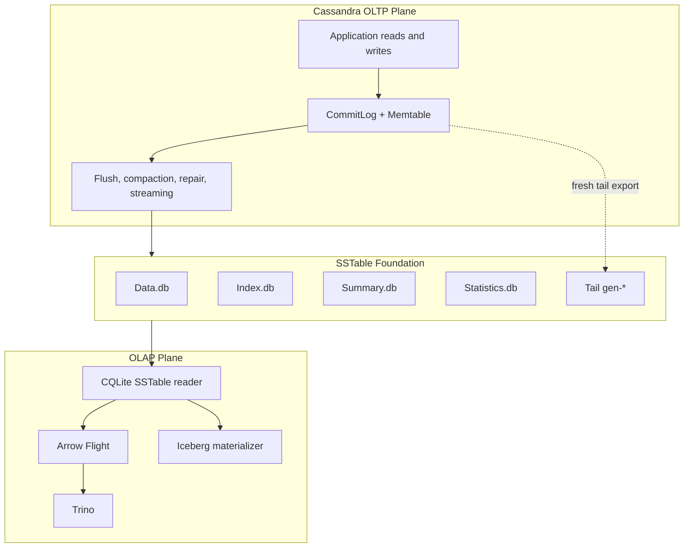

# Proposals and Research Website Section Design

**Date:** 2026-07-03
**Status:** Approved structure, pending implementation plan
**Scope:** CQLite website only, first launch scoped to storage-engine proposals and research

## Goal

Add an official **Proposals and Research** section to the CQLite website that explains forward-looking project direction without exposing readers to raw research notes as the primary experience.

The first launch should focus only on the storage-engine work. It should help users, contributors, and integrators understand the core decision: CQLite is an adjacent analytical plane beside Cassandra, not a replacement for Cassandra's internal storage engine.

## Information Architecture

Add a new Starlight docs section:

- `website/src/content/docs/proposals-research/index.mdx`
- `website/src/content/docs/proposals-research/storage-engine.md`

Add one sidebar entry in `website/astro.config.mjs`:

- `Proposals and Research`

The landing page should be a curated public hub, not a chronological notebook. It should include:

- A short explanation of what belongs in the section.
- A status legend for proposal maturity.
- A featured card for **Storage Engine Direction**.
- Links to deeper source material in the repository.

## First Proposal Page

The first page, **Storage Engine Direction**, should be a compact official proposal page with diagrams as the organizing frame.

Required sections:

1. **Public summary**
   - CQLite should sit beside Cassandra as an OLAP/read plane.
   - Cassandra remains the OLTP source of truth.
   - The shared substrate is Cassandra SSTable data on disk.

2. **Architecture diagram**
   - Left side: Cassandra OLTP plane.
   - Bottom: SSTable foundation.
   - Right side: OLAP plane with CQLite, Flight, Trino, and Iceberg.
   - Middle bridge: snapshot reads from SSTables plus optional fresh-tail export.

3. **Data paths**
   - Cold path: flushed SSTables to CQLite to Flight/Trino/Iceberg.
   - Fresh tail path: Cassandra memtable export to tail `gen-*` SSTables, then normal CQLite merge.
   - Research path: raw notes to synthesis to proposal to roadmap work.

4. **Decision map**
   - Accepted direction: adjacent analytical plane.
   - Proposed spike: CEP-11 memtable export for fresh reads.
   - Rejected or deferred: full storage-engine replacement, CDC-first spike path, live FFI reads, counters, repair-aware deduplication.

5. **Research sources**
   - Link to the storage-engine design/proposal docs under `docs/storage engine/`.
   - Present raw notes as evidence, not as primary navigation.

## Diagram Strategy

Use deterministic diagrams for technical accuracy:

- Mermaid for architecture, flow, and decision diagrams.
- SVG only if Mermaid cannot express the layout cleanly.
- Labels, arrows, file names, and component names must be hand-authored so generated text does not introduce errors.

Use Imagegen 2 selectively:

- Generate one polished conceptual visual for the top of the storage-engine page.
- The visual should show Cassandra's OLTP plane and CQLite's OLAP plane as parallel systems over a shared SSTable foundation.
- It should not contain critical labels. Any needed labels should be added by the website in HTML/SVG, not baked into the generated raster image.

## Visual Model

The approved diagram model is a parallel-plane layout:

This framing should replace a simple left-to-right export pipeline. The point is that CQLite does not replace Cassandra's write path or lifecycle. It reads Cassandra's durable storage substrate and can optionally merge a materialized live tail.

## Content Sources

Primary sources for the first page:

- `docs/storage engine/report-2-storage-engine-feasibility.md`
- `docs/storage engine/report-1-memtable-freshness.md`
- `docs/storage engine/memtable-plugin-design.md`
- `docs/storage engine/proposal.md`
- `docs/storage engine/design.md`

The generated website page should summarize these documents. It should not copy the raw research reports wholesale.

## Out of Scope

The first launch should not include:

- Other proposal threads such as Delta scan, Flight/Trino, or DataFusion.
- A raw research notebook section.
- Migration of all `docs/storage engine/cassandra-index/*.md` files into the public website nav.
- Implementation of the storage-engine proposal itself.
- A general-purpose proposal CMS or status automation.

## Validation

Implementation should validate:

- `npm run build` from `website/`.
- Internal Starlight links resolve.
- Mermaid diagrams render in the built site.
- The page remains readable on mobile.
- The new section appears in the sidebar and homepage documentation cards if the homepage is updated.

## Open Implementation Choices

These can be decided during implementation:

- Whether the landing page is `.md` or `.mdx`.
- Whether the storage-engine page uses only Mermaid or adds one static Imagegen asset.
- Whether the homepage documentation card grid should include the new section in the first pass.
